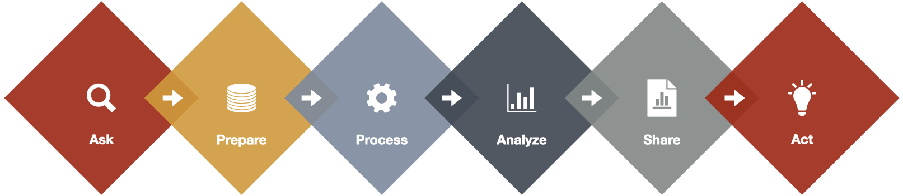
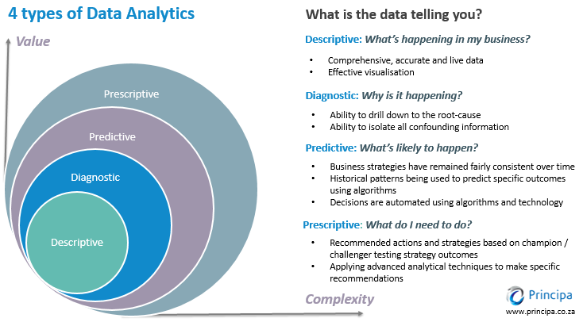
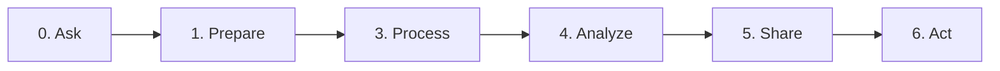
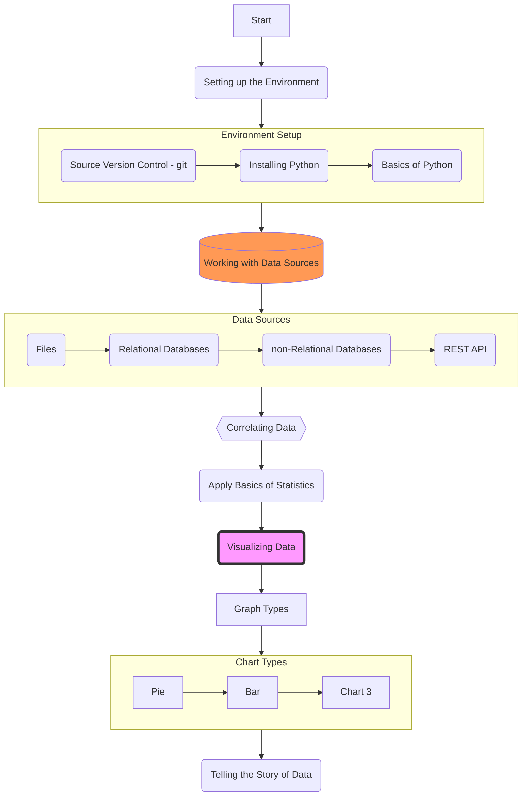
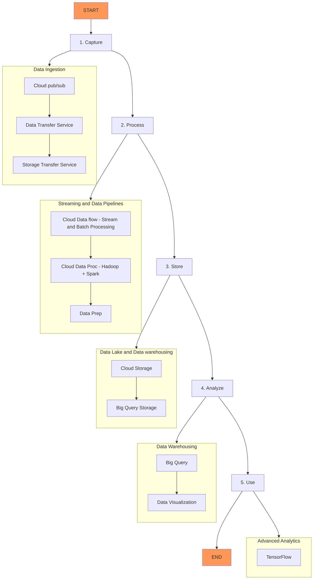

## What is data analytics and why is it important?
* Data is the new Oil.
* Data Analytics is the refining process of the new Oil, to produce a much more valuable forms of Oil (insights).
* Examples for Data Analytics and Science driving change:
  * https://www.forbes.com/sites/blakemorgan/2018/07/16/how-amazon-has-re-organized-around-artificial-intelligence-and-machine-learning/
  * https://www.nature.com/articles/d41586-020-01128-8
  * https://www.nature.com/articles/d41586-020-00847-2

## Types of Data Analytics

* Descriptive analytics
* Diagnostic analytics
* Predictive analytics
* And prescriptive analytics

## Data analytics process

1. Ask
    1. Understanding the business needs
    2. asking the relevant questions
    3. defining the objectives of the project and the needs that are being tackled
2.  Prepare
    1. collecting the data from the available data sources
    2. Data, Data, Data, … I can’t make bricks without clay . https://www.youtube.com/watch?v=2UQE5vR1Dc8 
3. Process 
    1. Data cleaning 
    2. data reduction
    3. data transformation
    4. fixing inconsistencies and anomolies 
    5. handeling missing data
    6. If this is a machine learning analytics, project this step may include some more steps such as feature engineering, data normalization, … 
4. Analyze
    1. Exploratory data analysis
    2. All trypes of analysis analysis
5. Share
    1. Storytelling with Visualizations
6. Act
    1. This is where the stakeholder could take information and start making decisions, 
    2. request further analysis
    3. identify KPM and monitoring procedures and so on.

🟠 Book Reading reflection

🟠 Ideas for data analytics projects

Discussion Board: what interests/project would you like to use data to analyze, what questions would you ask

Submit a Notebook on a set problem statements, what questions would you ask, what data sources can you get

For a particular problem set by me, what kinds of questions would you ask? what data sources would you use?

Submit a Notebook on GitHub
🟠 is there a correlation between yelp reviews and health inspections

https://hevodata.com/learn/ultimate-guide-to-data-analytics/

https://www.freecodecamp.org/news/scalable-data-analytics-pipeline/

[GitHub - Open Journalism](https://github.com/collections/open-journalism)
How can you use what you're learning for social change?

