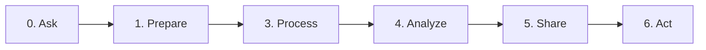

## Data Analytics Pipeline

🟠 Book Reading reflection

🟠 Ideas for data analytics projects

Discussion Board: what interests/project would you like to use data to analyze, what questions would you ask

Submit a Notebook on a set problem statements, what questions would you ask, what data sources can you get

For a particular problem set by me, what kinds of questions would you ask? what data sources would you use?

Submit a Notebook on GitHub
🟠 is there a correlation between yelp reviews and health inspections

https://hevodata.com/learn/ultimate-guide-to-data-analytics/

https://www.freecodecamp.org/news/scalable-data-analytics-pipeline/
