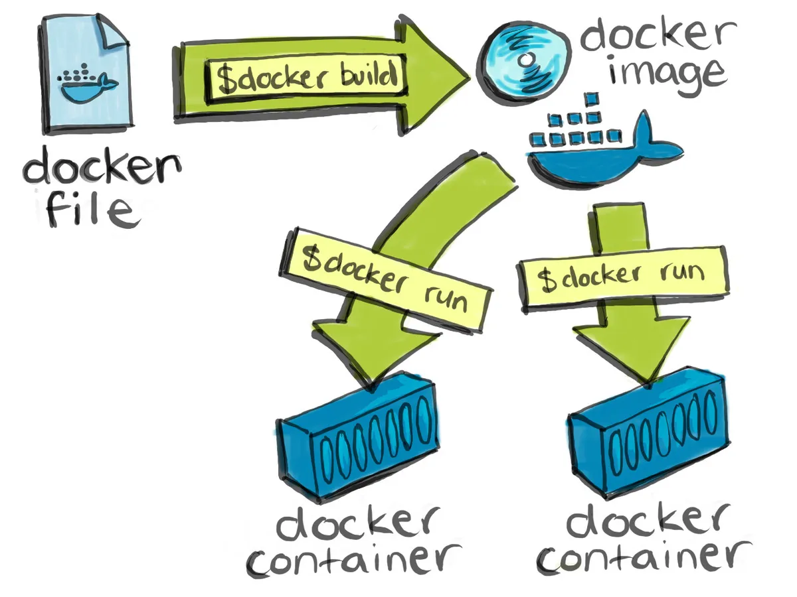

## What is [Docker](https://www.docker.com/)?
Docker is an open-source tool that use OS-level virtualization to deliver software in portable self-sufficient packages called containers.

Containers are a way to package applications with all the necessary dependencies and configuration in a portable artifact that you can share with others. We call those artifacts images.

### Docker Container vs Virtual Machine
Constainers are isolated but share OS and where appropriate, bins/libraries.

|  |
| --- |
| **Figure:** Virtual Machine Stack; every machine gets a separate copy of the OS and its binaries. |

|  |
| --- |
| **Figure:** Docker Container Stack; Containers are isolated, but share OS and when appropriate the bins and libs |

## What is a Docker container vs a Docker images
|  |
| --- |
| **Figure:** Docker image vs Docker container |
## Docker main commands

## How are we going to use it in class? Do you need to use it?
- This class is about introducing multiple technologies and tools. Each one of those has it's own set of OS depenedencies and needs, and configurations that may conflict with one another. Docker will allow you to spin up self-contained containers with those tools 

## Teach them how to setup a database. 

