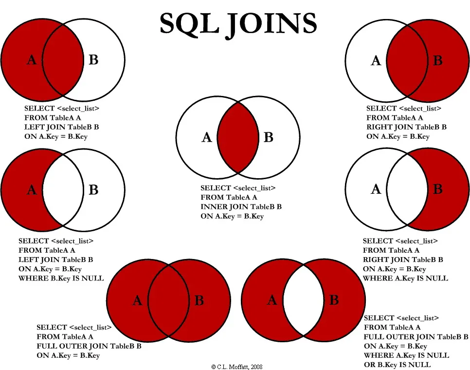
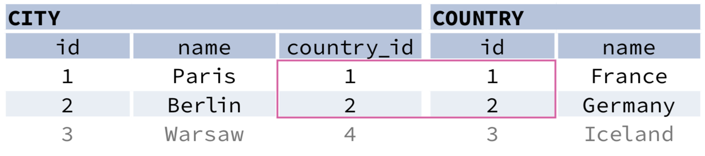
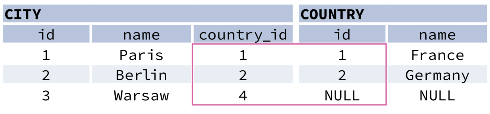
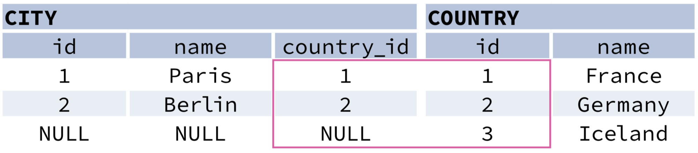
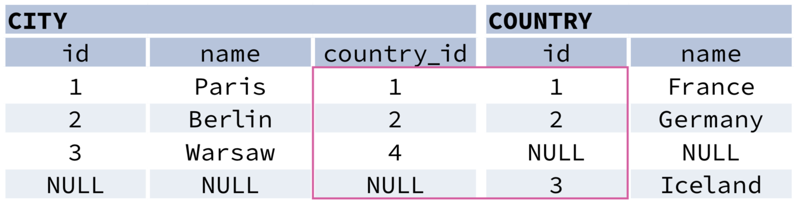
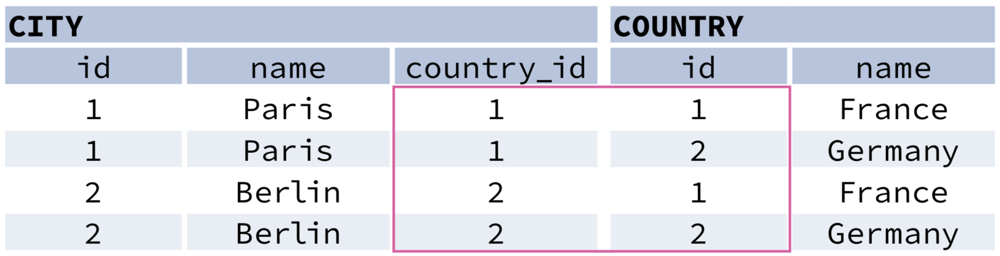
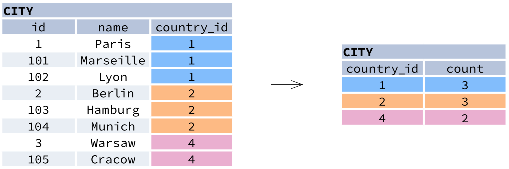
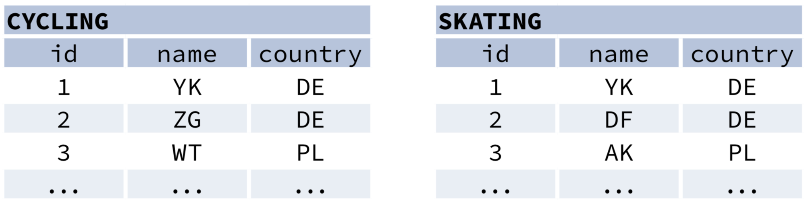

**SQL**, or Structured Query Language, is a language to talk to databases. It allows you to select specific data and to build complex reports. Today, SQL is a universal language of data. It is used in practically all technologies that process data.


:::note

This cheatsheet is modified from https://learnsql.com/blog/sql-basics-cheat-sheet/

:::

## Sample Data
The following queries are based on this sample data


## `SELECT`

* Fetch all columns from the `country` table:
```sql 
SELECT *
FROM country;
```

* Fetch `id` and `name` columns from the `city` table:
```sql
SELECT id, name
FROM city;
```
### Order (`ORDER BY`)
* Fetch city `name`s sorted by the `rating` column in the default `ASC`ending order:
```sql
SELECT name
FROM city
ORDER BY rating [ASC];
```

* Fetch city `name`s sorted by the `rating` column in the `DESC`ending order:
```sql
SELECT name
FROM city
ORDER BY rating DESC;
```

### Query using aliases (`AS`)

* Aliasing Columns
```sql
SELECT name AS city_name
FROM city;
```
* Aliasing Table
```sql
SELECT co.name, ci.name
FROM city AS ci
JOIN country AS co
  ON ci.country_id = co.id;
```
### Filtering the output (`WHERE`)
#### Comparison Operators

* Fetch names of cities that have a rating above 3:
```sql
SELECT name
FROM city
WHERE rating > 3;
```
* Fetch names of cities that are neither Berlin nor Madrid:
```sql
SELECT name
FROM city
WHERE name != 'Berlin'
  AND name != 'Madrid';
```

* Fetch names of cities that have a population between 500K and 5M:
```sql
SELECT name
FROM city
WHERE population BETWEEN 500000 AND 5000000;
```
OR
```sql
SELECT name
FROM city
WHERE population > 500000
AND population   < 5000000;
```


#### Text Operators
* Fetch names of cities that start with a 'P' or end with an 's':
```sql
SELECT name
FROM city
WHERE name LIKE 'P%'
  OR name LIKE '%s';
```
* Fetch names of cities that start with any letter followed by 'ublin' (like Dublin in Ireland or Lublin in Poland):
```sql
SELECT name
FROM city
WHERE name LIKE '%ublin';
```
### Other Operators
* Fetch names of cities that don't miss a rating value:
```sql
SELECT name
FROM city
WHERE rating IS NOT NULL;
```
* Fetch names of cities that are in countries with IDs 1, 4, 7, or 8:
```sql
SELECT name
FROM city
WHERE country_id IN (1, 4, 7, 8);
```

## `SELECT` with `JOIN`
This is to query from multiple tables at the same time. 

This is a summary of all the join types. 


### `INNER JOIN`

JOIN (or explicitly INNER JOIN) returns rows that have matching values in both tables.
```sql
SELECT city.name, country.name
FROM city
[INNER] JOIN country
  ON city.country_id = country.id;
```


### `LEFT JOIN`

LEFT JOIN returns all rows from the left table with corresponding rows from the right table. If there's no matching row, NULLs are returned as values from the second table.
```sql
SELECT city.name, country.name
FROM city
LEFT JOIN country
  ON city.country_id = country.id;
```


### `RIGHT JOIN`
RIGHT JOIN returns all rows from the right table with corresponding rows from the left table. If there's no matching row, NULLs are returned as values from the left table.
```sql
SELECT city.name, country.name
FROM city
RIGHT JOIN country
  ON city.country_id = country.id;
```


### `FULL JOIN`

FULL JOIN (or explicitly FULL OUTER JOIN) returns all rows from both tables – if there's no matching row in the second table, NULLs are returned.
```sql
SELECT city.name, country.name
FROM city
FULL [OUTER] JOIN country
  ON city.country_id = country.id;
```


### `CROSS JOIN`

CROSS JOIN returns all possible combinations of rows from both tables. There are two syntaxes available.
```sql
SELECT city.name, country.name
FROM city
CROSS JOIN country;
```
```sql
SELECT city.name, country.name
FROM city, country;
```


## `GROUP BY` - Aggregation And Grouping

`GROUP BY` groups together rows that have the same values in specified columns. It computes summaries (aggregates) for each unique combination of values.



### Aggregate Functions
`avg(expr)` − average value for rows within the group
`count(expr)` − count of values for rows within the group
`max(expr)` − maximum value within the group
`min(expr)` − minimum value within the group
`sum(expr)` − sum of values within the group

#### Example Queries

Find out the number of cities:
```sql
SELECT COUNT(*)
FROM city;
```
Find out the number of cities with non-null ratings:
```sql
SELECT COUNT(rating)
FROM city;
```
Find out the number of distinctive country values:
```sql
SELECT COUNT(DISTINCT country_id)
FROM city;
```
Find out the smallest and the greatest country populations:
```sql
SELECT MIN(population), MAX(population)
FROM country;
```
Find out the total population of cities in respective countries:
```sql
SELECT country_id, SUM(population)
FROM city
GROUP BY country_id;
```
Find out the average rating for cities in respective countries if the average is above 3.0:
```sql
SELECT country_id, AVG(rating)
FROM city
GROUP BY country_id
HAVING AVG(rating) > 3.0;
```

## Subqueries

A subquery is a query that is nested inside another query, or inside another subquery. There are different types of subqueries.

### Single Value

The simplest subquery returns exactly one column and exactly one row. It can be used with comparison operators =, <, <=, >, or >=.

This query finds cities with the same rating as Paris:
```sql
SELECT name
FROM city
WHERE rating = (
  SELECT rating
  FROM city
  WHERE name = 'Paris'
);
```
### Multiple Values

A subquery can also return multiple columns or multiple rows. Such subqueries can be used with operators IN, EXISTS, ALL, or ANY.

This query finds cities in countries that have a population above 20M:
```sql
SELECT name
FROM city
WHERE country_id IN (
  SELECT country_id
  FROM country
  WHERE population > 20000000
);
```
### Correlated

A correlated subquery refers to the tables introduced in the outer query. A correlated subquery depends on the outer query. It cannot be run independently from the outer query.

This query finds cities with a population greater than the average population in the country:
```sql
SELECT *
FROM city main_city
WHERE population > (
  SELECT AVG(population)
  FROM city average_city
  WHERE average_city.country_id = main_city.country_id
);
```
This query finds countries that have at least one city:
```sql
SELECT name
FROM country
WHERE EXISTS (
  SELECT *
  FROM city
  WHERE country_id = country.id
);
```

## Set Operations

Set operations are used to combine the results of two or more queries into a single result. The combined queries must return the same number of columns and compatible data types. The names of the corresponding columns can be different



### `UNION`


`UNION` combines the results of two result sets and removes duplicates. `UNION ALL` doesn't remove duplicate rows.

This query displays German cyclists together with German skaters:
```sql
SELECT name
FROM cycling
WHERE country = 'DE'
UNION
SELECT name
FROM skating
WHERE country = 'DE';
```
With `UNION ALL`
```sql
SELECT name
FROM cycling
WHERE country = 'DE'
UNION ALL
SELECT name
FROM skating
WHERE country = 'DE';
```


### `INTERSECT`


`INTERSECT` returns only rows that appear in both result sets.

This query displays German cyclists who are also German skaters at the same time:
```sql
SELECT name
FROM cycling
WHERE country = 'DE'
INTERSECT
SELECT name
FROM skating
WHERE country = 'DE';
```

### `EXCEPT`


`EXCEPT` returns only the rows that appear in the first result set but do not appear in the second result set.

This query displays German cyclists unless they are also German skaters at the same time:
```sql
SELECT name
FROM cycling
WHERE country = 'DE'
EXCEPT / MINUS
SELECT name
FROM skating
WHERE country = 'DE';
```

## `INSERT`
```sql
insert into cycling (name, country) 
values 
    ('YG', 'EG'), 
    (`MS`, 'EG');
```

## `UPDATE`
```sql
UPDATE cycling SET name = 'Mo' WHERE id = 1;
```

## `DELETE`
### Delete all data in a table
```sql 
DELETE from skating;
```
### Delete with a condition
```sql 
DELETE from skating WHERE id > 10;
```

## Transactions
Run a transaction
```sql
begin transaction
update tass_police set bezahlt = 0 where id_fi_kunde = 3533 and id_fi_vers_art = 1700
commit
-- or rollback
```

## Variables
Declare
```sql
DECLARE @veraenderung SMALLINT = 180;
DECLARE @neue_summe INT;
```

## Function
A function can be called from inside a statement just like any other function and can return a scalar value.

Create - Get value from table
```sql
create function f_plic_bez()
  returns decimal(10,2)
  as begin
  return (select sum(bezahlt) from tass_police)
  end;
go
select  dbo.f_plic_bez() AS 'Summe aller bezahlten Leistungen'
go
```
Drop
```sql
drop function f_bezahlt_versich
```
Create - With parameters
```sql
create function f_rabatt(@name varchar(40), @vers varchar(30))
  returns int
  as begin
  return (select (praem_stufe-100)*10 from  tass_police
  join tbl_kunde on id_fi_kunde = id_kunde
  join tkey_versicherung on id_fi_vers_art = id_vers_art
  where name = @name and vers_bez = @vers)
  end
```

## Stored Procedure
Stored procedures are stored as precompilated code (stored routine) and called by the programmer wherever it wants to fire. Stored procedure can return value(s).

Create and execute
```sql
CREATE PROCEDURE p_polic_del @fname VARCHAR(30), @versich VARCHAR(30)
  AS
  BEGIN
    DELETE FROM tass_police
      FROM tbl_kunde, tkey_versicherung
        WHERE name = @fname
          AND id_kunde = id_fi_kunde
          AND id_fi_vers_art = id_vers_art
          AND vers_bez = @versich
    IF @@ROWCOUNT = 0
      PRINT 'Police existiert nicht.'
      ELSE PRINT 'Löschung vollzogen.'
  END
GO

EXECUTE p_polic_del 'Meier', 'Taggeld';
```