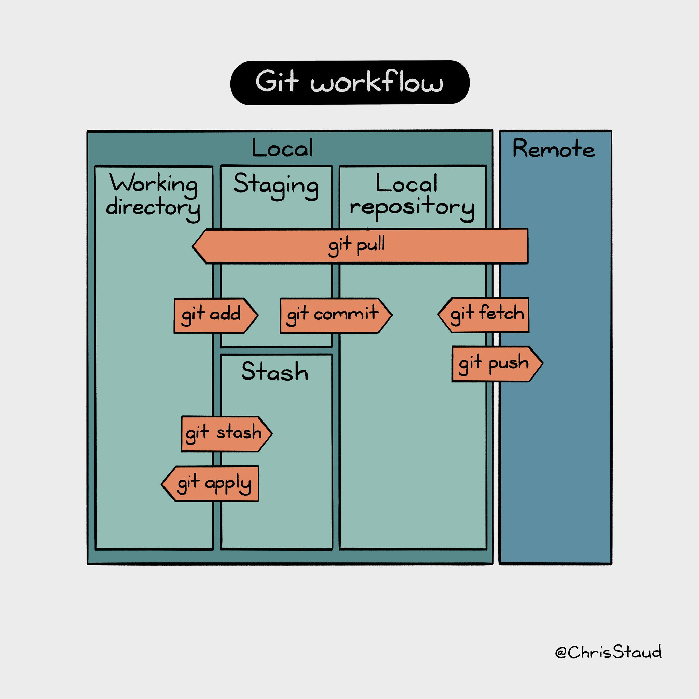

## Git Workflow
|  |
| --- |
| **Figure:** Git workflow diagram - [Tweet](https://twitter.com/ChrisStaud/status/1554091413272494080?s=20&t=_WT38kLmQ_hFYrHuXX9MZQ) by [`ChrisStaud`](https://twitter.com/ChrisStaud) |

## 1. Distributed Version Control System

* Server: GitHub.com
* Dev Environment: that's you. say hi.
* Working Directory: Let's say that's the repository folder that you see
* Local Repository and the Staging area both live in the same directory as hidden files (.git) - Don't delete

## 2. Cloning a repository from GitHub
* To download a project that's published on github.com, you'll need to clone it using the `git clone <url>` command
* If you're collaborating with a couple of developers on this same project, each of you will get a copy of the remote data. 

## 3. Updating the Remote repository with your changes 
To push your updates back to the github.com, you need to:
* stage your changes first `git add <filename`> OR `git add .` to stage all files
* commit the staged changed to your local repository `git commit -m "some descriptive message"`
* push the changes to the remote repository `git push`

if the person you're collaborating with pushed some new updates, you're not going to see those changes until you pull those changes.

## 4. Pulling Remote changes

the git pull command implicitly fetches the remote changes into the local repository and merges those changes to the working directory so you may see those changes in your code.

NOTE: only if both you and your collaborator made changes to the same exact line, you would get merge conflicts.
