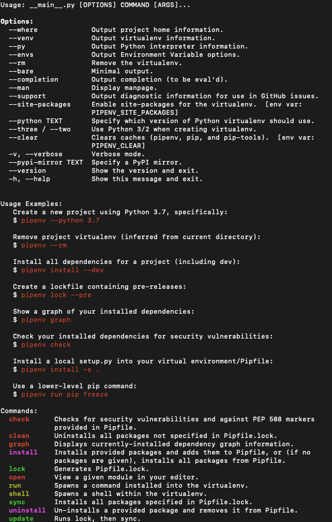

* PipEnv is an upgrade over pip. It doesn't come with Python by default, so you'll need to install it first.
* Two major benfits over pip are:
  - Dependencies are installed in a virtualenv, so you don't have to worry about installing them in the system path.
  - It automatically captures installed dependencies in files to generate an exact replica of the environment packages.
    * I'd then check the dependeinces file into my code repository and is always available for me to use and share.
    * Unlike in pip where you specifically need to freeze a snapshot of the entire virtual env with all of its dependencies.
    * It generates 2 files: Pipfile and Pipfile.lock

## Cheatsheet
*  To install a package
    ```bash
    pipenv install <package>
    ```

* To install a specific version of a package
    ```bash
    pipenv install <package>==<version>
    ```

* To upgrade a package
    ```bash
    pipenv update <package>
    ```

* To uninstall a package
    ```bash
    pipenv uninstall <package>
    ```

* To list all installed packages in a graph structure showing related packages
    ```bash
    pipenv graph
    ```

* Here's what else you can do with pipenv



* You may also find the follwing link helpful: https://realpython.com/pipenv-guide/