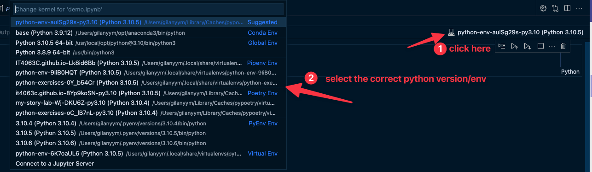

* Note that as of right now, VSCode doesn't automatically detect the virtual environment it is running in.
* You need to select the correct virtual envirnoments.
  * By activating the shell if you're using a python file executed in the terminal. (See Virtual Env.)
  * By Selecting the correct kernel from the notebook env. dropdown if you're using Jupyter Notebook.
    * 

## Extensions 
The following VSCode extensions are recommended to ease the development workflows
* [Python Extension](https://marketplace.visualstudio.com/items?itemName=ms-python.python)
* [Python Environment Manager](https://marketplace.visualstudio.com/items?itemName=donjayamanne.python-environment-manager)
* [SQLTools Extension](https://marketplace.visualstudio.com/items?itemName=mtxr.sqltools)
