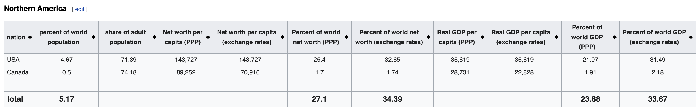
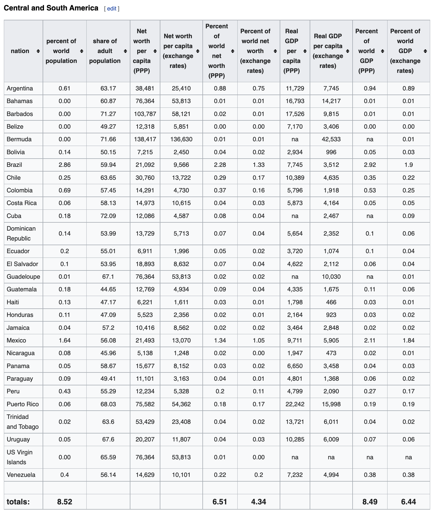
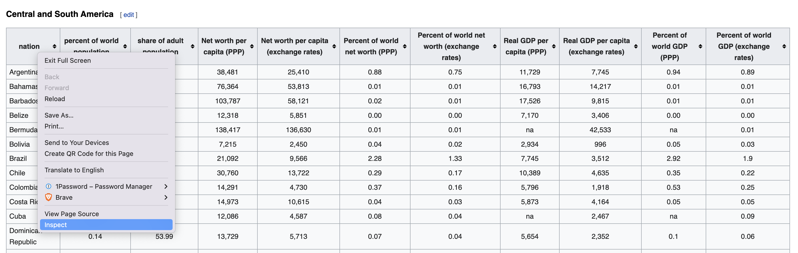
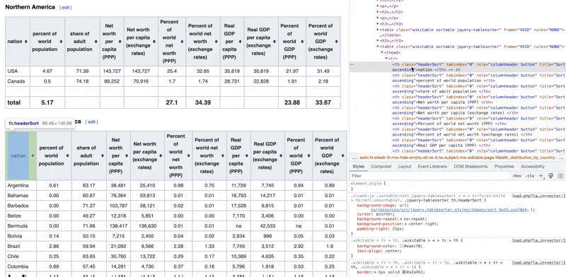
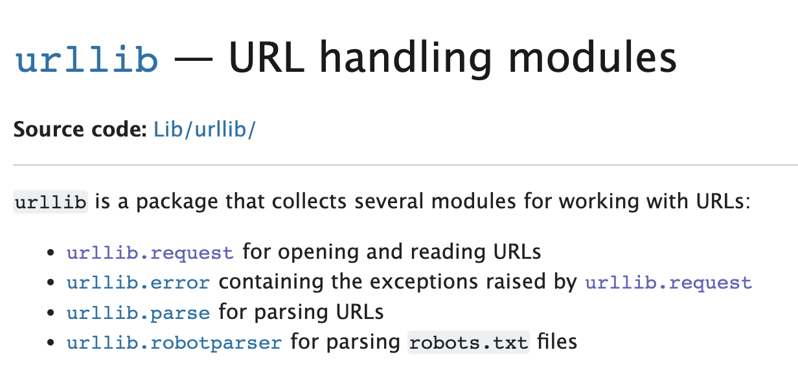

<!-- WARNING: THIS FILE WAS AUTOGENERATED! DO NOT EDIT! Instead, edit the notebook w/the location & name as this file. -->

We can construct a `DataFrame` from a variety of data sources. The most common data sources are:
  * CSV files
  * Excel files
  * SQL databases
  * JSON files
  * HTML files

In this notes, we see some of those examples in action

## 📥 From CSV


```python
import pandas as pd
import numpy as np
```


```python
url = "https://raw.github.com/pandas-dev/pandas/main/pandas/tests/io/data/csv/tips.csv"

tips = pd.read_csv(url)
tips.head()
```
    
<HTMLOutputBlock >


```html
<div>
<style scoped>
    .dataframe tbody tr th:only-of-type {
        vertical-align: middle;
    }

    .dataframe tbody tr th {
        vertical-align: top;
    }

    .dataframe thead th {
        text-align: right;
    }
</style>
<table border="1" class="dataframe">
  <thead>
    <tr style="text-align: right;">
      <th></th>
      <th>total_bill</th>
      <th>tip</th>
      <th>sex</th>
      <th>smoker</th>
      <th>day</th>
      <th>time</th>
      <th>size</th>
    </tr>
  </thead>
  <tbody>
    <tr>
      <th>0</th>
      <td>16.99</td>
      <td>1.01</td>
      <td>Female</td>
      <td>No</td>
      <td>Sun</td>
      <td>Dinner</td>
      <td>2</td>
    </tr>
    <tr>
      <th>1</th>
      <td>10.34</td>
      <td>1.66</td>
      <td>Male</td>
      <td>No</td>
      <td>Sun</td>
      <td>Dinner</td>
      <td>3</td>
    </tr>
    <tr>
      <th>2</th>
      <td>21.01</td>
      <td>3.50</td>
      <td>Male</td>
      <td>No</td>
      <td>Sun</td>
      <td>Dinner</td>
      <td>3</td>
    </tr>
    <tr>
      <th>3</th>
      <td>23.68</td>
      <td>3.31</td>
      <td>Male</td>
      <td>No</td>
      <td>Sun</td>
      <td>Dinner</td>
      <td>2</td>
    </tr>
    <tr>
      <th>4</th>
      <td>24.59</td>
      <td>3.61</td>
      <td>Female</td>
      <td>No</td>
      <td>Sun</td>
      <td>Dinner</td>
      <td>4</td>
    </tr>
  </tbody>
</table>
</div>
```


</HTMLOutputBlock>

The `.head()` function gets you the first 5 elements of the data frame to show what the data would look like.

You could also use the function `describe()` which return summary statistics about the dataset


```python
tips.describe()
```
    
<HTMLOutputBlock >


```html
<div>
<style scoped>
    .dataframe tbody tr th:only-of-type {
        vertical-align: middle;
    }

    .dataframe tbody tr th {
        vertical-align: top;
    }

    .dataframe thead th {
        text-align: right;
    }
</style>
<table border="1" class="dataframe">
  <thead>
    <tr style="text-align: right;">
      <th></th>
      <th>total_bill</th>
      <th>tip</th>
      <th>size</th>
    </tr>
  </thead>
  <tbody>
    <tr>
      <th>count</th>
      <td>244.000000</td>
      <td>244.000000</td>
      <td>244.000000</td>
    </tr>
    <tr>
      <th>mean</th>
      <td>19.785943</td>
      <td>2.998279</td>
      <td>2.569672</td>
    </tr>
    <tr>
      <th>std</th>
      <td>8.902412</td>
      <td>1.383638</td>
      <td>0.951100</td>
    </tr>
    <tr>
      <th>min</th>
      <td>3.070000</td>
      <td>1.000000</td>
      <td>1.000000</td>
    </tr>
    <tr>
      <th>25%</th>
      <td>13.347500</td>
      <td>2.000000</td>
      <td>2.000000</td>
    </tr>
    <tr>
      <th>50%</th>
      <td>17.795000</td>
      <td>2.900000</td>
      <td>2.000000</td>
    </tr>
    <tr>
      <th>75%</th>
      <td>24.127500</td>
      <td>3.562500</td>
      <td>3.000000</td>
    </tr>
    <tr>
      <th>max</th>
      <td>50.810000</td>
      <td>10.000000</td>
      <td>6.000000</td>
    </tr>
  </tbody>
</table>
</div>
```


</HTMLOutputBlock>

### Downloading Dataset from Kaggle using `OpenDatasets`

In cases where you're trying to use datasets that are available on online sources like `Kaggle`. You can continue to use the URL directly, if the source makes one available. Or you could use a tool such as `opendatasets`.
`opendatasets` is a Python library for downloading datasets from online sources like `Kaggle` and `Google Drive` using a simple Python command.

The following examples show how you can (DOWNLOAD) the US Elections Dataset available via `Kaggle`. You will be asked to provide your username and authentication API key (that's not the same as your account password).

**To get your Kaggle API Key:**


this will download a file named `kaggle.json` that contains your account name and a key that you'll use to authenticate in the following code cell.


```python
import opendatasets as od
dataset_url = 'https://www.kaggle.com/tunguz/us-elections-dataset'
od.download(dataset_url, data_dir='./data')
```

<CodeOutputBlock lang="python">

```
    Skipping, found downloaded files in "./data/us-elections-dataset" (use force=True to force download)
```

</CodeOutputBlock>

Once downloaded, you can Import the CSV file into a data frame.


```python
## import CSv file from local folder into a dataframe
elections = pd.read_csv('./data/us-elections-dataset/1976-2020-president.csv')
elections.head()
```
    
<HTMLOutputBlock >


```html
<div>
<style scoped>
    .dataframe tbody tr th:only-of-type {
        vertical-align: middle;
    }

    .dataframe tbody tr th {
        vertical-align: top;
    }

    .dataframe thead th {
        text-align: right;
    }
</style>
<table border="1" class="dataframe">
  <thead>
    <tr style="text-align: right;">
      <th></th>
      <th>year</th>
      <th>state</th>
      <th>state_po</th>
      <th>state_fips</th>
      <th>state_cen</th>
      <th>state_ic</th>
      <th>office</th>
      <th>candidate</th>
      <th>party_detailed</th>
      <th>writein</th>
      <th>candidatevotes</th>
      <th>totalvotes</th>
      <th>version</th>
      <th>notes</th>
      <th>party_simplified</th>
    </tr>
  </thead>
  <tbody>
    <tr>
      <th>0</th>
      <td>1976</td>
      <td>ALABAMA</td>
      <td>AL</td>
      <td>1</td>
      <td>63</td>
      <td>41</td>
      <td>US PRESIDENT</td>
      <td>CARTER, JIMMY</td>
      <td>DEMOCRAT</td>
      <td>False</td>
      <td>659170</td>
      <td>1182850</td>
      <td>20210113</td>
      <td>NaN</td>
      <td>DEMOCRAT</td>
    </tr>
    <tr>
      <th>1</th>
      <td>1976</td>
      <td>ALABAMA</td>
      <td>AL</td>
      <td>1</td>
      <td>63</td>
      <td>41</td>
      <td>US PRESIDENT</td>
      <td>FORD, GERALD</td>
      <td>REPUBLICAN</td>
      <td>False</td>
      <td>504070</td>
      <td>1182850</td>
      <td>20210113</td>
      <td>NaN</td>
      <td>REPUBLICAN</td>
    </tr>
    <tr>
      <th>2</th>
      <td>1976</td>
      <td>ALABAMA</td>
      <td>AL</td>
      <td>1</td>
      <td>63</td>
      <td>41</td>
      <td>US PRESIDENT</td>
      <td>MADDOX, LESTER</td>
      <td>AMERICAN INDEPENDENT PARTY</td>
      <td>False</td>
      <td>9198</td>
      <td>1182850</td>
      <td>20210113</td>
      <td>NaN</td>
      <td>OTHER</td>
    </tr>
    <tr>
      <th>3</th>
      <td>1976</td>
      <td>ALABAMA</td>
      <td>AL</td>
      <td>1</td>
      <td>63</td>
      <td>41</td>
      <td>US PRESIDENT</td>
      <td>BUBAR, BENJAMIN ""BEN""</td>
      <td>PROHIBITION</td>
      <td>False</td>
      <td>6669</td>
      <td>1182850</td>
      <td>20210113</td>
      <td>NaN</td>
      <td>OTHER</td>
    </tr>
    <tr>
      <th>4</th>
      <td>1976</td>
      <td>ALABAMA</td>
      <td>AL</td>
      <td>1</td>
      <td>63</td>
      <td>41</td>
      <td>US PRESIDENT</td>
      <td>HALL, GUS</td>
      <td>COMMUNIST PARTY USE</td>
      <td>False</td>
      <td>1954</td>
      <td>1182850</td>
      <td>20210113</td>
      <td>NaN</td>
      <td>OTHER</td>
    </tr>
  </tbody>
</table>
</div>
```


</HTMLOutputBlock>

## 📥 From API
To import data using an HTTP API in Python, you have multiple options for the HTTP client libraries. The one I choose and use here is `requests`. Here I will show you how you can use `requests` to query data from the US Census Data, and from the John Hopkins COVID APIs.

The most basic example is the following:
```python
import requests

x = requests.get('https://w3schools.com/python/demopage.htm')

print(x.text)
```

However, depending on the API provider, we may need to pass additional configurations and options in the request. We'll see that in the following examples

### US Census Data
The US Census Bureau provides machine-readable dataset via a developer API. 

> Developers could use the statistics available through this API to create apps that:
> 1. Show commuting patterns for every city in America.
> 2. Display the latest numbers on owners and renters in a neighborhood someone may want to live in.
> 3. Provide a local government a range of socioeconomic statistics on its population.

Here are [some of the datasets available that you can use](https://www.census.gov/data/developers/data-sets.html)

Each dataset provides technical documentation for the different variables you could get from that Particular API. Here's [an example](https://api.census.gov/data/2020/dec/pl/variables.html)


- [Working with US Census Data - PDF Guide](https://www.census.gov/content/dam/Census/library/publications/2020/acs/acs_api_handbook_2020_ch02.pdf)

To construct a request with `requests` we need to determine the URL we need to send the request to.


```python
import requests

HOST = "https://api.census.gov/data"
year = "2022"
dataset = "cps/basic/apr"
base_url = "/".join([HOST, year, dataset]) # JOIN the variables with a `/` separator https://api.census.gov/data/2022/cps/basic/apr

# The dataset is huge and contains a lot of data, so we'll request a subset of the available variables.
dataset_variables = ["GEDIV","HRMIS","PENATVTY"] 

predicates = {}
predicates["get"] = ",".join(dataset_variables) # JOIN the variables with a `,` separator
predicates["for"] = "state:*"

response = requests.get(base_url, params=predicates)

census_data = pd.DataFrame.from_records(response.json()[1:], columns=response.json()[0])
print(census_data.head())
```

<CodeOutputBlock lang="python">

```
      GEDIV HRMIS PENATVTY state
    0     8     8      303     4
    1     8     8      303     4
    2     8     8       57     4
    3     8     8       57     4
    4     7     2       57     5
```

</CodeOutputBlock>

This [link here](https://api.census.gov/data/2022/cps/basic/apr/variables.html) describes what those variables mean.

Also, you note that even the states are presented with some numerical values. to get the values of those state IDs, I'll send another request to another dataset


```python
import requests

HOST = "https://api.census.gov/data"
year = "2017"
dataset = "acs/acs5"
base_url = "/".join([HOST, year, dataset]) # JOIN the variables with a `/` separator https://api.census.gov/data/2022/cps/basic/apr

dataset_variables = ["NAME"]
predicates = {}
predicates["get"] = ",".join(dataset_variables)
predicates["for"] = "state:*"

r = requests.get(base_url, params=predicates)
states = pd.DataFrame.from_records(r.json()[1:], columns=r.json()[0])
print(states.head())
```

<CodeOutputBlock lang="python">

```
              NAME state
    0  Mississippi    28
    1     Missouri    29
    2      Montana    30
    3     Nebraska    31
    4       Nevada    32
```

</CodeOutputBlock>

You could subset the data recieved to find the State Numerical Code for the `Ohio`


```python
# Find the state code with the name "Ohio"
print(states[states["NAME"] == "Ohio"])
```

<CodeOutputBlock lang="python">

```
        NAME state
    16  Ohio    39
```

</CodeOutputBlock>

or you could just combine and merge the 2 data sets on the state ID, so we end up with a single dataset with all the information we need.


```python
# Merge census_data and states
full_census_data = pd.merge(census_data, states, on="state")
full_census_data.head() # Print the first 5 rows
```
    
<HTMLOutputBlock >


```html
<div>
<style scoped>
    .dataframe tbody tr th:only-of-type {
        vertical-align: middle;
    }

    .dataframe tbody tr th {
        vertical-align: top;
    }

    .dataframe thead th {
        text-align: right;
    }
</style>
<table border="1" class="dataframe">
  <thead>
    <tr style="text-align: right;">
      <th></th>
      <th>GEDIV</th>
      <th>HRMIS</th>
      <th>PENATVTY</th>
      <th>state</th>
      <th>NAME</th>
    </tr>
  </thead>
  <tbody>
    <tr>
      <th>0</th>
      <td>7</td>
      <td>6</td>
      <td>57</td>
      <td>40</td>
      <td>Oklahoma</td>
    </tr>
    <tr>
      <th>1</th>
      <td>7</td>
      <td>6</td>
      <td>57</td>
      <td>40</td>
      <td>Oklahoma</td>
    </tr>
    <tr>
      <th>2</th>
      <td>7</td>
      <td>6</td>
      <td>57</td>
      <td>40</td>
      <td>Oklahoma</td>
    </tr>
    <tr>
      <th>3</th>
      <td>7</td>
      <td>6</td>
      <td>57</td>
      <td>40</td>
      <td>Oklahoma</td>
    </tr>
    <tr>
      <th>4</th>
      <td>7</td>
      <td>3</td>
      <td>57</td>
      <td>40</td>
      <td>Oklahoma</td>
    </tr>
  </tbody>
</table>
</div>
```


</HTMLOutputBlock>

### John Hopkins Covid API

John Hopkins University | Cornoavirus Resources Center have been collecting and publishing data regarding COVID-19 since day one. 
You can learn more about that and [find official resources for how to use the data here](https://coronavirus.jhu.edu/about/how-to-use-our-data)

I believe someone is publishing those datasets by means of API through the RapidAPI platform. Whether it's an official resource or not, the goal of this exercise is to show you how to work with APIs in general.

You can see a very easy to understand documentation of [how to use the API here](https://rapidapi.com/axisbits-axisbits-default/api/covid-19-statistics/). 


```python
import os
from dotenv import load_dotenv
import requests

load_dotenv(override=True)
rapid_api_key = os.getenv("RAPID_API_KEY")

url = "https://covid-19-statistics.p.rapidapi.com/reports"
querystring = {"region_province":"Ohio","iso":"USA","region_name":"US","q":"US Ohio","date":"2020-04-16"}

headers = {
	"X-RapidAPI-Key": rapid_api_key,
	"X-RapidAPI-Host": "covid-19-statistics.p.rapidapi.com"
}

response = requests.request("GET", url, headers=headers, params=querystring)

# save json result into a pandas dataframe
covid_data = pd.DataFrame(response.json()["data"][0]["region"]["cities"])
covid_data.head()
```
    
<HTMLOutputBlock >


```html
<div>
<style scoped>
    .dataframe tbody tr th:only-of-type {
        vertical-align: middle;
    }

    .dataframe tbody tr th {
        vertical-align: top;
    }

    .dataframe thead th {
        text-align: right;
    }
</style>
<table border="1" class="dataframe">
  <thead>
    <tr style="text-align: right;">
      <th></th>
      <th>name</th>
      <th>date</th>
      <th>fips</th>
      <th>lat</th>
      <th>long</th>
      <th>confirmed</th>
      <th>deaths</th>
      <th>confirmed_diff</th>
      <th>deaths_diff</th>
      <th>last_update</th>
    </tr>
  </thead>
  <tbody>
    <tr>
      <th>0</th>
      <td>Adams</td>
      <td>2020-04-16</td>
      <td>39001</td>
      <td>38.84541072</td>
      <td>-83.4718964</td>
      <td>3</td>
      <td>0</td>
      <td>0</td>
      <td>0</td>
      <td>2020-04-16 23:30:51</td>
    </tr>
    <tr>
      <th>1</th>
      <td>Allen</td>
      <td>2020-04-16</td>
      <td>39003</td>
      <td>40.77285242</td>
      <td>-84.10802343</td>
      <td>57</td>
      <td>6</td>
      <td>6</td>
      <td>2</td>
      <td>2020-04-16 23:30:51</td>
    </tr>
    <tr>
      <th>2</th>
      <td>Ashland</td>
      <td>2020-04-16</td>
      <td>39005</td>
      <td>40.84772277</td>
      <td>-82.27280781</td>
      <td>5</td>
      <td>0</td>
      <td>-1</td>
      <td>0</td>
      <td>2020-04-16 23:30:51</td>
    </tr>
    <tr>
      <th>3</th>
      <td>Ashtabula</td>
      <td>2020-04-16</td>
      <td>39007</td>
      <td>41.70860332</td>
      <td>-80.74830218</td>
      <td>45</td>
      <td>3</td>
      <td>9</td>
      <td>0</td>
      <td>2020-04-16 23:30:51</td>
    </tr>
    <tr>
      <th>4</th>
      <td>Athens</td>
      <td>2020-04-16</td>
      <td>39009</td>
      <td>39.33425634</td>
      <td>-82.04278644</td>
      <td>3</td>
      <td>1</td>
      <td>0</td>
      <td>0</td>
      <td>2020-04-16 23:30:51</td>
    </tr>
  </tbody>
</table>
</div>
```


</HTMLOutputBlock>

## 📥 Using Socrata
The Socrata Open Data API allows you to programmatically access a wealth of open data resources from governments, non-profits, and NGOs around the world. 

### Cincinnati Datasets
For example, [here are a bunch of datasets that you can find about the City of Cincinnati](https://www.opendatanetwork.com/entity/1600000US3915000/Cincinnati_OH/demographics.population.count?ref=search-entity&year=2018)

For you to be able to access any of those datasets, you need to register to get an application token.


```python
import os
from dotenv import load_dotenv
import pandas as pd
from sodapy import Socrata

load_dotenv(override=True)

# Example authenticated client (needed for non-public datasets):
app_token = os.getenv("SODA_APP_TOKEN")

# client = Socrata("data.cincinnati-oh.gov", None)
client = Socrata("data.cincinnati-oh.gov",app_token)


# First 2000 results, returned as JSON from API / converted to Python list of
# dictionaries by sodapy.
results = client.get("rvmt-pkmq", limit=2000)

# Convert to pandas DataFrame
results_df = pd.DataFrame.from_records(results)
print(results_df.columns)
```

<CodeOutputBlock lang="python">

```
    Index(['address_x', 'latitude_x', 'longitude_x', 'age',
           'community_council_neighborhood', 'cpd_neighborhood',
           'sna_neighborhood', 'crashdate', 'crashseverity', 'crashseverityid',
           'datecrashreported', 'dayofweek', 'gender', 'injuries', 'instanceid',
           'lightconditionsprimary', 'localreportno', 'mannerofcrash',
           'roadconditionsprimary', 'roadcontour', 'roadsurface', 'unittype',
           'typeofperson', 'weather', 'zip', 'roadclass', 'roadclassdesc'],
          dtype='object')
```

</CodeOutputBlock>

## 📥 From SQL

### About SQL
SQL is a powerful programming language that allows us to interact and save data in Relational Databases. SQL stores data in a table format, consisting of rows representing a number of records and columns corresponding to various features.

There are many categories categories of SQL commands:
1. Data Definition Language (DDL)
   1. `CREATE`, `ALTER`, `DROP`; these are the commands used to define the data structure or the data model.

2. Data Manipulation Language (DML)
   1. `INSERT`, `UPDATE`, `DELETE`; these are the commands used to modify data in existing databases.

3. Data Query Language (DQL)
   1. `SELECT`

4. Data Control Langauge (DCL)
   1. `GRANT`, `REVOKE`; administrative commands to manage user permissions and access

5. Transaction Control Language (TCL)
   1. `COMMIT`, `ROLLBACK`, `BEGIN TRANSACTION`; for managing transaction queries where multiple DML are processed in a single operation. This is more for software developers than it is for data analysts.

While there is a SQL Standard, there are many dialects and implementations of that standard. You'll often hear of `Microsoft SQL Server`, `MySQL`, `PostgreSQL`, ...etc. All of these require that the an instance of the server is hosted on some server or locally.

Another dialect of SQL is called `SQLite`. This is a small, self-contained, serverless relational database system. This means that the entire database would be contained in a file. that can be shared with others. This has pros and cons.

For the purposes of demo-ing how we can use Python to interact with SQL Database, I'm using a sample SQLite database. The [SQLite Tutorial Website](https://www.sqlitetutorial.net/sqlite-sample-database/) offers same sample database for testing and training. 

I'm here demo-ing using the Chinook database in python. This is the database schema for the database tables.


First off, I'll download the sqlite database from [https://www.sqlitetutorial.net/wp-content/uploads/2018/03/chinook.zip](https://www.sqlitetutorial.net/wp-content/uploads/2018/03/chinook.zip). The downloaded file is zipped so I will need to also unzip that file. (of course we can do that manually, but how savage is that)


```python
from zipfile import ZipFile
from urllib.request import urlretrieve

file_handle, _ = urlretrieve("https://www.sqlitetutorial.net/wp-content/uploads/2018/03/chinook.zip")
zipfile = ZipFile(file_handle, 'r')
zipfile.extractall(".")
zipfile.close()
```

We'll need to use the `SQLAlchemy` package from the Python Package Index.

Here we define the connection string a sqlite connection to a locally available SQLite Database file `chinook`


```python
from sqlalchemy import create_engine

connection_string = "sqlite:///chinook.db"
engine = create_engine(connection_string)

dbConnection = engine.connect()
```


```python
import pandas as pd

genres_df = pd.read_sql("SELECT * FROM genres;", dbConnection)
genres_df
```
    
<HTMLOutputBlock >


```html
<div>
<style scoped>
    .dataframe tbody tr th:only-of-type {
        vertical-align: middle;
    }

    .dataframe tbody tr th {
        vertical-align: top;
    }

    .dataframe thead th {
        text-align: right;
    }
</style>
<table border="1" class="dataframe">
  <thead>
    <tr style="text-align: right;">
      <th></th>
      <th>GenreId</th>
      <th>Name</th>
    </tr>
  </thead>
  <tbody>
    <tr>
      <th>0</th>
      <td>1</td>
      <td>Rock</td>
    </tr>
    <tr>
      <th>1</th>
      <td>2</td>
      <td>Jazz</td>
    </tr>
    <tr>
      <th>2</th>
      <td>3</td>
      <td>Metal</td>
    </tr>
    <tr>
      <th>3</th>
      <td>4</td>
      <td>Alternative &amp; Punk</td>
    </tr>
    <tr>
      <th>4</th>
      <td>5</td>
      <td>Rock And Roll</td>
    </tr>
    <tr>
      <th>5</th>
      <td>6</td>
      <td>Blues</td>
    </tr>
    <tr>
      <th>6</th>
      <td>7</td>
      <td>Latin</td>
    </tr>
    <tr>
      <th>7</th>
      <td>8</td>
      <td>Reggae</td>
    </tr>
    <tr>
      <th>8</th>
      <td>9</td>
      <td>Pop</td>
    </tr>
    <tr>
      <th>9</th>
      <td>10</td>
      <td>Soundtrack</td>
    </tr>
    <tr>
      <th>10</th>
      <td>11</td>
      <td>Bossa Nova</td>
    </tr>
    <tr>
      <th>11</th>
      <td>12</td>
      <td>Easy Listening</td>
    </tr>
    <tr>
      <th>12</th>
      <td>13</td>
      <td>Heavy Metal</td>
    </tr>
    <tr>
      <th>13</th>
      <td>14</td>
      <td>R&amp;B/Soul</td>
    </tr>
    <tr>
      <th>14</th>
      <td>15</td>
      <td>Electronica/Dance</td>
    </tr>
    <tr>
      <th>15</th>
      <td>16</td>
      <td>World</td>
    </tr>
    <tr>
      <th>16</th>
      <td>17</td>
      <td>Hip Hop/Rap</td>
    </tr>
    <tr>
      <th>17</th>
      <td>18</td>
      <td>Science Fiction</td>
    </tr>
    <tr>
      <th>18</th>
      <td>19</td>
      <td>TV Shows</td>
    </tr>
    <tr>
      <th>19</th>
      <td>20</td>
      <td>Sci Fi &amp; Fantasy</td>
    </tr>
    <tr>
      <th>20</th>
      <td>21</td>
      <td>Drama</td>
    </tr>
    <tr>
      <th>21</th>
      <td>22</td>
      <td>Comedy</td>
    </tr>
    <tr>
      <th>22</th>
      <td>23</td>
      <td>Alternative</td>
    </tr>
    <tr>
      <th>23</th>
      <td>24</td>
      <td>Classical</td>
    </tr>
    <tr>
      <th>24</th>
      <td>25</td>
      <td>Opera</td>
    </tr>
  </tbody>
</table>
</div>
```


</HTMLOutputBlock>

Let's add one item to the dataframe


```python
genres_df = pd.concat([genres_df, pd.DataFrame.from_records([{'GenreId': '26', 'Name': 'Arabic Pop'}])], ignore_index=True)
genres_df
```
    
<HTMLOutputBlock >


```html
<div>
<style scoped>
    .dataframe tbody tr th:only-of-type {
        vertical-align: middle;
    }

    .dataframe tbody tr th {
        vertical-align: top;
    }

    .dataframe thead th {
        text-align: right;
    }
</style>
<table border="1" class="dataframe">
  <thead>
    <tr style="text-align: right;">
      <th></th>
      <th>GenreId</th>
      <th>Name</th>
    </tr>
  </thead>
  <tbody>
    <tr>
      <th>0</th>
      <td>1</td>
      <td>Rock</td>
    </tr>
    <tr>
      <th>1</th>
      <td>2</td>
      <td>Jazz</td>
    </tr>
    <tr>
      <th>2</th>
      <td>3</td>
      <td>Metal</td>
    </tr>
    <tr>
      <th>3</th>
      <td>4</td>
      <td>Alternative &amp; Punk</td>
    </tr>
    <tr>
      <th>4</th>
      <td>5</td>
      <td>Rock And Roll</td>
    </tr>
    <tr>
      <th>5</th>
      <td>6</td>
      <td>Blues</td>
    </tr>
    <tr>
      <th>6</th>
      <td>7</td>
      <td>Latin</td>
    </tr>
    <tr>
      <th>7</th>
      <td>8</td>
      <td>Reggae</td>
    </tr>
    <tr>
      <th>8</th>
      <td>9</td>
      <td>Pop</td>
    </tr>
    <tr>
      <th>9</th>
      <td>10</td>
      <td>Soundtrack</td>
    </tr>
    <tr>
      <th>10</th>
      <td>11</td>
      <td>Bossa Nova</td>
    </tr>
    <tr>
      <th>11</th>
      <td>12</td>
      <td>Easy Listening</td>
    </tr>
    <tr>
      <th>12</th>
      <td>13</td>
      <td>Heavy Metal</td>
    </tr>
    <tr>
      <th>13</th>
      <td>14</td>
      <td>R&amp;B/Soul</td>
    </tr>
    <tr>
      <th>14</th>
      <td>15</td>
      <td>Electronica/Dance</td>
    </tr>
    <tr>
      <th>15</th>
      <td>16</td>
      <td>World</td>
    </tr>
    <tr>
      <th>16</th>
      <td>17</td>
      <td>Hip Hop/Rap</td>
    </tr>
    <tr>
      <th>17</th>
      <td>18</td>
      <td>Science Fiction</td>
    </tr>
    <tr>
      <th>18</th>
      <td>19</td>
      <td>TV Shows</td>
    </tr>
    <tr>
      <th>19</th>
      <td>20</td>
      <td>Sci Fi &amp; Fantasy</td>
    </tr>
    <tr>
      <th>20</th>
      <td>21</td>
      <td>Drama</td>
    </tr>
    <tr>
      <th>21</th>
      <td>22</td>
      <td>Comedy</td>
    </tr>
    <tr>
      <th>22</th>
      <td>23</td>
      <td>Alternative</td>
    </tr>
    <tr>
      <th>23</th>
      <td>24</td>
      <td>Classical</td>
    </tr>
    <tr>
      <th>24</th>
      <td>25</td>
      <td>Opera</td>
    </tr>
    <tr>
      <th>25</th>
      <td>26</td>
      <td>Arabic Pop</td>
    </tr>
  </tbody>
</table>
</div>
```


</HTMLOutputBlock>

Let's update the database with the new data


```python
genres_df.to_sql('genres', dbConnection, if_exists='replace', index=False)
```

<CodeOutputBlock lang="python">

```
    26
```

</CodeOutputBlock>

Let's see what's in the database table now


```python
df2 = pd.read_sql("SELECT * FROM genres;", dbConnection)
df2
```
    
<HTMLOutputBlock >


```html
<div>
<style scoped>
    .dataframe tbody tr th:only-of-type {
        vertical-align: middle;
    }

    .dataframe tbody tr th {
        vertical-align: top;
    }

    .dataframe thead th {
        text-align: right;
    }
</style>
<table border="1" class="dataframe">
  <thead>
    <tr style="text-align: right;">
      <th></th>
      <th>GenreId</th>
      <th>Name</th>
    </tr>
  </thead>
  <tbody>
    <tr>
      <th>0</th>
      <td>1</td>
      <td>Rock</td>
    </tr>
    <tr>
      <th>1</th>
      <td>2</td>
      <td>Jazz</td>
    </tr>
    <tr>
      <th>2</th>
      <td>3</td>
      <td>Metal</td>
    </tr>
    <tr>
      <th>3</th>
      <td>4</td>
      <td>Alternative &amp; Punk</td>
    </tr>
    <tr>
      <th>4</th>
      <td>5</td>
      <td>Rock And Roll</td>
    </tr>
    <tr>
      <th>5</th>
      <td>6</td>
      <td>Blues</td>
    </tr>
    <tr>
      <th>6</th>
      <td>7</td>
      <td>Latin</td>
    </tr>
    <tr>
      <th>7</th>
      <td>8</td>
      <td>Reggae</td>
    </tr>
    <tr>
      <th>8</th>
      <td>9</td>
      <td>Pop</td>
    </tr>
    <tr>
      <th>9</th>
      <td>10</td>
      <td>Soundtrack</td>
    </tr>
    <tr>
      <th>10</th>
      <td>11</td>
      <td>Bossa Nova</td>
    </tr>
    <tr>
      <th>11</th>
      <td>12</td>
      <td>Easy Listening</td>
    </tr>
    <tr>
      <th>12</th>
      <td>13</td>
      <td>Heavy Metal</td>
    </tr>
    <tr>
      <th>13</th>
      <td>14</td>
      <td>R&amp;B/Soul</td>
    </tr>
    <tr>
      <th>14</th>
      <td>15</td>
      <td>Electronica/Dance</td>
    </tr>
    <tr>
      <th>15</th>
      <td>16</td>
      <td>World</td>
    </tr>
    <tr>
      <th>16</th>
      <td>17</td>
      <td>Hip Hop/Rap</td>
    </tr>
    <tr>
      <th>17</th>
      <td>18</td>
      <td>Science Fiction</td>
    </tr>
    <tr>
      <th>18</th>
      <td>19</td>
      <td>TV Shows</td>
    </tr>
    <tr>
      <th>19</th>
      <td>20</td>
      <td>Sci Fi &amp; Fantasy</td>
    </tr>
    <tr>
      <th>20</th>
      <td>21</td>
      <td>Drama</td>
    </tr>
    <tr>
      <th>21</th>
      <td>22</td>
      <td>Comedy</td>
    </tr>
    <tr>
      <th>22</th>
      <td>23</td>
      <td>Alternative</td>
    </tr>
    <tr>
      <th>23</th>
      <td>24</td>
      <td>Classical</td>
    </tr>
    <tr>
      <th>24</th>
      <td>25</td>
      <td>Opera</td>
    </tr>
    <tr>
      <th>25</th>
      <td>26</td>
      <td>Arabic Pop</td>
    </tr>
  </tbody>
</table>
</div>
```


</HTMLOutputBlock>

## 📥 From MongoDB

If you've taken Contemporary Database, you have already learned about One of the NoSQL Database options, MongoDB.

In the following example, I will show you how you can use Python to Query Data from a MongoDB.

Here we'll need to install the `PyMongo` Package. Depending on the MongoDB instance you're trying to connect to, you will need an extra companion package. You can find out about that in this [link to the PyMongo Documentation](https://pymongo.readthedocs.io/en/stable/installation.html). For instances:
* For AWS, you need to install `pymongo[aws]`
* For `mongodb+srv` connection strings, you'd need to install `pymongo[srv]`

For the MongoDB instance on Mongo Atlas, we need `pymongo[srv]`, `pipenv install 'pymongo[srv]'`


```python
import pandas as pd
from pymongo import MongoClient
import os
from dotenv import load_dotenv

load_dotenv(override=True)

pd.set_option('display.max_columns', None) # Otherwise, pandas would not be able to display the full content of each cell


def _connect_mongo(host, username, password, db):
    """ A util for making a connection to mongo """

    mongo_uri = 'mongodb+srv://%s:%s@%s/?retryWrites=true&w=majority"' % (username, password, host)

    conn = MongoClient(mongo_uri)

    return conn[db]


def read_mongo(db, collection, query={}, no_id=True):
    """ Read from Mongo and Store into DataFrame """

    # Make a query to the specific DB and Collection
    cursor = db[collection].find(query)

    # Expand the cursor and construct the DataFrame
    df =  pd.DataFrame(list(cursor))

    # Delete the _id
    if no_id:
        del df['_id']

    return df

username = os.getenv("MONGO_USERNAME")
password = os.getenv("MONGO_PASSWORD")

db = _connect_mongo(host='it4063c.ykv1yjn.mongodb.net', username=username, password=password, db='sample_airbnb')
df = read_mongo(db=db, collection='listingsAndReviews', query={'bedrooms': {'$lt': 2}}, no_id=False)
df.head()
```
    
<HTMLOutputBlock >


```html
<div>
<style scoped>
    .dataframe tbody tr th:only-of-type {
        vertical-align: middle;
    }

    .dataframe tbody tr th {
        vertical-align: top;
    }

    .dataframe thead th {
        text-align: right;
    }
</style>
<table border="1" class="dataframe">
  <thead>
    <tr style="text-align: right;">
      <th></th>
      <th>_id</th>
      <th>listing_url</th>
      <th>name</th>
      <th>summary</th>
      <th>space</th>
      <th>description</th>
      <th>neighborhood_overview</th>
      <th>notes</th>
      <th>transit</th>
      <th>access</th>
      <th>interaction</th>
      <th>house_rules</th>
      <th>property_type</th>
      <th>room_type</th>
      <th>bed_type</th>
      <th>minimum_nights</th>
      <th>maximum_nights</th>
      <th>cancellation_policy</th>
      <th>last_scraped</th>
      <th>calendar_last_scraped</th>
      <th>accommodates</th>
      <th>bedrooms</th>
      <th>beds</th>
      <th>number_of_reviews</th>
      <th>bathrooms</th>
      <th>amenities</th>
      <th>price</th>
      <th>weekly_price</th>
      <th>monthly_price</th>
      <th>cleaning_fee</th>
      <th>extra_people</th>
      <th>guests_included</th>
      <th>images</th>
      <th>host</th>
      <th>address</th>
      <th>availability</th>
      <th>review_scores</th>
      <th>reviews</th>
      <th>first_review</th>
      <th>last_review</th>
      <th>security_deposit</th>
      <th>reviews_per_month</th>
    </tr>
  </thead>
  <tbody>
    <tr>
      <th>0</th>
      <td>10009999</td>
      <td>https://www.airbnb.com/rooms/10009999</td>
      <td>Horto flat with small garden</td>
      <td>One bedroom + sofa-bed in quiet and bucolic ne...</td>
      <td>Lovely one bedroom + sofa-bed in the living ro...</td>
      <td>One bedroom + sofa-bed in quiet and bucolic ne...</td>
      <td>This charming ground floor flat is located in ...</td>
      <td>There´s a table in the living room now, that d...</td>
      <td>Easy access to transport (bus, taxi, car) and ...</td>
      <td></td>
      <td>I´ll be happy to help you with any doubts, tip...</td>
      <td>I just hope the guests treat the space as they...</td>
      <td>Apartment</td>
      <td>Entire home/apt</td>
      <td>Real Bed</td>
      <td>2</td>
      <td>1125</td>
      <td>flexible</td>
      <td>2019-02-11 05:00:00</td>
      <td>2019-02-11 05:00:00</td>
      <td>4</td>
      <td>1</td>
      <td>2.0</td>
      <td>0</td>
      <td>1.0</td>
      <td>[Wifi, Wheelchair accessible, Kitchen, Free pa...</td>
      <td>317.00</td>
      <td>1492.00</td>
      <td>4849.00</td>
      <td>187.00</td>
      <td>0.00</td>
      <td>1</td>
      <td>{'thumbnail_url': '', 'medium_url': '', 'pictu...</td>
      <td>{'host_id': '1282196', 'host_url': 'https://ww...</td>
      <td>{'street': 'Rio de Janeiro, Rio de Janeiro, Br...</td>
      <td>{'availability_30': 0, 'availability_60': 0, '...</td>
      <td>{}</td>
      <td>[]</td>
      <td>NaT</td>
      <td>NaT</td>
      <td>NaN</td>
      <td>NaN</td>
    </tr>
    <tr>
      <th>1</th>
      <td>1001265</td>
      <td>https://www.airbnb.com/rooms/1001265</td>
      <td>Ocean View Waikiki Marina w/prkg</td>
      <td>A short distance from Honolulu's billion dolla...</td>
      <td>Great studio located on Ala Moana across the s...</td>
      <td>A short distance from Honolulu's billion dolla...</td>
      <td>You can breath ocean as well as aloha.</td>
      <td></td>
      <td>Honolulu does have a very good air conditioned...</td>
      <td>Pool, hot tub and tennis</td>
      <td>We try our best at creating, simple responsive...</td>
      <td>The general welfare and well being of all the ...</td>
      <td>Condominium</td>
      <td>Entire home/apt</td>
      <td>Real Bed</td>
      <td>3</td>
      <td>365</td>
      <td>strict_14_with_grace_period</td>
      <td>2019-03-06 05:00:00</td>
      <td>2019-03-06 05:00:00</td>
      <td>2</td>
      <td>1</td>
      <td>1.0</td>
      <td>96</td>
      <td>1.0</td>
      <td>[TV, Cable TV, Wifi, Air conditioning, Pool, K...</td>
      <td>115.00</td>
      <td>650.00</td>
      <td>2150.00</td>
      <td>100.00</td>
      <td>0.00</td>
      <td>1</td>
      <td>{'thumbnail_url': '', 'medium_url': '', 'pictu...</td>
      <td>{'host_id': '5448114', 'host_url': 'https://ww...</td>
      <td>{'street': 'Honolulu, HI, United States', 'sub...</td>
      <td>{'availability_30': 16, 'availability_60': 46,...</td>
      <td>{'review_scores_accuracy': 9, 'review_scores_c...</td>
      <td>[{'_id': '4765259', 'date': 2013-05-24 04:00:0...</td>
      <td>2013-05-24 04:00:00</td>
      <td>2019-02-07 05:00:00</td>
      <td>NaN</td>
      <td>NaN</td>
    </tr>
    <tr>
      <th>2</th>
      <td>10021707</td>
      <td>https://www.airbnb.com/rooms/10021707</td>
      <td>Private Room in Bushwick</td>
      <td>Here exists a very cozy room for rent in a sha...</td>
      <td></td>
      <td>Here exists a very cozy room for rent in a sha...</td>
      <td></td>
      <td></td>
      <td></td>
      <td></td>
      <td></td>
      <td></td>
      <td>Apartment</td>
      <td>Private room</td>
      <td>Real Bed</td>
      <td>14</td>
      <td>1125</td>
      <td>flexible</td>
      <td>2019-03-06 05:00:00</td>
      <td>2019-03-06 05:00:00</td>
      <td>1</td>
      <td>1</td>
      <td>1.0</td>
      <td>1</td>
      <td>1.5</td>
      <td>[Internet, Wifi, Air conditioning, Kitchen, Bu...</td>
      <td>40.00</td>
      <td>NaN</td>
      <td>NaN</td>
      <td>NaN</td>
      <td>0.00</td>
      <td>1</td>
      <td>{'thumbnail_url': '', 'medium_url': '', 'pictu...</td>
      <td>{'host_id': '11275734', 'host_url': 'https://w...</td>
      <td>{'street': 'Brooklyn, NY, United States', 'sub...</td>
      <td>{'availability_30': 0, 'availability_60': 0, '...</td>
      <td>{'review_scores_accuracy': 10, 'review_scores_...</td>
      <td>[{'_id': '61050713', 'date': 2016-01-31 05:00:...</td>
      <td>2016-01-31 05:00:00</td>
      <td>2016-01-31 05:00:00</td>
      <td>NaN</td>
      <td>NaN</td>
    </tr>
    <tr>
      <th>3</th>
      <td>10030955</td>
      <td>https://www.airbnb.com/rooms/10030955</td>
      <td>Apt Linda Vista Lagoa - Rio</td>
      <td>Quarto com vista para a Lagoa Rodrigo de Freit...</td>
      <td></td>
      <td>Quarto com vista para a Lagoa Rodrigo de Freit...</td>
      <td></td>
      <td></td>
      <td></td>
      <td></td>
      <td></td>
      <td></td>
      <td>Apartment</td>
      <td>Private room</td>
      <td>Real Bed</td>
      <td>1</td>
      <td>1125</td>
      <td>flexible</td>
      <td>2019-02-11 05:00:00</td>
      <td>2019-02-11 05:00:00</td>
      <td>2</td>
      <td>1</td>
      <td>1.0</td>
      <td>0</td>
      <td>2.0</td>
      <td>[TV, Cable TV, Internet, Wifi, Air conditionin...</td>
      <td>701.00</td>
      <td>NaN</td>
      <td>NaN</td>
      <td>250.00</td>
      <td>0.00</td>
      <td>1</td>
      <td>{'thumbnail_url': '', 'medium_url': '', 'pictu...</td>
      <td>{'host_id': '51496939', 'host_url': 'https://w...</td>
      <td>{'street': 'Rio de Janeiro, Rio de Janeiro, Br...</td>
      <td>{'availability_30': 28, 'availability_60': 58,...</td>
      <td>{}</td>
      <td>[]</td>
      <td>NaT</td>
      <td>NaT</td>
      <td>1000.00</td>
      <td>NaN</td>
    </tr>
    <tr>
      <th>4</th>
      <td>1003530</td>
      <td>https://www.airbnb.com/rooms/1003530</td>
      <td>New York City - Upper West Side Apt</td>
      <td></td>
      <td>Murphy bed, optional second bedroom available....</td>
      <td>Murphy bed, optional second bedroom available....</td>
      <td>Great neighborhood - many terrific restaurants...</td>
      <td>My cat, Samantha, are in and out during the su...</td>
      <td>Conveniently located near 1, 2, 3, B &amp; C subwa...</td>
      <td>New York City!</td>
      <td></td>
      <td>No smoking is permitted in the apartment. All ...</td>
      <td>Apartment</td>
      <td>Private room</td>
      <td>Real Bed</td>
      <td>12</td>
      <td>360</td>
      <td>strict_14_with_grace_period</td>
      <td>2019-03-07 05:00:00</td>
      <td>2019-03-07 05:00:00</td>
      <td>2</td>
      <td>1</td>
      <td>1.0</td>
      <td>70</td>
      <td>1.0</td>
      <td>[Internet, Wifi, Air conditioning, Kitchen, El...</td>
      <td>135.00</td>
      <td>NaN</td>
      <td>NaN</td>
      <td>135.00</td>
      <td>0.00</td>
      <td>1</td>
      <td>{'thumbnail_url': '', 'medium_url': '', 'pictu...</td>
      <td>{'host_id': '454250', 'host_url': 'https://www...</td>
      <td>{'street': 'New York, NY, United States', 'sub...</td>
      <td>{'availability_30': 0, 'availability_60': 0, '...</td>
      <td>{'review_scores_accuracy': 10, 'review_scores_...</td>
      <td>[{'_id': '4351675', 'date': 2013-04-29 04:00:0...</td>
      <td>2013-04-29 04:00:00</td>
      <td>2018-08-12 04:00:00</td>
      <td>0.00</td>
      <td>NaN</td>
    </tr>
  </tbody>
</table>
</div>
```


</HTMLOutputBlock>

## 📥 Via Web Scrapping

Data is available in different structures and format. These formats are: 
1. Structured Data
  Data that can be displayed in tabular formats. Often the format you find via Databases, CSV files, and sometimes APIs.
2. Unstructured Data
  These are data that can't readily be presented as tables. It may include images, audio files, documents.
3. Semi-Structured Data
  These are structured data that can't exactly fit in a tabular formats. For example, data that's represented as nested objects. (See the COVID API Response; the top level represents all the aggregates, then region specific data, county, city, ...etc. Each of those levels don't necessary contain the same data elements, and may include different features or properties. These are data that are often shared as APIs, JSON files, ...etc.

One of the semi-structured-to unstructured data is data that's available on websites. They're not exactly always in a consumable state (even if they're tables). One way we can take advantage of this information is by Web Scrapping.

This is the process of extracting data from websites.

Let's say we found this data on Wikipedia on [the world distribution of wealth](https://en.wikipedia.org/wiki/Wealth_distribution_by_country). The page contains this information in tables with no API or an easily downloadable CSV files. 




and so on for every continent.

#### Sidebar: HTML Tables
If you're not familiar with HTML as a markup language. Please review [the following website](https://htmlcheatsheet.com/). For this particular part, we're only looking at the Table Markups.

  ```html
  <table>
    <thead>
      <tr>
        <th>Header cell 1</th>
        <th>Header cell 2</th>
      </tr>
    </thead>

    <tbody>
      <tr>
        <td>Row 1 - Cell 1</td>
        <td>Row 1 - Cell 2</td>
      </tr>
      <tr>
        <td>Row 2 - Cell 1</td>
        <td>Row 2 - Cell 2</td>
      </tr>
    </tbody>
  </table>
  ```

If you look at the Wikipedia page, above, you'll see there are multiple sections and html elements on the page. You'll also see multiple tables on the page. The browser receives the data as HTML code, and parses it to present it in a human-friendly format. To see the underlying HTML code, you can open the page inspector/developer tools.

> For any chromium-based browser (Chrome, Firefox, Brave, Edge, ...), you should be able to see the same option.

See how you can see the code elements and what they represent on the web page. 


Now we need to see if we can get the HTML code from this page to parse and extract the data from it. So we'll download the content of the URL as a string first.

We'll use the [`URLLib` Package](https://docs.python.org/3/library/urllib.html). This Package contains multiple modules. The one we're interested in here is the `Request` module, which contains multiple functions related to opening and reading URLs.



Please take a moment to review the [documentation page](https://docs.python.org/3/library/urllib.request.html), especially the [Examples section](https://docs.python.org/3/library/urllib.request.html#examples). You'll need to be familiar with how you can review and understand documentations.

:::info 🦉 Develop that skill
Understanding the documentation is not going to be outdated, The libraries will. These tools will keep on getting updates. Don't memorize the syntax for those libraries but learn how to understand their documentation. That's the skill that you should learn from this lesson.
:::


```python
import urllib.request
```


```python
html = urllib.request.urlopen("https://en.wikipedia.org/wiki/Wealth_distribution_by_country").read(500) # Read the first 500 characters
html
```

<CodeOutputBlock lang="python">

```
    b'<!DOCTYPE html>\n<html class="client-nojs" lang="en" dir="ltr">\n<head>\n<meta charset="UTF-8"/>\n<title>Wealth distribution by country - Wikipedia</title>\n<script>document.documentElement.className="client-js";RLCONF={"wgBreakFrames":false,"wgSeparatorTransformTable":["",""],"wgDigitTransformTable":["",""],"wgDefaultDateFormat":"dmy","wgMonthNames":["","January","February","March","April","May","June","July","August","September","October","November","December"],"wgRequestId":"7a4f1b56-2331-4b09-82b'
```

</CodeOutputBlock>

you can run the previous cell again without passing any numbers in the read function. This will return the entirety of the page. the problem there now is that we have to figure out ways to parse HTML string we receive to find the different elements of the page we're interested in. (not a very easy thing to do)

For a moment, I thought the `parse` module of the same package would be the answer here, however this module parses the URL itself.

Thankfully, some developer ran into the same problem. They developed and release [`BeautifulSoup`](https://www.crummy.com/software/BeautifulSoup/)

This is a python package that's built for HTML web scrapping, it's able to parse and interface with HTML documents.

It's a third party package, so I will need to install it first `pipenv install beautifulsoup4`

Let's now get the wikipedia page using `BeautifulSoup`:


```python
from bs4 import BeautifulSoup
import requests

url = "https://en.wikipedia.org/wiki/Wealth_distribution_by_country"
page = requests.get(url) # Get the page
soup = BeautifulSoup(page.content, 'html.parser') # Parse the HTML as a string
print(soup.prettify()) # Print the parsed data of html
```

<CodeOutputBlock lang="python">

```
    <!DOCTYPE html>
    <html class="client-nojs" dir="ltr" lang="en">
     <head>
      <meta charset="utf-8"/>
      <title>
       Wealth distribution by country - Wikipedia
      </title>
      <script>
       document.documentElement.className="client-js";RLCONF={"wgBreakFrames":false,"wgSeparatorTransformTable":["",""],"wgDigitTransformTable":["",""],"wgDefaultDateFormat":"dmy","wgMonthNames":["","January","February","March","April","May","June","July","August","September","October","November","December"],"wgRequestId":"7a4f1b56-2331-4b09-82bd-b4a9be62c243","wgCSPNonce":false,"wgCanonicalNamespace":"","wgCanonicalSpecialPageName":false,"wgNamespaceNumber":0,"wgPageName":"Wealth_distribution_by_country","wgTitle":"Wealth distribution by country","wgCurRevisionId":1030493932,"wgRevisionId":1030493932,"wgArticleId":14763780,"wgIsArticle":true,"wgIsRedirect":false,"wgAction":"view","wgUserName":null,"wgUserGroups":["*"],"wgCategories":["Articles with short description","Short description matches Wikidata","Distribution of wealth","Global inequality"],"wgPageContentLanguage":"en","wgPageContentModel":"wikitext","wgRelevantPageName":"Wealth_distribution_by_country","wgRelevantArticleId":14763780
    ,"wgIsProbablyEditable":true,"wgRelevantPageIsProbablyEditable":true,"wgRestrictionEdit":[],"wgRestrictionMove":[],"wgFlaggedRevsParams":{"tags":{"status":{"levels":1}}},"wgVisualEditor":{"pageLanguageCode":"en","pageLanguageDir":"ltr","pageVariantFallbacks":"en"},"wgMFDisplayWikibaseDescriptions":{"search":true,"nearby":true,"watchlist":true,"tagline":false},"wgWMESchemaEditAttemptStepOversample":false,"wgWMEPageLength":100000,"wgNoticeProject":"wikipedia","wgVector2022PreviewPages":[],"wgMediaViewerOnClick":true,"wgMediaViewerEnabledByDefault":true,"wgPopupsFlags":10,"wgULSCurrentAutonym":"English","wgEditSubmitButtonLabelPublish":true,"wgCentralAuthMobileDomain":false,"wgULSPosition":"interlanguage","wgULSisCompactLinksEnabled":true,"wgWikibaseItemId":"Q3456249","GEHomepageSuggestedEditsEnableTopics":true,"wgGETopicsMatchModeEnabled":false,"wgGEStructuredTaskRejectionReasonTextInputEnabled":false};RLSTATE={"ext.globalCssJs.user.styles":"ready","site.styles":"ready","user.styles":
    "ready","ext.globalCssJs.user":"ready","user":"ready","user.options":"loading","ext.cite.styles":"ready","skins.vector.styles.legacy":"ready","jquery.tablesorter.styles":"ready","ext.visualEditor.desktopArticleTarget.noscript":"ready","ext.wikimediaBadges":"ready","ext.uls.interlanguage":"ready","wikibase.client.init":"ready"};RLPAGEMODULES=["ext.cite.ux-enhancements","site","mediawiki.page.ready","jquery.tablesorter","mediawiki.toc","skins.vector.legacy.js","mmv.head","mmv.bootstrap.autostart","ext.visualEditor.desktopArticleTarget.init","ext.visualEditor.targetLoader","ext.eventLogging","ext.wikimediaEvents","ext.navigationTiming","ext.cx.eventlogging.campaigns","ext.centralNotice.geoIP","ext.centralNotice.startUp","ext.gadget.ReferenceTooltips","ext.gadget.charinsert","ext.gadget.extra-toolbar-buttons","ext.gadget.switcher","ext.centralauth.centralautologin","ext.popups","ext.uls.compactlinks","ext.uls.interface","ext.growthExperiments.SuggestedEditSession"];
      </script>
      <script>
       (RLQ=window.RLQ||[]).push(function(){mw.loader.implement("user.options@12s5i",function($,jQuery,require,module){mw.user.tokens.set({"patrolToken":"+\\","watchToken":"+\\","csrfToken":"+\\"});});});
      </script>
      <link href="/w/load.php?lang=en&amp;modules=ext.cite.styles%7Cext.uls.interlanguage%7Cext.visualEditor.desktopArticleTarget.noscript%7Cext.wikimediaBadges%7Cjquery.tablesorter.styles%7Cskins.vector.styles.legacy%7Cwikibase.client.init&amp;only=styles&amp;skin=vector" rel="stylesheet"/>
      <script async="" src="/w/load.php?lang=en&amp;modules=startup&amp;only=scripts&amp;raw=1&amp;skin=vector">
      </script>
      <meta content="" name="ResourceLoaderDynamicStyles"/>
      <link href="/w/load.php?lang=en&amp;modules=site.styles&amp;only=styles&amp;skin=vector" rel="stylesheet"/>
      <meta content="MediaWiki 1.39.0-wmf.28" name="generator"/>
      <meta content="origin" name="referrer"/>
      <meta content="origin-when-crossorigin" name="referrer"/>
      <meta content="origin-when-cross-origin" name="referrer"/>
      <meta content="telephone=no" name="format-detection"/>
      <meta content="https://upload.wikimedia.org/wikipedia/commons/d/d3/World_distributionofwealth_GDP_and_population_by_region.gif" property="og:image"/>
      <meta content="1200" property="og:image:width"/>
      <meta content="789" property="og:image:height"/>
      <meta content="https://upload.wikimedia.org/wikipedia/commons/d/d3/World_distributionofwealth_GDP_and_population_by_region.gif" property="og:image"/>
      <meta content="800" property="og:image:width"/>
      <meta content="526" property="og:image:height"/>
      <meta content="640" property="og:image:width"/>
      <meta content="421" property="og:image:height"/>
      <meta content="width=1000" name="viewport"/>
      <meta content="Wealth distribution by country - Wikipedia" property="og:title"/>
      <meta content="website" property="og:type"/>
      <link href="//upload.wikimedia.org" rel="preconnect"/>
      <link href="//en.m.wikipedia.org/wiki/Wealth_distribution_by_country" media="only screen and (max-width: 720px)" rel="alternate"/>
      <link href="/w/index.php?title=Wealth_distribution_by_country&amp;action=edit" rel="alternate" title="Edit this page" type="application/x-wiki"/>
      <link href="/static/apple-touch/wikipedia.png" rel="apple-touch-icon"/>
      <link href="/static/favicon/wikipedia.ico" rel="icon"/>
      <link href="/w/opensearch_desc.php" rel="search" title="Wikipedia (en)" type="application/opensearchdescription+xml"/>
      <link href="//en.wikipedia.org/w/api.php?action=rsd" rel="EditURI" type="application/rsd+xml"/>
      <link href="https://creativecommons.org/licenses/by-sa/3.0/" rel="license"/>
      <link href="https://en.wikipedia.org/wiki/Wealth_distribution_by_country" rel="canonical"/>
      <link href="//meta.wikimedia.org" rel="dns-prefetch"/>
      <link href="//login.wikimedia.org" rel="dns-prefetch"/>
     </head>
     <body class="mediawiki ltr sitedir-ltr mw-hide-empty-elt ns-0 ns-subject mw-editable page-Wealth_distribution_by_country rootpage-Wealth_distribution_by_country skin-vector action-view skin-vector-legacy vector-feature-language-in-header-enabled vector-feature-language-in-main-page-header-disabled vector-feature-language-alert-in-sidebar-enabled vector-feature-sticky-header-disabled vector-feature-sticky-header-edit-disabled vector-feature-table-of-contents-disabled vector-feature-visual-enhancement-next-disabled">
      <div class="noprint" id="mw-page-base">
      </div>
      <div class="noprint" id="mw-head-base">
      </div>
      <div class="mw-body" id="content" role="main">
       <a id="top">
       </a>
       <div id="siteNotice">
        <!-- CentralNotice -->
       </div>
       <div class="mw-indicators">
       </div>
       <h1 class="firstHeading mw-first-heading" id="firstHeading">
        <span class="mw-page-title-main">
         Wealth distribution by country
        </span>
       </h1>
       <div class="vector-body" id="bodyContent">
        <div class="noprint" id="siteSub">
         From Wikipedia, the free encyclopedia
        </div>
        <div id="contentSub">
        </div>
        <div id="contentSub2">
        </div>
        <div id="jump-to-nav">
        </div>
        <a class="mw-jump-link" href="#mw-head">
         Jump to navigation
        </a>
        <a class="mw-jump-link" href="#searchInput">
         Jump to search
        </a>
        <div class="mw-body-content mw-content-ltr" dir="ltr" id="mw-content-text" lang="en">
         <div class="mw-parser-output">
          <div class="shortdescription nomobile noexcerpt noprint searchaux" style="display:none">
           Statistical data that describes how wealth is distributed around the world
          </div>
          <div class="thumb tright">
           <div class="thumbinner" style="width:332px;">
            <a class="image" href="/wiki/File:World_distributionofwealth_GDP_and_population_by_region.gif">
             
            </a>
            <div class="thumbcaption">
             <div class="magnify">
              <a class="internal" href="/wiki/File:World_distributionofwealth_GDP_and_population_by_region.gif" title="Enlarge">
              </a>
             </div>
             World distribution of wealth, GDP, and population by region in the year 2000
            </div>
           </div>
          </div>
          <p>
           <b>
            World distribution of wealth
           </b>
           is the
           <a href="/wiki/Distribution_(mathematics)" title="Distribution (mathematics)">
            distribution
           </a>
           of how
           <a href="/wiki/Wealth" title="Wealth">
            wealth
           </a>
           is distributed around the world. The guideline for categorizing the data is to organize it based on the continent on which the people with wealth reside.
          </p>
          <div aria-labelledby="mw-toc-heading" class="toc" id="toc" role="navigation">
           <input class="toctogglecheckbox" id="toctogglecheckbox" role="button" style="display:none" type="checkbox"/>
           <div class="toctitle" dir="ltr" lang="en">
            <h2 id="mw-toc-heading">
             Contents
            </h2>
            <span class="toctogglespan">
             <label class="toctogglelabel" for="toctogglecheckbox">
             </label>
            </span>
           </div>
           <ul>
            <li class="toclevel-1 tocsection-1">
             <a href="#Data_organization">
              <span class="tocnumber">
               1
              </span>
              <span class="toctext">
               Data organization
              </span>
             </a>
            </li>
            <li class="toclevel-1 tocsection-2">
             <a href="#World_distribution_of_wealth_(2016)">
              <span class="tocnumber">
               2
              </span>
              <span class="toctext">
               World distribution of wealth (2016)
              </span>
             </a>
             <ul>
              <li class="toclevel-2 tocsection-3">
               <a href="#Northern_America">
                <span class="tocnumber">
                 2.1
                </span>
                <span class="toctext">
                 Northern America
                </span>
               </a>
              </li>
              <li class="toclevel-2 tocsection-4">
               <a href="#Central_and_South_America">
                <span class="tocnumber">
                 2.2
                </span>
                <span class="toctext">
                 Central and South America
                </span>
               </a>
              </li>
              <li class="toclevel-2 tocsection-5">
               <a href="#Europe">
                <span class="tocnumber">
                 2.3
                </span>
                <span class="toctext">
                 Europe
                </span>
               </a>
              </li>
              <li class="toclevel-2 tocsection-6">
               <a href="#Africa">
                <span class="tocnumber">
                 2.4
                </span>
                <span class="toctext">
                 Africa
                </span>
               </a>
              </li>
              <li class="toclevel-2 tocsection-7">
               <a href="#Middle_East">
                <span class="tocnumber">
                 2.5
                </span>
                <span class="toctext">
                 Middle East
                </span>
               </a>
              </li>
              <li class="toclevel-2 tocsection-8">
               <a href="#Asia">
                <span class="tocnumber">
                 2.6
                </span>
                <span class="toctext">
                 Asia
                </span>
               </a>
              </li>
              <li class="toclevel-2 tocsection-9">
               <a href="#Other">
                <span class="tocnumber">
                 2.7
                </span>
                <span class="toctext">
                 Other
                </span>
               </a>
              </li>
             </ul>
            </li>
            <li class="toclevel-1 tocsection-10">
             <a href="#Net_worth_per_capita_(2016)">
              <span class="tocnumber">
               3
              </span>
              <span class="toctext">
               Net worth per capita  (2016)
              </span>
             </a>
            </li>
            <li class="toclevel-1 tocsection-11">
             <a href="#References">
              <span class="tocnumber">
               4
              </span>
              <span class="toctext">
               References
              </span>
             </a>
            </li>
            <li class="toclevel-1 tocsection-12">
             <a href="#See_also">
              <span class="tocnumber">
               5
              </span>
              <span class="toctext">
               See also
              </span>
             </a>
            </li>
           </ul>
          </div>
          <h2>
           <span class="mw-headline" id="Data_organization">
            Data organization
           </span>
           <span class="mw-editsection">
            <span class="mw-editsection-bracket">
             [
            </span>
            <a href="/w/index.php?title=Wealth_distribution_by_country&amp;action=edit&amp;section=1" title="Edit section: Data organization">
             edit
            </a>
            <span class="mw-editsection-bracket">
             ]
            </span>
           </span>
          </h2>
          <p>
           Sometimes the data is organized by household wealth.  It is useful to do it this way because sometimes the holders of wealth take care of other people who have no wealth, such as children or other family members.
          </p>
          <h2>
           <span id="World_distribution_of_wealth_.282016.29">
           </span>
           <span class="mw-headline" id="World_distribution_of_wealth_(2016)">
            World distribution of wealth (2016)
           </span>
           <span class="mw-editsection">
            <span class="mw-editsection-bracket">
             [
            </span>
            <a href="/w/index.php?title=Wealth_distribution_by_country&amp;action=edit&amp;section=2" title="Edit section: World distribution of wealth (2016)">
             edit
            </a>
            <span class="mw-editsection-bracket">
             ]
            </span>
           </span>
          </h2>
          <p>
           Data for the following tables is obtained from
           <i>
            The UN-WIDER World Distribution of Household Wealth Report
           </i>
           .
           <sup class="reference" id="cite_ref-1">
            <a href="#cite_note-1">
             [1]
            </a>
           </sup>
          </p>
          <h3>
           <span class="mw-headline" id="Northern_America">
            Northern America
           </span>
           <span class="mw-editsection">
            <span class="mw-editsection-bracket">
             [
            </span>
            <a href="/w/index.php?title=Wealth_distribution_by_country&amp;action=edit&amp;section=3" title="Edit section: Northern America">
             edit
            </a>
            <span class="mw-editsection-bracket">
             ]
            </span>
           </span>
          </h3>
          <table class="wikitable sortable" frame="VOID" rules="NONE">
           <tbody>
            <tr>
             <th>
              nation
             </th>
             <th>
              percent of world population
             </th>
             <th>
              share of adult population
             </th>
             <th>
              Net worth per capita (PPP)
             </th>
             <th>
              Net worth per capita (exchange rates)
             </th>
             <th>
              Percent of world net worth (PPP)
             </th>
             <th>
              Percent of world net worth (exchange rates)
             </th>
             <th>
              Real GDP per capita (PPP)
             </th>
             <th>
              Real GDP per capita (exchange rates)
             </th>
             <th>
              Percent of world GDP (PPP)
             </th>
             <th>
              Percent of world GDP (exchange rates)
             </th>
            </tr>
            <tr>
             <td align="LEFT" height="16">
              USA
             </td>
             <td align="CENTER">
              4.67
             </td>
             <td align="CENTER">
              71.39
             </td>
             <td align="CENTER">
              143,727
             </td>
             <td align="CENTER">
              143,727
             </td>
             <td align="CENTER">
              25.4
             </td>
             <td align="CENTER">
              32.65
             </td>
             <td align="CENTER">
              35,619
             </td>
             <td align="CENTER">
              35,619
             </td>
             <td align="CENTER">
              21.97
             </td>
             <td align="CENTER">
              31.49
             </td>
            </tr>
            <tr>
             <td align="LEFT" height="16">
              Canada
             </td>
             <td align="CENTER">
              0.5
             </td>
             <td align="CENTER">
              74.18
             </td>
             <td align="CENTER">
              89,252
             </td>
             <td align="CENTER">
              70,916
             </td>
             <td align="CENTER">
              1.7
             </td>
             <td align="CENTER">
              1.74
             </td>
             <td align="CENTER">
              28,731
             </td>
             <td align="CENTER">
              22,828
             </td>
             <td align="CENTER">
              1.91
             </td>
             <td align="CENTER">
              2.18
             </td>
            </tr>
            <tr>
             <td align="LEFT" height="16">
              <br/>
             </td>
             <td align="CENTER">
              <br/>
             </td>
             <td align="CENTER">
              <br/>
             </td>
             <td align="CENTER">
              <br/>
             </td>
             <td align="CENTER">
              <br/>
             </td>
             <td align="CENTER">
              <br/>
             </td>
             <td align="CENTER">
              <br/>
             </td>
             <td align="CENTER">
              <br/>
             </td>
             <td align="CENTER">
              <br/>
             </td>
             <td align="CENTER">
              <br/>
             </td>
             <td align="CENTER">
              <br/>
             </td>
            </tr>
            <tr class="sortbottom">
             <td align="LEFT" height="19">
              <b>
               <span style="font-size:125%;">
                total
               </span>
              </b>
             </td>
             <td align="CENTER">
              <b>
               <span style="font-size:125%;">
                5.17
               </span>
              </b>
             </td>
             <td align="CENTER">
              <b>
               <span style="font-size:125%;">
                <br/>
               </span>
              </b>
             </td>
             <td align="CENTER">
              <b>
               <span style="font-size:125%;">
                <br/>
               </span>
              </b>
             </td>
             <td align="CENTER">
              <b>
               <span style="font-size:125%;">
                <br/>
               </span>
              </b>
             </td>
             <td align="CENTER">
              <b>
               <span style="font-size:125%;">
                27.1
               </span>
              </b>
             </td>
             <td align="CENTER">
              <b>
               <span style="font-size:125%;">
                34.39
               </span>
              </b>
             </td>
             <td align="CENTER">
              <b>
               <span style="font-size:125%;">
                <br/>
               </span>
              </b>
             </td>
             <td align="CENTER">
              <b>
               <span style="font-size:125%;">
                <br/>
               </span>
              </b>
             </td>
             <td align="CENTER">
              <b>
               <span style="font-size:125%;">
                23.88
               </span>
              </b>
             </td>
             <td align="CENTER">
              <b>
               <span style="font-size:125%;">
                33.67
               </span>
              </b>
             </td>
            </tr>
           </tbody>
          </table>
          <h3>
           <span class="mw-headline" id="Central_and_South_America">
            Central and South America
           </span>
           <span class="mw-editsection">
            <span class="mw-editsection-bracket">
             [
            </span>
            <a href="/w/index.php?title=Wealth_distribution_by_country&amp;action=edit&amp;section=4" title="Edit section: Central and South America">
             edit
            </a>
            <span class="mw-editsection-bracket">
             ]
            </span>
           </span>
          </h3>
          <div class="thumb tnone">
           <div class="thumbinner" style="width:662px;">
            <a class="image" href="/wiki/File:Distribution_wealth_population_centralsouthamerica_2000.gif">
             
            </a>
            <div class="thumbcaption">
             <div class="magnify">
              <a class="internal" href="/wiki/File:Distribution_wealth_population_centralsouthamerica_2000.gif" title="Enlarge">
              </a>
             </div>
             Distribution of Wealth of Central and South American in the Year 2000
            </div>
           </div>
          </div>
          <table class="wikitable sortable" frame="VOID" rules="NONE">
           <tbody>
            <tr>
             <th>
              nation
             </th>
             <th>
              percent of world population
             </th>
             <th>
              share of adult population
             </th>
             <th>
              Net worth per capita (PPP)
             </th>
             <th>
              Net worth per capita (exchange rates)
             </th>
             <th>
              Percent of world net worth (PPP)
             </th>
             <th>
              Percent of world net worth (exchange rates)
             </th>
             <th>
              Real GDP per capita (PPP)
             </th>
             <th>
              Real GDP per capita (exchange rates)
             </th>
             <th>
              Percent of world GDP (PPP)
             </th>
             <th>
              Percent of world GDP (exchange rates)
             </th>
            </tr>
            <tr>
             <td align="LEFT" height="16">
              Argentina
             </td>
             <td align="CENTER">
              0.61
             </td>
             <td align="CENTER">
              63.17
             </td>
             <td align="CENTER">
              38,481
             </td>
             <td align="CENTER">
              25,410
             </td>
             <td align="CENTER">
              0.88
             </td>
             <td align="CENTER">
              0.75
             </td>
             <td align="CENTER">
              11,729
             </td>
             <td align="CENTER">
              7,745
             </td>
             <td align="CENTER">
              0.94
             </td>
             <td align="CENTER">
              0.89
             </td>
            </tr>
            <tr>
             <td align="LEFT" height="16">
              Bahamas
             </td>
             <td align="CENTER">
              0.00
             </td>
             <td align="CENTER">
              60.87
             </td>
             <td align="CENTER">
              76,364
             </td>
             <td align="CENTER">
              53,813
             </td>
             <td align="CENTER">
              0.01
             </td>
             <td align="CENTER">
              0.01
             </td>
             <td align="CENTER">
              16,793
             </td>
             <td align="CENTER">
              14,217
             </td>
             <td align="CENTER">
              0.01
             </td>
             <td align="CENTER">
              0.01
             </td>
            </tr>
            <tr>
             <td align="LEFT" height="16">
              Barbados
             </td>
             <td align="CENTER">
              0.00
             </td>
             <td align="CENTER">
              71.27
             </td>
             <td align="CENTER">
              103,787
             </td>
             <td align="CENTER">
              58,121
             </td>
             <td align="CENTER">
              0.02
             </td>
             <td align="CENTER">
              0.01
             </td>
             <td align="CENTER">
              17,526
             </td>
             <td align="CENTER">
              9,815
             </td>
             <td align="CENTER">
              0.01
             </td>
             <td align="CENTER">
              0.01
             </td>
            </tr>
            <tr>
             <td align="LEFT" height="16">
              Belize
             </td>
             <td align="CENTER">
              0.00
             </td>
             <td align="CENTER">
              49.27
             </td>
             <td align="CENTER">
              12,318
             </td>
             <td align="CENTER">
              5,851
             </td>
             <td align="CENTER">
              0.00
             </td>
             <td align="CENTER">
              0.00
             </td>
             <td align="CENTER">
              7,170
             </td>
             <td align="CENTER">
              3,406
             </td>
             <td align="CENTER">
              0.00
             </td>
             <td align="CENTER">
              0.00
             </td>
            </tr>
            <tr>
             <td align="LEFT" height="17">
              Bermuda
             </td>
             <td align="CENTER">
              0.00
             </td>
             <td align="CENTER">
              71.66
             </td>
             <td align="CENTER">
              138,417
             </td>
             <td align="CENTER">
              136,630
             </td>
             <td align="CENTER">
              0.01
             </td>
             <td align="CENTER">
              0.01
             </td>
             <td align="CENTER">
              na
             </td>
             <td align="CENTER">
              42,533
             </td>
             <td align="CENTER">
              na
             </td>
             <td align="CENTER">
              0.01
             </td>
            </tr>
            <tr>
             <td align="LEFT" height="16">
              Bolivia
             </td>
             <td align="CENTER">
              0.14
             </td>
             <td align="CENTER">
              50.15
             </td>
             <td align="CENTER">
              7,215
             </td>
             <td align="CENTER">
              2,450
             </td>
             <td align="CENTER">
              0.04
             </td>
             <td align="CENTER">
              0.02
             </td>
             <td align="CENTER">
              2,934
             </td>
             <td align="CENTER">
              996
             </td>
             <td align="CENTER">
              0.05
             </td>
             <td align="CENTER">
              0.03
             </td>
            </tr>
            <tr>
             <td align="LEFT" height="16">
              Brazil
             </td>
             <td align="CENTER">
              2.86
             </td>
             <td align="CENTER">
              59.94
             </td>
             <td align="CENTER">
              21,092
             </td>
             <td align="CENTER">
              9,566
             </td>
             <td align="CENTER">
              2.28
             </td>
             <td align="CENTER">
              1.33
             </td>
             <td align="CENTER">
              7,745
             </td>
             <td align="CENTER">
              3,512
             </td>
             <td align="CENTER">
              2.92
             </td>
             <td align="CENTER">
              1.9
             </td>
            </tr>
            <tr>
             <td align="LEFT" height="16">
              Chile
             </td>
             <td align="CENTER">
              0.25
             </td>
             <td align="CENTER">
              63.65
             </td>
             <td align="CENTER">
              30,760
             </td>
             <td align="CENTER">
              13,722
             </td>
             <td align="CENTER">
              0.29
             </td>
             <td align="CENTER">
              0.17
             </td>
             <td align="CENTER">
              10,389
             </td>
             <td align="CENTER">
              4,635
             </td>
             <td align="CENTER">
              0.35
             </td>
             <td align="CENTER">
              0.22
             </td>
            </tr>
            <tr>
             <td align="LEFT" height="16">
              Colombia
             </td>
             <td align="CENTER">
              0.69
             </td>
             <td align="CENTER">
              57.45
             </td>
             <td align="CENTER">
              14,291
             </td>
             <td align="CENTER">
              4,730
             </td>
             <td align="CENTER">
              0.37
             </td>
             <td align="CENTER">
              0.16
             </td>
             <td align="CENTER">
              5,796
             </td>
             <td align="CENTER">
              1,918
             </td>
             <td align="CENTER">
              0.53
             </td>
             <td align="CENTER">
              0.25
             </td>
            </tr>
            <tr>
             <td align="LEFT" height="16">
              Costa Rica
             </td>
             <td align="CENTER">
              0.06
             </td>
             <td align="CENTER">
              58.13
             </td>
             <td align="CENTER">
              14,973
             </td>
             <td align="CENTER">
              10,615
             </td>
             <td align="CENTER">
              0.04
             </td>
             <td align="CENTER">
              0.03
             </td>
             <td align="CENTER">
              5,873
             </td>
             <td align="CENTER">
              4,164
             </td>
             <td align="CENTER">
              0.05
             </td>
             <td align="CENTER">
              0.05
             </td>
            </tr>
            <tr>
             <td align="LEFT" height="17">
              Cuba
             </td>
             <td align="CENTER">
              0.18
             </td>
             <td align="CENTER">
              72.09
             </td>
             <td align="CENTER">
              12,086
             </td>
             <td align="CENTER">
              4,587
             </td>
             <td align="CENTER">
              0.08
             </td>
             <td align="CENTER">
              0.04
             </td>
             <td align="CENTER">
              na
             </td>
             <td align="CENTER">
              2,467
             </td>
             <td align="CENTER">
              na
             </td>
             <td align="CENTER">
              0.09
             </td>
            </tr>
            <tr>
             <td align="LEFT" height="16">
              Dominican Republic
             </td>
             <td align="CENTER">
              0.14
             </td>
             <td align="CENTER">
              53.99
             </td>
             <td align="CENTER">
              13,729
             </td>
             <td align="CENTER">
              5,713
             </td>
             <td align="CENTER">
              0.07
             </td>
             <td align="CENTER">
              0.04
             </td>
             <td align="CENTER">
              5,654
             </td>
             <td align="CENTER">
              2,352
             </td>
             <td align="CENTER">
              0.1
             </td>
             <td align="CENTER">
              0.06
             </td>
            </tr>
            <tr>
             <td align="LEFT" height="16">
              Ecuador
             </td>
             <td align="CENTER">
              0.2
             </td>
             <td align="CENTER">
              55.01
             </td>
             <td align="CENTER">
              6,911
             </td>
             <td align="CENTER">
              1,996
             </td>
             <td align="CENTER">
              0.05
             </td>
             <td align="CENTER">
              0.02
             </td>
             <td align="CENTER">
              3,720
             </td>
             <td align="CENTER">
              1,074
             </td>
             <td align="CENTER">
              0.1
             </td>
             <td align="CENTER">
              0.04
             </td>
            </tr>
            <tr>
             <td align="LEFT" height="16">
              El Salvador
             </td>
             <td align="CENTER">
              0.1
             </td>
             <td align="CENTER">
              53.95
             </td>
             <td align="CENTER">
              18,893
             </td>
             <td align="CENTER">
              8,632
             </td>
             <td align="CENTER">
              0.07
             </td>
             <td align="CENTER">
              0.04
             </td>
             <td align="CENTER">
              4,622
             </td>
             <td align="CENTER">
              2,112
             </td>
             <td align="CENTER">
              0.06
             </td>
             <td align="CENTER">
              0.04
             </td>
            </tr>
            <tr>
             <td align="LEFT" height="17">
              Guadeloupe
             </td>
             <td align="CENTER">
              0.01
             </td>
             <td align="CENTER">
              67.1
             </td>
             <td align="CENTER">
              76,364
             </td>
             <td align="CENTER">
              53,813
             </td>
             <td align="CENTER">
              0.02
             </td>
             <td align="CENTER">
              0.02
             </td>
             <td align="CENTER">
              na
             </td>
             <td align="CENTER">
              10,030
             </td>
             <td align="CENTER">
              na
             </td>
             <td align="CENTER">
              0.01
             </td>
            </tr>
            <tr>
             <td align="LEFT" height="16">
              Guatemala
             </td>
             <td align="CENTER">
              0.18
             </td>
             <td align="CENTER">
              44.65
             </td>
             <td align="CENTER">
              12,769
             </td>
             <td align="CENTER">
              4,934
             </td>
             <td align="CENTER">
              0.09
             </td>
             <td align="CENTER">
              0.04
             </td>
             <td align="CENTER">
              4,335
             </td>
             <td align="CENTER">
              1,675
             </td>
             <td align="CENTER">
              0.11
             </td>
             <td align="CENTER">
              0.06
             </td>
            </tr>
            <tr>
             <td align="LEFT" height="16">
              Haiti
             </td>
             <td align="CENTER">
              0.13
             </td>
             <td align="CENTER">
              47.17
             </td>
             <td align="CENTER">
              6,221
             </td>
             <td align="CENTER">
              1,611
             </td>
             <td align="CENTER">
              0.03
             </td>
             <td align="CENTER">
              0.01
             </td>
             <td align="CENTER">
              1,798
             </td>
             <td align="CENTER">
              466
             </td>
             <td align="CENTER">
              0.03
             </td>
             <td align="CENTER">
              0.01
             </td>
            </tr>
            <tr>
             <td align="LEFT" height="16">
              Honduras
             </td>
             <td align="CENTER">
              0.11
             </td>
             <td align="CENTER">
              47.09
             </td>
             <td align="CENTER">
              5,523
             </td>
             <td align="CENTER">
              2,356
             </td>
             <td align="CENTER">
              0.02
             </td>
             <td align="CENTER">
              0.01
             </td>
             <td align="CENTER">
              2,164
             </td>
             <td align="CENTER">
              923
             </td>
             <td align="CENTER">
              0.03
             </td>
             <td align="CENTER">
              0.02
             </td>
            </tr>
            <tr>
             <td align="LEFT" height="16">
              Jamaica
             </td>
             <td align="CENTER">
              0.04
             </td>
             <td align="CENTER">
              57.2
             </td>
             <td align="CENTER">
              10,416
             </td>
             <td align="CENTER">
              8,562
             </td>
             <td align="CENTER">
              0.02
             </td>
             <td align="CENTER">
              0.02
             </td>
             <td align="CENTER">
              3,464
             </td>
             <td align="CENTER">
              2,848
             </td>
             <td align="CENTER">
              0.02
             </td>
             <td align="CENTER">
              0.02
             </td>
            </tr>
            <tr>
             <td align="LEFT" height="16">
              Mexico
             </td>
             <td align="CENTER">
              1.64
             </td>
             <td align="CENTER">
              56.08
             </td>
             <td align="CENTER">
              21,493
             </td>
             <td align="CENTER">
              13,070
             </td>
             <td align="CENTER">
              1.34
             </td>
             <td align="CENTER">
              1.05
             </td>
             <td align="CENTER">
              9,711
             </td>
             <td align="CENTER">
              5,905
             </td>
             <td align="CENTER">
              2.11
             </td>
             <td align="CENTER">
              1.84
             </td>
            </tr>
            <tr>
             <td align="LEFT" height="16">
              Nicaragua
             </td>
             <td align="CENTER">
              0.08
             </td>
             <td align="CENTER">
              45.96
             </td>
             <td align="CENTER">
              5,138
             </td>
             <td align="CENTER">
              1,248
             </td>
             <td align="CENTER">
              0.02
             </td>
             <td align="CENTER">
              0.00
             </td>
             <td align="CENTER">
              1,947
             </td>
             <td align="CENTER">
              473
             </td>
             <td align="CENTER">
              0.02
             </td>
             <td align="CENTER">
              0.01
             </td>
            </tr>
            <tr>
             <td align="LEFT" height="16">
              Panama
             </td>
             <td align="CENTER">
              0.05
             </td>
             <td align="CENTER">
              58.67
             </td>
             <td align="CENTER">
              15,677
             </td>
             <td align="CENTER">
              8,152
             </td>
             <td align="CENTER">
              0.03
             </td>
             <td align="CENTER">
              0.02
             </td>
             <td align="CENTER">
              6,650
             </td>
             <td align="CENTER">
              3,458
             </td>
             <td align="CENTER">
              0.04
             </td>
             <td align="CENTER">
              0.03
             </td>
            </tr>
            <tr>
             <td align="LEFT" height="16">
              Paraguay
             </td>
             <td align="CENTER">
              0.09
             </td>
             <td align="CENTER">
              49.41
             </td>
             <td align="CENTER">
              11,101
             </td>
             <td align="CENTER">
              3,163
             </td>
             <td align="CENTER">
              0.04
             </td>
             <td align="CENTER">
              0.01
             </td>
             <td align="CENTER">
              4,801
             </td>
             <td align="CENTER">
              1,368
             </td>
             <td align="CENTER">
              0.06
             </td>
             <td align="CENTER">
              0.02
             </td>
            </tr>
            <tr>
             <td align="LEFT" height="16">
              Peru
             </td>
             <td align="CENTER">
              0.43
             </td>
             <td align="CENTER">
              55.29
             </td>
             <td align="CENTER">
              12,234
             </td>
             <td align="CENTER">
              5,328
             </td>
             <td align="CENTER">
              0.2
             </td>
             <td align="CENTER">
              0.11
             </td>
             <td align="CENTER">
              4,799
             </td>
             <td align="CENTER">
              2,090
             </td>
             <td align="CENTER">
              0.27
             </td>
             <td align="CENTER">
              0.17
             </td>
            </tr>
            <tr>
             <td align="LEFT" height="16">
              Puerto Rico
             </td>
             <td align="CENTER">
              0.06
             </td>
             <td align="CENTER">
              68.03
             </td>
             <td align="CENTER">
              75,582
             </td>
             <td align="CENTER">
              54,362
             </td>
             <td align="CENTER">
              0.18
             </td>
             <td align="CENTER">
              0.17
             </td>
             <td align="CENTER">
              22,242
             </td>
             <td align="CENTER">
              15,998
             </td>
             <td align="CENTER">
              0.19
             </td>
             <td align="CENTER">
              0.19
             </td>
            </tr>
            <tr>
             <td align="LEFT" height="16">
              Trinidad and Tobago
             </td>
             <td align="CENTER">
              0.02
             </td>
             <td align="CENTER">
              63.6
             </td>
             <td align="CENTER">
              53,429
             </td>
             <td align="CENTER">
              23,408
             </td>
             <td align="CENTER">
              0.04
             </td>
             <td align="CENTER">
              0.02
             </td>
             <td align="CENTER">
              13,721
             </td>
             <td align="CENTER">
              6,011
             </td>
             <td align="CENTER">
              0.04
             </td>
             <td align="CENTER">
              0.02
             </td>
            </tr>
            <tr>
             <td align="LEFT" height="16">
              Uruguay
             </td>
             <td align="CENTER">
              0.05
             </td>
             <td align="CENTER">
              67.6
             </td>
             <td align="CENTER">
              20,207
             </td>
             <td align="CENTER">
              11,807
             </td>
             <td align="CENTER">
              0.04
             </td>
             <td align="CENTER">
              0.03
             </td>
             <td align="CENTER">
              10,285
             </td>
             <td align="CENTER">
              6,009
             </td>
             <td align="CENTER">
              0.07
             </td>
             <td align="CENTER">
              0.06
             </td>
            </tr>
            <tr>
             <td align="LEFT" height="17">
              US Virgin Islands
             </td>
             <td align="CENTER">
              0.00
             </td>
             <td align="CENTER">
              65.59
             </td>
             <td align="CENTER">
              76,364
             </td>
             <td align="CENTER">
              53,813
             </td>
             <td align="CENTER">
              0.01
             </td>
             <td align="CENTER">
              0.00
             </td>
             <td align="CENTER">
              na
             </td>
             <td align="CENTER">
              na
             </td>
             <td align="CENTER">
              na
             </td>
             <td align="CENTER">
              na
             </td>
            </tr>
            <tr>
             <td align="LEFT" height="16">
              Venezuela
             </td>
             <td align="CENTER">
              0.4
             </td>
             <td align="CENTER">
              56.14
             </td>
             <td align="CENTER">
              14,629
             </td>
             <td align="CENTER">
              10,101
             </td>
             <td align="CENTER">
              0.22
             </td>
             <td align="CENTER">
              0.2
             </td>
             <td align="CENTER">
              7,232
             </td>
             <td align="CENTER">
              4,994
             </td>
             <td align="CENTER">
              0.38
             </td>
             <td align="CENTER">
              0.38
             </td>
            </tr>
            <tr>
             <td align="LEFT" height="16">
              <br/>
             </td>
             <td align="CENTER">
              <br/>
             </td>
             <td align="CENTER">
              <br/>
             </td>
             <td align="CENTER">
              <br/>
             </td>
             <td align="CENTER">
              <br/>
             </td>
             <td align="CENTER">
              <br/>
             </td>
             <td align="CENTER">
              <br/>
             </td>
             <td align="CENTER">
              <br/>
             </td>
             <td align="CENTER">
              <br/>
             </td>
             <td align="CENTER">
              <br/>
             </td>
             <td align="CENTER">
              <br/>
             </td>
            </tr>
            <tr class="sortbottom">
             <td align="LEFT" height="19">
              <b>
               <span style="font-size:125%;">
                totals:
               </span>
              </b>
             </td>
             <td align="CENTER">
              <b>
               <span style="font-size:125%;">
                8.52
               </span>
              </b>
             </td>
             <td align="CENTER">
              <b>
               <span style="font-size:125%;">
                <br/>
               </span>
              </b>
             </td>
             <td align="CENTER">
              <b>
               <span style="font-size:125%;">
                <br/>
               </span>
              </b>
             </td>
             <td align="CENTER">
              <b>
               <span style="font-size:125%;">
                <br/>
               </span>
              </b>
             </td>
             <td align="CENTER">
              <b>
               <span style="font-size:125%;">
                6.51
               </span>
              </b>
             </td>
             <td align="CENTER">
              <b>
               <span style="font-size:125%;">
                4.34
               </span>
              </b>
             </td>
             <td align="CENTER">
              <b>
               <span style="font-size:125%;">
                <br/>
               </span>
              </b>
             </td>
             <td align="CENTER">
              <b>
               <span style="font-size:125%;">
                <br/>
               </span>
              </b>
             </td>
             <td align="CENTER">
              <b>
               <span style="font-size:125%;">
                8.49
               </span>
              </b>
             </td>
             <td align="CENTER">
              <b>
               <span style="font-size:125%;">
                6.44
               </span>
              </b>
             </td>
            </tr>
           </tbody>
          </table>
          <h3>
           <span class="mw-headline" id="Europe">
            Europe
           </span>
           <span class="mw-editsection">
            <span class="mw-editsection-bracket">
             [
            </span>
            <a href="/w/index.php?title=Wealth_distribution_by_country&amp;action=edit&amp;section=5" title="Edit section: Europe">
             edit
            </a>
            <span class="mw-editsection-bracket">
             ]
            </span>
           </span>
          </h3>
          <div class="thumb tnone">
           <div class="thumbinner" style="width:662px;">
            <a class="image" href="/wiki/File:Distribution_wealth_population_europe_2000.gif">
             
            </a>
            <div class="thumbcaption">
             <div class="magnify">
              <a class="internal" href="/wiki/File:Distribution_wealth_population_europe_2000.gif" title="Enlarge">
              </a>
             </div>
             Distribution of Wealth in Europe in the Year 2000
            </div>
           </div>
          </div>
          <table class="wikitable sortable" frame="VOID" rules="NONE">
           <tbody>
            <tr>
             <th>
              nation
             </th>
             <th>
              percent of world population
             </th>
             <th>
              share of adult population
             </th>
             <th>
              Net worth per capita (PPP)
             </th>
             <th>
              Net worth per capita (exchange rates)
             </th>
             <th>
              Percent of world net worth (PPP)
             </th>
             <th>
              Percent of world net worth (exchange rates)
             </th>
             <th>
              Real GDP per capita (PPP)
             </th>
             <th>
              Real GDP per capita (exchange rates)
             </th>
             <th>
              Percent of world GDP (PPP)
             </th>
             <th>
              Percent of world GDP (exchange rates)
             </th>
            </tr>
            <tr>
             <td align="LEFT" height="16">
              Albania
             </td>
             <td align="CENTER">
              0.05
             </td>
             <td align="CENTER">
              60.44
             </td>
             <td align="CENTER">
              10,504
             </td>
             <td align="CENTER">
              3,155
             </td>
             <td align="CENTER">
              0.02
             </td>
             <td align="CENTER">
              0.01
             </td>
             <td align="CENTER">
              3,658
             </td>
             <td align="CENTER">
              1,099
             </td>
             <td align="CENTER">
              0.02
             </td>
             <td align="CENTER">
              0.01
             </td>
            </tr>
            <tr>
             <td align="LEFT" height="16">
              Austria
             </td>
             <td align="CENTER">
              0.13
             </td>
             <td align="CENTER">
              77.46
             </td>
             <td align="CENTER">
              66,639
             </td>
             <td align="CENTER">
              62,420
             </td>
             <td align="CENTER">
              0.34
             </td>
             <td align="CENTER">
              0.40
             </td>
             <td align="CENTER">
              24,836
             </td>
             <td align="CENTER">
              23,264
             </td>
             <td align="CENTER">
              0.44
             </td>
             <td align="CENTER">
              0.59
             </td>
            </tr>
            <tr>
             <td align="LEFT" height="16">
              Belarus
             </td>
             <td align="CENTER">
              0.16
             </td>
             <td align="CENTER">
              73.14
             </td>
             <td align="CENTER">
              14,591
             </td>
             <td align="CENTER">
              1,698
             </td>
             <td align="CENTER">
              0.09
             </td>
             <td align="CENTER">
              0.01
             </td>
             <td align="CENTER">
              8,738
             </td>
             <td align="CENTER">
              1,017
             </td>
             <td align="CENTER">
              0.19
             </td>
             <td align="CENTER">
              0.03
             </td>
            </tr>
            <tr>
             <td align="LEFT" height="16">
              Belgium
             </td>
             <td align="CENTER">
              0.17
             </td>
             <td align="CENTER">
              76.63
             </td>
             <td align="CENTER">
              85,818
             </td>
             <td align="CENTER">
              76,577
             </td>
             <td align="CENTER">
              0.55
             </td>
             <td align="CENTER">
              0.63
             </td>
             <td align="CENTER">
              25,008
             </td>
             <td align="CENTER">
              22,315
             </td>
             <td align="CENTER">
              0.56
             </td>
             <td align="CENTER">
              0.72
             </td>
            </tr>
            <tr>
             <td align="LEFT" height="16">
              Bosnia and Herzegovina
             </td>
             <td align="CENTER">
              0.06
             </td>
             <td align="CENTER">
              73.92
             </td>
             <td align="CENTER">
              12,131
             </td>
             <td align="CENTER">
              2,457
             </td>
             <td align="CENTER">
              0.03
             </td>
             <td align="CENTER">
              0.01
             </td>
             <td align="CENTER">
              5,252
             </td>
             <td align="CENTER">
              1,117
             </td>
             <td align="CENTER">
              0.04
             </td>
             <td align="CENTER">
              0.01
             </td>
            </tr>
            <tr>
             <td align="LEFT" height="16">
              Bulgaria
             </td>
             <td align="CENTER">
              0.13
             </td>
             <td align="CENTER">
              77.43
             </td>
             <td align="CENTER">
              15,356
             </td>
             <td align="CENTER">
              3,544
             </td>
             <td align="CENTER">
              0.08
             </td>
             <td align="CENTER">
              0.02
             </td>
             <td align="CENTER">
              6,356
             </td>
             <td align="CENTER">
              1,467
             </td>
             <td align="CENTER">
              0.11
             </td>
             <td align="CENTER">
              0.04
             </td>
            </tr>
            <tr>
             <td align="LEFT" height="16">
              Croatia
             </td>
             <td align="CENTER">
              0.07
             </td>
             <td align="CENTER">
              76.12
             </td>
             <td align="CENTER">
              22,439
             </td>
             <td align="CENTER">
              10,221
             </td>
             <td align="CENTER">
              0.06
             </td>
             <td align="CENTER">
              0.04
             </td>
             <td align="CENTER">
              9,547
             </td>
             <td align="CENTER">
              4,349
             </td>
             <td align="CENTER">
              0.09
             </td>
             <td align="CENTER">
              0.06
             </td>
            </tr>
            <tr>
             <td align="LEFT" height="16">
              Czech Republic
             </td>
             <td align="CENTER">
              0.17
             </td>
             <td align="CENTER">
              76.84
             </td>
             <td align="CENTER">
              32,431
             </td>
             <td align="CENTER">
              10,797
             </td>
             <td align="CENTER">
              0.21
             </td>
             <td align="CENTER">
              0.09
             </td>
             <td align="CENTER">
              14,844
             </td>
             <td align="CENTER">
              4,942
             </td>
             <td align="CENTER">
              0.33
             </td>
             <td align="CENTER">
              0.16
             </td>
            </tr>
            <tr>
             <td align="LEFT" height="16">
              Denmark
             </td>
             <td align="CENTER">
              0.09
             </td>
             <td align="CENTER">
              76.26
             </td>
             <td align="CENTER">
              66,191
             </td>
             <td align="CENTER">
              70,751
             </td>
             <td align="CENTER">
              0.22
             </td>
             <td align="CENTER">
              0.30
             </td>
             <td align="CENTER">
              28,539
             </td>
             <td align="CENTER">
              30,505
             </td>
             <td align="CENTER">
              0.33
             </td>
             <td align="CENTER">
              0.51
             </td>
            </tr>
            <tr>
             <td align="LEFT" height="16">
              Estonia
             </td>
             <td align="CENTER">
              0.02
             </td>
             <td align="CENTER">
              74.36
             </td>
             <td align="CENTER">
              26,361
             </td>
             <td align="CENTER">
              8,420
             </td>
             <td align="CENTER">
              0.02
             </td>
             <td align="CENTER">
              0.01
             </td>
             <td align="CENTER">
              10,873
             </td>
             <td align="CENTER">
              3,473
             </td>
             <td align="CENTER">
              0.03
             </td>
             <td align="CENTER">
              0.01
             </td>
            </tr>
            <tr>
             <td align="LEFT" height="16">
              Finland
             </td>
             <td align="CENTER">
              0.09
             </td>
             <td align="CENTER">
              75.44
             </td>
             <td align="CENTER">
              38,754
             </td>
             <td align="CENTER">
              37,171
             </td>
             <td align="CENTER">
              0.12
             </td>
             <td align="CENTER">
              0.15
             </td>
             <td align="CENTER">
              24,416
             </td>
             <td align="CENTER">
              23,419
             </td>
             <td align="CENTER">
              0.27
             </td>
             <td align="CENTER">
              0.38
             </td>
            </tr>
            <tr>
             <td align="LEFT" height="16">
              France
             </td>
             <td align="CENTER">
              0.97
             </td>
             <td align="CENTER">
              74.83
             </td>
             <td align="CENTER">
              130,546
             </td>
             <td align="CENTER">
              128,327
             </td>
             <td align="CENTER">
              4.73
             </td>
             <td align="CENTER">
              5.97
             </td>
             <td align="CENTER">
              24,478
             </td>
             <td align="CENTER">
              24,679
             </td>
             <td align="CENTER">
              3.10
             </td>
             <td align="CENTER">
              4.40
             </td>
            </tr>
            <tr>
             <td align="LEFT" height="16">
              Georgia
             </td>
             <td align="CENTER">
              0.08
             </td>
             <td align="CENTER">
              70.47
             </td>
             <td align="CENTER">
              12,315
             </td>
             <td align="CENTER">
              1,371
             </td>
             <td align="CENTER">
              0.04
             </td>
             <td align="CENTER">
              0.01
             </td>
             <td align="CENTER">
              5,315
             </td>
             <td align="CENTER">
              592
             </td>
             <td align="CENTER">
              0.05
             </td>
             <td align="CENTER">
              0.01
             </td>
            </tr>
            <tr>
             <td align="LEFT" height="16">
              Germany
             </td>
             <td align="CENTER">
              1.35
             </td>
             <td align="CENTER">
              78.71
             </td>
             <td align="CENTER">
              89,871
             </td>
             <td align="CENTER">
              86,369
             </td>
             <td align="CENTER">
              4.60
             </td>
             <td align="CENTER">
              5.69
             </td>
             <td align="CENTER">
              23,917
             </td>
             <td align="CENTER">
              22,758
             </td>
             <td align="CENTER">
              4.28
             </td>
             <td align="CENTER">
              5.83
             </td>
            </tr>
            <tr>
             <td align="LEFT" height="17">
              Gibraltar
             </td>
             <td align="CENTER">
              0.00
             </td>
             <td align="CENTER">
              77.2
             </td>
             <td align="CENTER">
              99,526
             </td>
             <td align="CENTER">
              90,277
             </td>
             <td align="CENTER">
              0.00
             </td>
             <td align="CENTER">
              0.00
             </td>
             <td align="CENTER">
              na
             </td>
             <td align="CENTER">
              na
             </td>
             <td align="CENTER">
              na
             </td>
             <td align="CENTER">
              na
             </td>
            </tr>
            <tr>
             <td align="LEFT" height="16">
              Greece
             </td>
             <td align="CENTER">
              0.18
             </td>
             <td align="CENTER">
              78.07
             </td>
             <td align="CENTER">
              72,825
             </td>
             <td align="CENTER">
              50,240
             </td>
             <td align="CENTER">
              0.50
             </td>
             <td align="CENTER">
              0.44
             </td>
             <td align="CENTER">
              15,558
             </td>
             <td align="CENTER">
              10,733
             </td>
             <td align="CENTER">
              0.37
             </td>
             <td align="CENTER">
              0.37
             </td>
            </tr>
            <tr>
             <td align="LEFT" height="17">
              Greenland
             </td>
             <td align="CENTER">
              0.00
             </td>
             <td align="CENTER">
              71.66
             </td>
             <td align="CENTER">
              138,417
             </td>
             <td align="CENTER">
              136,630
             </td>
             <td align="CENTER">
              0.00
             </td>
             <td align="CENTER">
              0.01
             </td>
             <td align="CENTER">
              na
             </td>
             <td align="CENTER">
              na
             </td>
             <td align="CENTER">
              na
             </td>
             <td align="CENTER">
              na
             </td>
            </tr>
            <tr>
             <td align="LEFT" height="16">
              Hungary
             </td>
             <td align="CENTER">
              0.17
             </td>
             <td align="CENTER">
              76.61
             </td>
             <td align="CENTER">
              32,456
             </td>
             <td align="CENTER">
              13,562
             </td>
             <td align="CENTER">
              0.21
             </td>
             <td align="CENTER">
              0.11
             </td>
             <td align="CENTER">
              11,063
             </td>
             <td align="CENTER">
              4,623
             </td>
             <td align="CENTER">
              0.25
             </td>
             <td align="CENTER">
              0.15
             </td>
            </tr>
            <tr>
             <td align="LEFT" height="16">
              Iceland
             </td>
             <td align="CENTER">
              0.00
             </td>
             <td align="CENTER">
              69.12
             </td>
             <td align="CENTER">
              73,401
             </td>
             <td align="CENTER">
              83,031
             </td>
             <td align="CENTER">
              0.01
             </td>
             <td align="CENTER">
              0.02
             </td>
             <td align="CENTER">
              26,929
             </td>
             <td align="CENTER">
              30,461
             </td>
             <td align="CENTER">
              0.02
             </td>
             <td align="CENTER">
              0.03
             </td>
            </tr>
            <tr>
             <td align="LEFT" height="16">
              Ireland
             </td>
             <td align="CENTER">
              0.06
             </td>
             <td align="CENTER">
              69.59
             </td>
             <td align="CENTER">
              89,327
             </td>
             <td align="CENTER">
              82,555
             </td>
             <td align="CENTER">
              0.21
             </td>
             <td align="CENTER">
              0.25
             </td>
             <td align="CENTER">
              27,197
             </td>
             <td align="CENTER">
              25,135
             </td>
             <td align="CENTER">
              0.22
             </td>
             <td align="CENTER">
              0.30
             </td>
            </tr>
            <tr>
             <td align="LEFT" height="16">
              Italy
             </td>
             <td align="CENTER">
              0.95
             </td>
             <td align="CENTER">
              80.42
             </td>
             <td align="CENTER">
              119,704
             </td>
             <td align="CENTER">
              98,317
             </td>
             <td align="CENTER">
              4.30
             </td>
             <td align="CENTER">
              4.54
             </td>
             <td align="CENTER">
              22,876
             </td>
             <td align="CENTER">
              18,604
             </td>
             <td align="CENTER">
              2.87
             </td>
             <td align="CENTER">
              3.34
             </td>
            </tr>
            <tr>
             <td align="LEFT" height="16">
              Latvia
             </td>
             <td align="CENTER">
              0.04
             </td>
             <td align="CENTER">
              74.57
             </td>
             <td align="CENTER">
              19,162
             </td>
             <td align="CENTER">
              6,951
             </td>
             <td align="CENTER">
              0.03
             </td>
             <td align="CENTER">
              0.01
             </td>
             <td align="CENTER">
              8,305
             </td>
             <td align="CENTER">
              3,013
             </td>
             <td align="CENTER">
              0.04
             </td>
             <td align="CENTER">
              0.02
             </td>
            </tr>
            <tr>
             <td align="LEFT" height="17">
              Liechtenstein
             </td>
             <td align="CENTER">
              0.00
             </td>
             <td align="CENTER">
              77.2
             </td>
             <td align="CENTER">
              99,526
             </td>
             <td align="CENTER">
              90,277
             </td>
             <td align="CENTER">
              0.00
             </td>
             <td align="CENTER">
              0.00
             </td>
             <td align="CENTER">
              na
             </td>
             <td align="CENTER">
              na
             </td>
             <td align="CENTER">
              na
             </td>
             <td align="CENTER">
              na
             </td>
            </tr>
            <tr>
             <td align="LEFT" height="16">
              Lithuania
             </td>
             <td align="CENTER">
              0.06
             </td>
             <td align="CENTER">
              72.8
             </td>
             <td align="CENTER">
              22,126
             </td>
             <td align="CENTER">
              8,076
             </td>
             <td align="CENTER">
              0.05
             </td>
             <td align="CENTER">
              0.02
             </td>
             <td align="CENTER">
              8,397
             </td>
             <td align="CENTER">
              3,065
             </td>
             <td align="CENTER">
              0.06
             </td>
             <td align="CENTER">
              0.03
             </td>
            </tr>
            <tr>
             <td align="LEFT" height="16">
              Luxembourg
             </td>
             <td align="CENTER">
              0.01
             </td>
             <td align="CENTER">
              75.42
             </td>
             <td align="CENTER">
              182,567
             </td>
             <td align="CENTER">
              160,030
             </td>
             <td align="CENTER">
              0.05
             </td>
             <td align="CENTER">
              0.06
             </td>
             <td align="CENTER">
              48,968
             </td>
             <td align="CENTER">
              42,923
             </td>
             <td align="CENTER">
              0.05
             </td>
             <td align="CENTER">
              0.06
             </td>
            </tr>
            <tr>
             <td align="LEFT" height="16">
              Macedonia
             </td>
             <td align="CENTER">
              0.03
             </td>
             <td align="CENTER">
              69.59
             </td>
             <td align="CENTER">
              14,606
             </td>
             <td align="CENTER">
              4,652
             </td>
             <td align="CENTER">
              0.02
             </td>
             <td align="CENTER">
              0.01
             </td>
             <td align="CENTER">
              5,506
             </td>
             <td align="CENTER">
              1,754
             </td>
             <td align="CENTER">
              0.02
             </td>
             <td align="CENTER">
              0.01
             </td>
            </tr>
            <tr>
             <td align="LEFT" height="16">
              Malta
             </td>
             <td align="CENTER">
              0.01
             </td>
             <td align="CENTER">
              72.46
             </td>
             <td align="CENTER">
              75,694
             </td>
             <td align="CENTER">
              40,471
             </td>
             <td align="CENTER">
              0.02
             </td>
             <td align="CENTER">
              0.01
             </td>
             <td align="CENTER">
              18,526
             </td>
             <td align="CENTER">
              9,761
             </td>
             <td align="CENTER">
              0.02
             </td>
             <td align="CENTER">
              0.01
             </td>
            </tr>
            <tr>
             <td align="LEFT" height="16">
              Moldova
             </td>
             <td align="CENTER">
              0.07
             </td>
             <td align="CENTER">
              67.7
             </td>
             <td align="CENTER">
              8,498
             </td>
             <td align="CENTER">
              1,155
             </td>
             <td align="CENTER">
              0.02
             </td>
             <td align="CENTER">
              0.00
             </td>
             <td align="CENTER">
              2,212
             </td>
             <td align="CENTER">
              301
             </td>
             <td align="CENTER">
              0.02
             </td>
             <td align="CENTER">
              0.00
             </td>
            </tr>
            <tr>
             <td align="LEFT" height="17">
              Monaco
             </td>
             <td align="CENTER">
              0.00
             </td>
             <td align="CENTER">
              77.2
             </td>
             <td align="CENTER">
              99,526
             </td>
             <td align="CENTER">
              90,277
             </td>
             <td align="CENTER">
              0.00
             </td>
             <td align="CENTER">
              0.00
             </td>
             <td align="CENTER">
              na
             </td>
             <td align="CENTER">
              22,065
             </td>
             <td align="CENTER">
              na
             </td>
             <td align="CENTER">
              0.00
             </td>
            </tr>
            <tr>
             <td align="LEFT" height="16">
              Netherlands
             </td>
             <td align="CENTER">
              0.26
             </td>
             <td align="CENTER">
              75.77
             </td>
             <td align="CENTER">
              120,086
             </td>
             <td align="CENTER">
              109,418
             </td>
             <td align="CENTER">
              1.19
             </td>
             <td align="CENTER">
              1.39
             </td>
             <td align="CENTER">
              25,759
             </td>
             <td align="CENTER">
              23,261
             </td>
             <td align="CENTER">
              0.89
             </td>
             <td align="CENTER">
              1.15
             </td>
            </tr>
            <tr>
             <td align="LEFT" height="17">
              Netherlands Antilles
             </td>
             <td align="CENTER">
              0.00
             </td>
             <td align="CENTER">
              67.98
             </td>
             <td align="CENTER">
              76,364
             </td>
             <td align="CENTER">
              53,813
             </td>
             <td align="CENTER">
              0.01
             </td>
             <td align="CENTER">
              0.01
             </td>
             <td align="CENTER">
              na
             </td>
             <td align="CENTER">
              12,862
             </td>
             <td align="CENTER">
              na
             </td>
             <td align="CENTER">
              0.01
             </td>
            </tr>
            <tr>
             <td align="LEFT" height="16">
              Norway
             </td>
             <td align="CENTER">
              0.07
             </td>
             <td align="CENTER">
              74.12
             </td>
             <td align="CENTER">
              72,254
             </td>
             <td align="CENTER">
              81,188
             </td>
             <td align="CENTER">
              0.20
             </td>
             <td align="CENTER">
              0.29
             </td>
             <td align="CENTER">
              32,057
             </td>
             <td align="CENTER">
              36,021
             </td>
             <td align="CENTER">
              0.31
             </td>
             <td align="CENTER">
              0.50
             </td>
            </tr>
            <tr>
             <td align="LEFT" height="16">
              Poland
             </td>
             <td align="CENTER">
              0.64
             </td>
             <td align="CENTER">
              72.08
             </td>
             <td align="CENTER">
              24,654
             </td>
             <td align="CENTER">
              10,438
             </td>
             <td align="CENTER">
              0.59
             </td>
             <td align="CENTER">
              0.32
             </td>
             <td align="CENTER">
              9,661
             </td>
             <td align="CENTER">
              4,090
             </td>
             <td align="CENTER">
              0.81
             </td>
             <td align="CENTER">
              0.49
             </td>
            </tr>
            <tr>
             <td align="LEFT" height="16">
              Portugal
             </td>
             <td align="CENTER">
              0.17
             </td>
             <td align="CENTER">
              77.05
             </td>
             <td align="CENTER">
              53,357
             </td>
             <td align="CENTER">
              33,421
             </td>
             <td align="CENTER">
              0.34
             </td>
             <td align="CENTER">
              0.27
             </td>
             <td align="CENTER">
              17,089
             </td>
             <td align="CENTER">
              10,614
             </td>
             <td align="CENTER">
              0.38
             </td>
             <td align="CENTER">
              0.34
             </td>
            </tr>
            <tr>
             <td align="LEFT" height="16">
              Romania
             </td>
             <td align="CENTER">
              0.36
             </td>
             <td align="CENTER">
              74.29
             </td>
             <td align="CENTER">
              14,827
             </td>
             <td align="CENTER">
              4,821
             </td>
             <td align="CENTER">
              0.20
             </td>
             <td align="CENTER">
              0.09
             </td>
             <td align="CENTER">
              5,024
             </td>
             <td align="CENTER">
              1,634
             </td>
             <td align="CENTER">
              0.24
             </td>
             <td align="CENTER">
              0.11
             </td>
            </tr>
            <tr>
             <td align="LEFT" height="17">
              Saint-Pierre et Miquelon
             </td>
             <td align="CENTER">
              0.00
             </td>
             <td align="CENTER">
              71.67
             </td>
             <td align="CENTER">
              138,417
             </td>
             <td align="CENTER">
              136,630
             </td>
             <td align="CENTER">
              0.00
             </td>
             <td align="CENTER">
              0.00
             </td>
             <td align="CENTER">
              na
             </td>
             <td align="CENTER">
              na
             </td>
             <td align="CENTER">
              na
             </td>
             <td align="CENTER">
              na
             </td>
            </tr>
            <tr>
             <td align="LEFT" height="17">
              Serbia and Montenegro
             </td>
             <td align="CENTER">
              0.17
             </td>
             <td align="CENTER">
              72.3
             </td>
             <td align="CENTER">
              12,131
             </td>
             <td align="CENTER">
              2,457
             </td>
             <td align="CENTER">
              0.08
             </td>
             <td align="CENTER">
              0.02
             </td>
             <td align="CENTER">
              na
             </td>
             <td align="CENTER">
              1,043
             </td>
             <td align="CENTER">
              na
             </td>
             <td align="CENTER">
              0.03
             </td>
            </tr>
            <tr>
             <td align="LEFT" height="16">
              Slovakia
             </td>
             <td align="CENTER">
              0.09
             </td>
             <td align="CENTER">
              72.22
             </td>
             <td align="CENTER">
              23,968
             </td>
             <td align="CENTER">
              6,779
             </td>
             <td align="CENTER">
              0.08
             </td>
             <td align="CENTER">
              0.03
             </td>
             <td align="CENTER">
              12,619
             </td>
             <td align="CENTER">
              3,569
             </td>
             <td align="CENTER">
              0.15
             </td>
             <td align="CENTER">
              0.06
             </td>
            </tr>
            <tr>
             <td align="LEFT" height="16">
              Slovenia
             </td>
             <td align="CENTER">
              0.03
             </td>
             <td align="CENTER">
              77.35
             </td>
             <td align="CENTER">
              36,672
             </td>
             <td align="CENTER">
              19,713
             </td>
             <td align="CENTER">
              0.04
             </td>
             <td align="CENTER">
              0.03
             </td>
             <td align="CENTER">
              16,983
             </td>
             <td align="CENTER">
              9,130
             </td>
             <td align="CENTER">
              0.07
             </td>
             <td align="CENTER">
              0.06
             </td>
            </tr>
            <tr>
             <td align="LEFT" height="16">
              Spain
             </td>
             <td align="CENTER">
              0.67
             </td>
             <td align="CENTER">
              79
             </td>
             <td align="CENTER">
              92,253
             </td>
             <td align="CENTER">
              68,693
             </td>
             <td align="CENTER">
              2.34
             </td>
             <td align="CENTER">
              2.24
             </td>
             <td align="CENTER">
              19,037
             </td>
             <td align="CENTER">
              14,048
             </td>
             <td align="CENTER">
              1.68
             </td>
             <td align="CENTER">
              1.78
             </td>
            </tr>
            <tr>
             <td align="LEFT" height="16">
              Sweden
             </td>
             <td align="CENTER">
              0.15
             </td>
             <td align="CENTER">
              75.87
             </td>
             <td align="CENTER">
              80,091
             </td>
             <td align="CENTER">
              83,918
             </td>
             <td align="CENTER">
              0.44
             </td>
             <td align="CENTER">
              0.60
             </td>
             <td align="CENTER">
              24,628
             </td>
             <td align="CENTER">
              25,805
             </td>
             <td align="CENTER">
              0.47
             </td>
             <td align="CENTER">
              0.71
             </td>
            </tr>
            <tr>
             <td align="LEFT" height="16">
              Switzerland
             </td>
             <td align="CENTER">
              0.12
             </td>
             <td align="CENTER">
              76.69
             </td>
             <td align="CENTER">
              144,186
             </td>
             <td align="CENTER">
              170,755
             </td>
             <td align="CENTER">
              0.64
             </td>
             <td align="CENTER">
              0.98
             </td>
             <td align="CENTER">
              28,209
             </td>
             <td align="CENTER">
              33,407
             </td>
             <td align="CENTER">
              0.44
             </td>
             <td align="CENTER">
              0.74
             </td>
            </tr>
            <tr>
             <td align="LEFT" height="16">
              UK
             </td>
             <td align="CENTER">
              0.96
             </td>
             <td align="CENTER">
              74.78
             </td>
             <td align="CENTER">
              128,959
             </td>
             <td align="CENTER">
              126,832
             </td>
             <td align="CENTER">
              4.71
             </td>
             <td align="CENTER">
              5.95
             </td>
             <td align="CENTER">
              24,252
             </td>
             <td align="CENTER">
              23,852
             </td>
             <td align="CENTER">
              3.09
             </td>
             <td align="CENTER">
              4.35
             </td>
            </tr>
            <tr>
             <td align="LEFT" height="16">
              Ukraine
             </td>
             <td align="CENTER">
              0.81
             </td>
             <td align="CENTER">
              74.46
             </td>
             <td align="CENTER">
              9,890
             </td>
             <td align="CENTER">
              1,236
             </td>
             <td align="CENTER">
              0.30
             </td>
             <td align="CENTER">
              0.05
             </td>
             <td align="CENTER">
              5,147
             </td>
             <td align="CENTER">
              643
             </td>
             <td align="CENTER">
              0.55
             </td>
             <td align="CENTER">
              0.10
             </td>
            </tr>
            <tr>
             <td align="LEFT" height="17">
              Vatican
             </td>
             <td align="CENTER">
              0.00
             </td>
             <td align="CENTER">
              77.2
             </td>
             <td align="CENTER">
              99,526
             </td>
             <td align="CENTER">
              90,277
             </td>
             <td align="CENTER">
              0.00
             </td>
             <td align="CENTER">
              0.00
             </td>
             <td align="CENTER">
              na
             </td>
             <td align="CENTER">
              na
             </td>
             <td align="CENTER">
              na
             </td>
             <td align="CENTER">
              na
             </td>
            </tr>
            <tr>
             <td align="LEFT" height="16">
              <br/>
             </td>
             <td align="CENTER">
              <br/>
             </td>
             <td align="CENTER">
              <br/>
             </td>
             <td align="CENTER">
              <br/>
             </td>
             <td align="CENTER">
              <br/>
             </td>
             <td align="CENTER">
              <br/>
             </td>
             <td align="CENTER">
              <br/>
             </td>
             <td align="CENTER">
              <br/>
             </td>
             <td align="CENTER">
              <br/>
             </td>
             <td align="CENTER">
              <br/>
             </td>
             <td align="CENTER">
              <br/>
             </td>
            </tr>
            <tr class="sortbottom">
             <td align="LEFT" height="19">
              <b>
               <span style="font-size:125%;">
                total:
               </span>
              </b>
             </td>
             <td align="CENTER">
              <b>
               <span style="font-size:125%;">
                9.62
               </span>
              </b>
             </td>
             <td align="CENTER">
              <b>
               <span style="font-size:125%;">
                <br/>
               </span>
              </b>
             </td>
             <td align="CENTER">
              <b>
               <span style="font-size:125%;">
                <br/>
               </span>
              </b>
             </td>
             <td align="CENTER">
              <b>
               <span style="font-size:125%;">
                <br/>
               </span>
              </b>
             </td>
             <td align="CENTER">
              <b>
               <span style="font-size:125%;">
                26.42
               </span>
              </b>
             </td>
             <td align="CENTER">
              <b>
               <span style="font-size:125%;">
                29.19
               </span>
              </b>
             </td>
             <td align="CENTER">
              <b>
               <span style="font-size:125%;">
                <br/>
               </span>
              </b>
             </td>
             <td align="CENTER">
              <b>
               <span style="font-size:125%;">
                <br/>
               </span>
              </b>
             </td>
             <td align="CENTER">
              <b>
               <span style="font-size:125%;">
                22.8
               </span>
              </b>
             </td>
             <td align="CENTER">
              <b>
               <span style="font-size:125%;">
                27.06
               </span>
              </b>
             </td>
            </tr>
           </tbody>
          </table>
          <h3>
           <span class="mw-headline" id="Africa">
            Africa
           </span>
           <span class="mw-editsection">
            <span class="mw-editsection-bracket">
             [
            </span>
            <a href="/w/index.php?title=Wealth_distribution_by_country&amp;action=edit&amp;section=6" title="Edit section: Africa">
             edit
            </a>
            <span class="mw-editsection-bracket">
             ]
            </span>
           </span>
          </h3>
          <div class="thumb tnone">
           <div class="thumbinner" style="width:662px;">
            <a class="image" href="/wiki/File:Distribution_wealth_population_africa_2000.gif">
             
            </a>
            <div class="thumbcaption">
             <div class="magnify">
              <a class="internal" href="/wiki/File:Distribution_wealth_population_africa_2000.gif" title="Enlarge">
              </a>
             </div>
             Distribution of Wealth of Africa in the Year 2000
            </div>
           </div>
          </div>
          <table class="wikitable sortable" frame="VOID" rules="NONE">
           <tbody>
            <tr>
             <th>
              nation
             </th>
             <th>
              percent of world population
             </th>
             <th>
              share of adult population
             </th>
             <th>
              Net worth per capita (PPP)
             </th>
             <th>
              Net worth per capita (exchange rates)
             </th>
             <th>
              Percent of world net worth (PPP)
             </th>
             <th>
              Percent of world net worth (exchange rates)
             </th>
             <th>
              Real GDP per capita (PPP)
             </th>
             <th>
              Real GDP per capita (exchange rates)
             </th>
             <th>
              Percent of world GDP (PPP)
             </th>
             <th>
              Percent of world GDP (exchange rates)
             </th>
            </tr>
            <tr>
             <td align="LEFT" height="16">
              Algeria
             </td>
             <td align="CENTER">
              0.50
             </td>
             <td align="CENTER">
              53.68
             </td>
             <td align="CENTER">
              7,270
             </td>
             <td align="CENTER">
              2,087
             </td>
             <td align="CENTER">
              0.14
             </td>
             <td align="CENTER">
              0.05
             </td>
             <td align="CENTER">
              6,107
             </td>
             <td align="CENTER">
              1,754
             </td>
             <td align="CENTER">
              0.40
             </td>
             <td align="CENTER">
              0.17
             </td>
            </tr>
            <tr>
             <td align="LEFT" height="16">
              Benin
             </td>
             <td align="CENTER">
              0.12
             </td>
             <td align="CENTER">
              43.24
             </td>
             <td align="CENTER">
              3,370
             </td>
             <td align="CENTER">
              950
             </td>
             <td align="CENTER">
              0.02
             </td>
             <td align="CENTER">
              0.01
             </td>
             <td align="CENTER">
              1,225
             </td>
             <td align="CENTER">
              345
             </td>
             <td align="CENTER">
              0.02
             </td>
             <td align="CENTER">
              0.01
             </td>
            </tr>
            <tr>
             <td align="LEFT" height="17">
              Burkina Faso
             </td>
             <td align="CENTER">
              0.19
             </td>
             <td align="CENTER">
              40.66
             </td>
             <td align="CENTER">
              2,123
             </td>
             <td align="CENTER">
              419
             </td>
             <td align="CENTER">
              0.01
             </td>
             <td align="CENTER">
              0.00
             </td>
             <td align="CENTER">
              986
             </td>
             <td align="CENTER">
              195
             </td>
             <td align="CENTER">
              0.02
             </td>
             <td align="CENTER">
              0.01
             </td>
            </tr>
            <tr>
             <td align="LEFT" height="16">
              Burundi
             </td>
             <td align="CENTER">
              0.11
             </td>
             <td align="CENTER">
              40.20
             </td>
             <td align="CENTER">
              1,876
             </td>
             <td align="CENTER">
              327
             </td>
             <td align="CENTER">
              0.01
             </td>
             <td align="CENTER">
              0.00
             </td>
             <td align="CENTER">
              619
             </td>
             <td align="CENTER">
              108
             </td>
             <td align="CENTER">
              0.01
             </td>
             <td align="CENTER">
              0.00
             </td>
            </tr>
            <tr>
             <td align="LEFT" height="16">
              Cameroon
             </td>
             <td align="CENTER">
              0.24
             </td>
             <td align="CENTER">
              45.90
             </td>
             <td align="CENTER">
              5,272
             </td>
             <td align="CENTER">
              1,262
             </td>
             <td align="CENTER">
              0.05
             </td>
             <td align="CENTER">
              0.01
             </td>
             <td align="CENTER">
              2,301
             </td>
             <td align="CENTER">
              551
             </td>
             <td align="CENTER">
              0.07
             </td>
             <td align="CENTER">
              0.03
             </td>
            </tr>
            <tr>
             <td align="LEFT" height="16">
              Chad
             </td>
             <td align="CENTER">
              0.13
             </td>
             <td align="CENTER">
              42.61
             </td>
             <td align="CENTER">
              1,728
             </td>
             <td align="CENTER">
              329
             </td>
             <td align="CENTER">
              0.01
             </td>
             <td align="CENTER">
              0.00
             </td>
             <td align="CENTER">
              959
             </td>
             <td align="CENTER">
              183
             </td>
             <td align="CENTER">
              0.02
             </td>
             <td align="CENTER">
              0.00
             </td>
            </tr>
            <tr>
             <td align="LEFT" height="16">
              Congo, Democratic Republic
             </td>
             <td align="CENTER">
              0.82
             </td>
             <td align="CENTER">
              42.06
             </td>
             <td align="CENTER">
              1,402
             </td>
             <td align="CENTER">
              180
             </td>
             <td align="CENTER">
              0.04
             </td>
             <td align="CENTER">
              0.01
             </td>
             <td align="CENTER">
              669
             </td>
             <td align="CENTER">
              86
             </td>
             <td align="CENTER">
              0.07
             </td>
             <td align="CENTER">
              0.01
             </td>
            </tr>
            <tr>
             <td align="LEFT" height="16">
              Congo, Republic
             </td>
             <td align="CENTER">
              0.06
             </td>
             <td align="CENTER">
              42.69
             </td>
             <td align="CENTER">
              2,795
             </td>
             <td align="CENTER">
              1,127
             </td>
             <td align="CENTER">
              0.01
             </td>
             <td align="CENTER">
              0.00
             </td>
             <td align="CENTER">
              2,533
             </td>
             <td align="CENTER">
              1,022
             </td>
             <td align="CENTER">
              0.02
             </td>
             <td align="CENTER">
              0.01
             </td>
            </tr>
            <tr>
             <td align="LEFT" height="17">
              Côte d'Ivoire
             </td>
             <td align="CENTER">
              0.27
             </td>
             <td align="CENTER">
              44.99
             </td>
             <td align="CENTER">
              5,502
             </td>
             <td align="CENTER">
              1,589
             </td>
             <td align="CENTER">
              0.06
             </td>
             <td align="CENTER">
              0.02
             </td>
             <td align="CENTER">
              2,028
             </td>
             <td align="CENTER">
              586
             </td>
             <td align="CENTER">
              0.07
             </td>
             <td align="CENTER">
              0.03
             </td>
            </tr>
            <tr>
             <td align="LEFT" height="16">
              Eritrea
             </td>
             <td align="CENTER">
              0.06
             </td>
             <td align="CENTER">
              43.66
             </td>
             <td align="CENTER">
              2,349
             </td>
             <td align="CENTER">
              577
             </td>
             <td align="CENTER">
              0.01
             </td>
             <td align="CENTER">
              0.00
             </td>
             <td align="CENTER">
              747
             </td>
             <td align="CENTER">
              203
             </td>
             <td align="CENTER">
              0.01
             </td>
             <td align="CENTER">
              0.00
             </td>
            </tr>
            <tr>
             <td align="LEFT" height="16">
              Ethiopia
             </td>
             <td align="CENTER">
              1.13
             </td>
             <td align="CENTER">
              43.81
             </td>
             <td align="CENTER">
              1,414
             </td>
             <td align="CENTER">
              193
             </td>
             <td align="CENTER">
              0.06
             </td>
             <td align="CENTER">
              0.01
             </td>
             <td align="CENTER">
              720
             </td>
             <td align="CENTER">
              98
             </td>
             <td align="CENTER">
              0.11
             </td>
             <td align="CENTER">
              0.02
             </td>
            </tr>
            <tr>
             <td align="LEFT" height="16">
              Ghana
             </td>
             <td align="CENTER">
              0.33
             </td>
             <td align="CENTER">
              47.41
             </td>
             <td align="CENTER">
              4,129
             </td>
             <td align="CENTER">
              775
             </td>
             <td align="CENTER">
              0.05
             </td>
             <td align="CENTER">
              0.01
             </td>
             <td align="CENTER">
              1,376
             </td>
             <td align="CENTER">
              258
             </td>
             <td align="CENTER">
              0.06
             </td>
             <td align="CENTER">
              0.02
             </td>
            </tr>
            <tr>
             <td align="LEFT" height="16">
              Guinea
             </td>
             <td align="CENTER">
              0.14
             </td>
             <td align="CENTER">
              45.96
             </td>
             <td align="CENTER">
              7,734
             </td>
             <td align="CENTER">
              1,062
             </td>
             <td align="CENTER">
              0.04
             </td>
             <td align="CENTER">
              0.01
             </td>
             <td align="CENTER">
              2,961
             </td>
             <td align="CENTER">
              407
             </td>
             <td align="CENTER">
              0.05
             </td>
             <td align="CENTER">
              0.01
             </td>
            </tr>
            <tr>
             <td align="LEFT" height="16">
              Guinea-Bissau
             </td>
             <td align="CENTER">
              0.02
             </td>
             <td align="CENTER">
              43.09
             </td>
             <td align="CENTER">
              1,673
             </td>
             <td align="CENTER">
              409
             </td>
             <td align="CENTER">
              0.00
             </td>
             <td align="CENTER">
              0.00
             </td>
             <td align="CENTER">
              738
             </td>
             <td align="CENTER">
              180
             </td>
             <td align="CENTER">
              0.00
             </td>
             <td align="CENTER">
              0.00
             </td>
            </tr>
            <tr>
             <td align="LEFT" height="16">
              Kenya
             </td>
             <td align="CENTER">
              0.50
             </td>
             <td align="CENTER">
              43.69
             </td>
             <td align="CENTER">
              3,671
             </td>
             <td align="CENTER">
              966
             </td>
             <td align="CENTER">
              0.07
             </td>
             <td align="CENTER">
              0.02
             </td>
             <td align="CENTER">
              1,316
             </td>
             <td align="CENTER">
              346
             </td>
             <td align="CENTER">
              0.09
             </td>
             <td align="CENTER">
              0.03
             </td>
            </tr>
            <tr>
             <td align="LEFT" height="17">
              Libya
             </td>
             <td align="CENTER">
              0.09
             </td>
             <td align="CENTER">
              53.97
             </td>
             <td align="CENTER">
              17,339
             </td>
             <td align="CENTER">
              6,285
             </td>
             <td align="CENTER">
              0.06
             </td>
             <td align="CENTER">
              0.03
             </td>
             <td align="CENTER">
              na
             </td>
             <td align="CENTER">
              6,484
             </td>
             <td align="CENTER">
              na
             </td>
             <td align="CENTER">
              0.11
             </td>
            </tr>
            <tr>
             <td align="LEFT" height="16">
              Madagascar
             </td>
             <td align="CENTER">
              0.27
             </td>
             <td align="CENTER">
              44.83
             </td>
             <td align="CENTER">
              2,223
             </td>
             <td align="CENTER">
              633
             </td>
             <td align="CENTER">
              0.02
             </td>
             <td align="CENTER">
              0.01
             </td>
             <td align="CENTER">
              877
             </td>
             <td align="CENTER">
              249
             </td>
             <td align="CENTER">
              0.03
             </td>
             <td align="CENTER">
              0.01
             </td>
            </tr>
            <tr>
             <td align="LEFT" height="16">
              Malawi
             </td>
             <td align="CENTER">
              0.19
             </td>
             <td align="CENTER">
              43.17
             </td>
             <td align="CENTER">
              2,683
             </td>
             <td align="CENTER">
              546
             </td>
             <td align="CENTER">
              0.02
             </td>
             <td align="CENTER">
              0.01
             </td>
             <td align="CENTER">
              808
             </td>
             <td align="CENTER">
              165
             </td>
             <td align="CENTER">
              0.02
             </td>
             <td align="CENTER">
              0.01
             </td>
            </tr>
            <tr>
             <td align="LEFT" height="16">
              Mali
             </td>
             <td align="CENTER">
              0.19
             </td>
             <td align="CENTER">
              40.28
             </td>
             <td align="CENTER">
              1,798
             </td>
             <td align="CENTER">
              383
             </td>
             <td align="CENTER">
              0.01
             </td>
             <td align="CENTER">
              0.00
             </td>
             <td align="CENTER">
              996
             </td>
             <td align="CENTER">
              212
             </td>
             <td align="CENTER">
              0.03
             </td>
             <td align="CENTER">
              0.01
             </td>
            </tr>
            <tr>
             <td align="LEFT" height="16">
              Mauritania
             </td>
             <td align="CENTER">
              0.04
             </td>
             <td align="CENTER">
              46.31
             </td>
             <td align="CENTER">
              5,207
             </td>
             <td align="CENTER">
              1,231
             </td>
             <td align="CENTER">
              0.01
             </td>
             <td align="CENTER">
              0.00
             </td>
             <td align="CENTER">
              1,729
             </td>
             <td align="CENTER">
              409
             </td>
             <td align="CENTER">
              0.01
             </td>
             <td align="CENTER">
              0.00
             </td>
            </tr>
            <tr>
             <td align="LEFT" height="16">
              Mauritius
             </td>
             <td align="CENTER">
              0.02
             </td>
             <td align="CENTER">
              65.70
             </td>
             <td align="CENTER">
              62,338
             </td>
             <td align="CENTER">
              15,983
             </td>
             <td align="CENTER">
              0.05
             </td>
             <td align="CENTER">
              0.02
             </td>
             <td align="CENTER">
              14,406
             </td>
             <td align="CENTER">
              3,693
             </td>
             <td align="CENTER">
              0.04
             </td>
             <td align="CENTER">
              0.01
             </td>
            </tr>
            <tr>
             <td align="LEFT" height="16">
              Morocco
             </td>
             <td align="CENTER">
              0.48
             </td>
             <td align="CENTER">
              55.31
             </td>
             <td align="CENTER">
              13,603
             </td>
             <td align="CENTER">
              3,687
             </td>
             <td align="CENTER">
              0.25
             </td>
             <td align="CENTER">
              0.09
             </td>
             <td align="CENTER">
              4,299
             </td>
             <td align="CENTER">
              1,165
             </td>
             <td align="CENTER">
              0.27
             </td>
             <td align="CENTER">
              0.11
             </td>
            </tr>
            <tr>
             <td align="LEFT" height="16">
              Mozambique
             </td>
             <td align="CENTER">
              0.29
             </td>
             <td align="CENTER">
              45.16
             </td>
             <td align="CENTER">
              2,817
             </td>
             <td align="CENTER">
              545
             </td>
             <td align="CENTER">
              0.03
             </td>
             <td align="CENTER">
              0.01
             </td>
             <td align="CENTER">
              1,113
             </td>
             <td align="CENTER">
              215
             </td>
             <td align="CENTER">
              0.04
             </td>
             <td align="CENTER">
              0.01
             </td>
            </tr>
            <tr>
             <td align="LEFT" height="16">
              Niger
             </td>
             <td align="CENTER">
              0.19
             </td>
             <td align="CENTER">
              40.39
             </td>
             <td align="CENTER">
              1,756
             </td>
             <td align="CENTER">
              329
             </td>
             <td align="CENTER">
              0.01
             </td>
             <td align="CENTER">
              0.00
             </td>
             <td align="CENTER">
              902
             </td>
             <td align="CENTER">
              169
             </td>
             <td align="CENTER">
              0.02
             </td>
             <td align="CENTER">
              0.01
             </td>
            </tr>
            <tr>
             <td align="LEFT" height="16">
              Nigeria
             </td>
             <td align="CENTER">
              1.93
             </td>
             <td align="CENTER">
              43.73
             </td>
             <td align="CENTER">
              960
             </td>
             <td align="CENTER">
              377
             </td>
             <td align="CENTER">
              0.07
             </td>
             <td align="CENTER">
              0.04
             </td>
             <td align="CENTER">
              826
             </td>
             <td align="CENTER">
              325
             </td>
             <td align="CENTER">
              0.21
             </td>
             <td align="CENTER">
              0.12
             </td>
            </tr>
            <tr>
             <td align="LEFT" height="16">
              Rwanda
             </td>
             <td align="CENTER">
              0.13
             </td>
             <td align="CENTER">
              40.50
             </td>
             <td align="CENTER">
              2,951
             </td>
             <td align="CENTER">
              638
             </td>
             <td align="CENTER">
              0.01
             </td>
             <td align="CENTER">
              0.00
             </td>
             <td align="CENTER">
              976
             </td>
             <td align="CENTER">
              211
             </td>
             <td align="CENTER">
              0.02
             </td>
             <td align="CENTER">
              0.01
             </td>
            </tr>
            <tr>
             <td align="LEFT" height="17">
              Reunion
             </td>
             <td align="CENTER">
              0.01
             </td>
             <td align="CENTER">
              62.67
             </td>
             <td align="CENTER">
              17,339
             </td>
             <td align="CENTER">
              6,285
             </td>
             <td align="CENTER">
              0.01
             </td>
             <td align="CENTER">
              0.00
             </td>
             <td align="CENTER">
              na
             </td>
             <td align="CENTER">
              9,014
             </td>
             <td align="CENTER">
              na
             </td>
             <td align="CENTER">
              0.02
             </td>
            </tr>
            <tr>
             <td align="LEFT" height="16">
              Senegal
             </td>
             <td align="CENTER">
              0.17
             </td>
             <td align="CENTER">
              43.96
             </td>
             <td align="CENTER">
              4,294
             </td>
             <td align="CENTER">
              1,172
             </td>
             <td align="CENTER">
              0.03
             </td>
             <td align="CENTER">
              0.01
             </td>
             <td align="CENTER">
              1,681
             </td>
             <td align="CENTER">
              459
             </td>
             <td align="CENTER">
              0.04
             </td>
             <td align="CENTER">
              0.01
             </td>
            </tr>
            <tr>
             <td align="LEFT" height="16">
              Sierra Leone
             </td>
             <td align="CENTER">
              0.07
             </td>
             <td align="CENTER">
              47.38
             </td>
             <td align="CENTER">
              2,044
             </td>
             <td align="CENTER">
              353
             </td>
             <td align="CENTER">
              0.01
             </td>
             <td align="CENTER">
              0.00
             </td>
             <td align="CENTER">
              734
             </td>
             <td align="CENTER">
              127
             </td>
             <td align="CENTER">
              0.01
             </td>
             <td align="CENTER">
              0.00
             </td>
            </tr>
            <tr>
             <td align="LEFT" height="17">
              Somalia
             </td>
             <td align="CENTER">
              0.12
             </td>
             <td align="CENTER">
              45.76
             </td>
             <td align="CENTER">
              2,349
             </td>
             <td align="CENTER">
              577
             </td>
             <td align="CENTER">
              0.01
             </td>
             <td align="CENTER">
              0.00
             </td>
             <td align="CENTER">
              na
             </td>
             <td align="CENTER">
              235
             </td>
             <td align="CENTER">
              na
             </td>
             <td align="CENTER">
              0.01
             </td>
            </tr>
            <tr>
             <td align="LEFT" height="16">
              South Africa
             </td>
             <td align="CENTER">
              0.75
             </td>
             <td align="CENTER">
              55.86
             </td>
             <td align="CENTER">
              16,266
             </td>
             <td align="CENTER">
              5,977
             </td>
             <td align="CENTER">
              0.46
             </td>
             <td align="CENTER">
              0.22
             </td>
             <td align="CENTER">
              8,017
             </td>
             <td align="CENTER">
              2,946
             </td>
             <td align="CENTER">
              0.79
             </td>
             <td align="CENTER">
              0.42
             </td>
            </tr>
            <tr>
             <td align="LEFT" height="16">
              Sudan
             </td>
             <td align="CENTER">
              0.54
             </td>
             <td align="CENTER">
              48.64
             </td>
             <td align="CENTER">
              2,349
             </td>
             <td align="CENTER">
              577
             </td>
             <td align="CENTER">
              0.05
             </td>
             <td align="CENTER">
              0.02
             </td>
             <td align="CENTER">
              1,756
             </td>
             <td align="CENTER">
              367
             </td>
             <td align="CENTER">
              0.13
             </td>
             <td align="CENTER">
              0.04
             </td>
            </tr>
            <tr>
             <td align="LEFT" height="16">
              Swaziland
             </td>
             <td align="CENTER">
              0.02
             </td>
             <td align="CENTER">
              43.42
             </td>
             <td align="CENTER">
              13,239
             </td>
             <td align="CENTER">
              3,377
             </td>
             <td align="CENTER">
              0.01
             </td>
             <td align="CENTER">
              0.00
             </td>
             <td align="CENTER">
              5,047
             </td>
             <td align="CENTER">
              1,287
             </td>
             <td align="CENTER">
              0.01
             </td>
             <td align="CENTER">
              0.00
             </td>
            </tr>
            <tr>
             <td align="LEFT" height="16">
              Tanzania
             </td>
             <td align="CENTER">
              0.57
             </td>
             <td align="CENTER">
              44.79
             </td>
             <td align="CENTER">
              1,246
             </td>
             <td align="CENTER">
              681
             </td>
             <td align="CENTER">
              0.03
             </td>
             <td align="CENTER">
              0.02
             </td>
             <td align="CENTER">
              490
             </td>
             <td align="CENTER">
              268
             </td>
             <td align="CENTER">
              0.04
             </td>
             <td align="CENTER">
              0.03
             </td>
            </tr>
            <tr>
             <td align="LEFT" height="16">
              Togo
             </td>
             <td align="CENTER">
              0.09
             </td>
             <td align="CENTER">
              44.35
             </td>
             <td align="CENTER">
              2,214
             </td>
             <td align="CENTER">
              645
             </td>
             <td align="CENTER">
              0.01
             </td>
             <td align="CENTER">
              0.00
             </td>
             <td align="CENTER">
              926
             </td>
             <td align="CENTER">
              270
             </td>
             <td align="CENTER">
              0.01
             </td>
             <td align="CENTER">
              0.00
             </td>
            </tr>
            <tr>
             <td align="LEFT" height="16">
              Tunisia
             </td>
             <td align="CENTER">
              0.16
             </td>
             <td align="CENTER">
              58.95
             </td>
             <td align="CENTER">
              21,237
             </td>
             <td align="CENTER">
              6,042
             </td>
             <td align="CENTER">
              0.13
             </td>
             <td align="CENTER">
              0.05
             </td>
             <td align="CENTER">
              7,130
             </td>
             <td align="CENTER">
              2,029
             </td>
             <td align="CENTER">
              0.15
             </td>
             <td align="CENTER">
              0.06
             </td>
            </tr>
            <tr>
             <td align="LEFT" height="16">
              Uganda
             </td>
             <td align="CENTER">
              0.40
             </td>
             <td align="CENTER">
              38.55
             </td>
             <td align="CENTER">
              2,905
             </td>
             <td align="CENTER">
              725
             </td>
             <td align="CENTER">
              0.04
             </td>
             <td align="CENTER">
              0.01
             </td>
             <td align="CENTER">
              1,030
             </td>
             <td align="CENTER">
              257
             </td>
             <td align="CENTER">
              0.05
             </td>
             <td align="CENTER">
              0.02
             </td>
            </tr>
            <tr>
             <td align="LEFT" height="16">
              Zambia
             </td>
             <td align="CENTER">
              0.18
             </td>
             <td align="CENTER">
              42.20
             </td>
             <td align="CENTER">
              2,121
             </td>
             <td align="CENTER">
              789
             </td>
             <td align="CENTER">
              0.01
             </td>
             <td align="CENTER">
              0.01
             </td>
             <td align="CENTER">
              841
             </td>
             <td align="CENTER">
              313
             </td>
             <td align="CENTER">
              0.02
             </td>
             <td align="CENTER">
              0.01
             </td>
            </tr>
            <tr>
             <td align="LEFT" height="16">
              Zimbabwe
             </td>
             <td align="CENTER">
              0.21
             </td>
             <td align="CENTER">
              44.71
             </td>
             <td align="CENTER">
              6,863
             </td>
             <td align="CENTER">
              1,465
             </td>
             <td align="CENTER">
              0.05
             </td>
             <td align="CENTER">
              0.01
             </td>
             <td align="CENTER">
              2,607
             </td>
             <td align="CENTER">
              556
             </td>
             <td align="CENTER">
              0.07
             </td>
             <td align="CENTER">
              0.02
             </td>
            </tr>
            <tr>
             <td align="LEFT" height="16">
              <br/>
             </td>
             <td align="CENTER">
              <br/>
             </td>
             <td align="CENTER">
              <br/>
             </td>
             <td align="CENTER">
              <br/>
             </td>
             <td align="CENTER">
              <br/>
             </td>
             <td align="CENTER">
              <br/>
             </td>
             <td align="CENTER">
              <br/>
             </td>
             <td align="CENTER">
              <br/>
             </td>
             <td align="CENTER">
              <br/>
             </td>
             <td align="CENTER">
              <br/>
             </td>
             <td align="CENTER">
              <br/>
             </td>
            </tr>
            <tr class="sortbottom">
             <td align="LEFT" height="19">
              <b>
               <span style="font-size:125%;">
                total:
               </span>
              </b>
             </td>
             <td align="CENTER">
              <b>
               <span style="font-size:125%;">
                10.66
               </span>
              </b>
             </td>
             <td align="CENTER">
              <b>
               <span style="font-size:125%;">
                <br/>
               </span>
              </b>
             </td>
             <td align="CENTER">
              <b>
               <span style="font-size:125%;">
                <br/>
               </span>
              </b>
             </td>
             <td align="CENTER">
              <b>
               <span style="font-size:125%;">
                <br/>
               </span>
              </b>
             </td>
             <td align="CENTER">
              <b>
               <span style="font-size:125%;">
                1.52
               </span>
              </b>
             </td>
             <td align="CENTER">
              <b>
               <span style="font-size:125%;">
                0.54
               </span>
              </b>
             </td>
             <td align="CENTER">
              <b>
               <span style="font-size:125%;">
                <br/>
               </span>
              </b>
             </td>
             <td align="CENTER">
              <b>
               <span style="font-size:125%;">
                <br/>
               </span>
              </b>
             </td>
             <td align="CENTER">
              <b>
               <span style="font-size:125%;">
                2.36
               </span>
              </b>
             </td>
             <td align="CENTER">
              <b>
               <span style="font-size:125%;">
                1.01
               </span>
              </b>
             </td>
            </tr>
           </tbody>
          </table>
          <h3>
           <span class="mw-headline" id="Middle_East">
            Middle East
           </span>
           <span class="mw-editsection">
            <span class="mw-editsection-bracket">
             [
            </span>
            <a href="/w/index.php?title=Wealth_distribution_by_country&amp;action=edit&amp;section=7" title="Edit section: Middle East">
             edit
            </a>
            <span class="mw-editsection-bracket">
             ]
            </span>
           </span>
          </h3>
          <div class="thumb tnone">
           <div class="thumbinner" style="width:662px;">
            <a class="image" href="/wiki/File:Distribution_wealth_population_middleeast-israel_2000.gif">
             
            </a>
            <div class="thumbcaption">
             <div class="magnify">
              <a class="internal" href="/wiki/File:Distribution_wealth_population_middleeast-israel_2000.gif" title="Enlarge">
              </a>
             </div>
             Distribution of Wealth of the Middle East in the Year 2000 (Includes Israel)
            </div>
           </div>
          </div>
          <table class="wikitable sortable" frame="VOID" rules="NONE">
           <tbody>
            <tr>
             <th>
              nation
             </th>
             <th>
              percent of world population
             </th>
             <th>
              share of adult population
             </th>
             <th>
              Net worth per capita (PPP)
             </th>
             <th>
              Net worth per capita (exchange rates)
             </th>
             <th>
              Percent of world net worth (PPP)
             </th>
             <th>
              Percent of world net worth (exchange rates)
             </th>
             <th>
              Real GDP per capita (PPP)
             </th>
             <th>
              Real GDP per capita (exchange rates)
             </th>
             <th>
              Percent of world GDP (PPP)
             </th>
             <th>
              Percent of world GDP (exchange rates)
             </th>
            </tr>
            <tr>
             <td align="LEFT" height="17">
              Afghanistan
             </td>
             <td align="CENTER">
              0.39
             </td>
             <td align="CENTER">
              42.90
             </td>
             <td align="CENTER">
              6,561
             </td>
             <td align="CENTER">
              1,164
             </td>
             <td align="CENTER">
              0.10
             </td>
             <td align="CENTER">
              0.02
             </td>
             <td align="CENTER">
              na
             </td>
             <td align="CENTER">
              101
             </td>
             <td align="CENTER">
              na
             </td>
             <td align="CENTER">
              0.01
             </td>
            </tr>
            <tr>
             <td align="LEFT" height="16">
              Armenia
             </td>
             <td align="CENTER">
              0.05
             </td>
             <td align="CENTER">
              64.44
             </td>
             <td align="CENTER">
              9,545
             </td>
             <td align="CENTER">
              1,548
             </td>
             <td align="CENTER">
              0.02
             </td>
             <td align="CENTER">
              0.00
             </td>
             <td align="CENTER">
              3,068
             </td>
             <td align="CENTER">
              498
             </td>
             <td align="CENTER">
              0.02
             </td>
             <td align="CENTER">
              0.00
             </td>
            </tr>
            <tr>
             <td align="LEFT" height="16">
              Azerbaijan
             </td>
             <td align="CENTER">
              0.13
             </td>
             <td align="CENTER">
              59.14
             </td>
             <td align="CENTER">
              6,717
             </td>
             <td align="CENTER">
              1,237
             </td>
             <td align="CENTER">
              0.03
             </td>
             <td align="CENTER">
              0.01
             </td>
             <td align="CENTER">
              3,555
             </td>
             <td align="CENTER">
              654
             </td>
             <td align="CENTER">
              0.06
             </td>
             <td align="CENTER">
              0.02
             </td>
            </tr>
            <tr>
             <td align="LEFT" height="16">
              Bahrain
             </td>
             <td align="CENTER">
              0.01
             </td>
             <td align="CENTER">
              63.93
             </td>
             <td align="CENTER">
              105,287
             </td>
             <td align="CENTER">
              130,833
             </td>
             <td align="CENTER">
              0.04
             </td>
             <td align="CENTER">
              0.07
             </td>
             <td align="CENTER">
              15,870
             </td>
             <td align="CENTER">
              11,775
             </td>
             <td align="CENTER">
              0.02
             </td>
             <td align="CENTER">
              0.02
             </td>
            </tr>
            <tr>
             <td align="LEFT" height="16">
              Egypt
             </td>
             <td align="CENTER">
              1.11
             </td>
             <td align="CENTER">
              52.83
             </td>
             <td align="CENTER">
              16,650
             </td>
             <td align="CENTER">
              5,754
             </td>
             <td align="CENTER">
              0.70
             </td>
             <td align="CENTER">
              0.31
             </td>
             <td align="CENTER">
              4,406
             </td>
             <td align="CENTER">
              1,523
             </td>
             <td align="CENTER">
              0.64
             </td>
             <td align="CENTER">
              0.32
             </td>
            </tr>
            <tr>
             <td align="LEFT" height="16">
              Iran
             </td>
             <td align="CENTER">
              1.09
             </td>
             <td align="CENTER">
              51.31
             </td>
             <td align="CENTER">
              17,569
             </td>
             <td align="CENTER">
              11,621
             </td>
             <td align="CENTER">
              0.73
             </td>
             <td align="CENTER">
              0.62
             </td>
             <td align="CENTER">
              7,202
             </td>
             <td align="CENTER">
              4,764
             </td>
             <td align="CENTER">
              1.04
             </td>
             <td align="CENTER">
              0.98
             </td>
            </tr>
            <tr>
             <td align="LEFT" height="17">
              Iraq
             </td>
             <td align="CENTER">
              0.41
             </td>
             <td align="CENTER">
              46.70
             </td>
             <td align="CENTER">
              12,343
             </td>
             <td align="CENTER">
              3,480
             </td>
             <td align="CENTER">
              0.19
             </td>
             <td align="CENTER">
              0.07
             </td>
             <td align="CENTER">
              na
             </td>
             <td align="CENTER">
              766
             </td>
             <td align="CENTER">
              na
             </td>
             <td align="CENTER">
              0.06
             </td>
            </tr>
            <tr>
             <td align="LEFT" height="16">
              Israel
             </td>
             <td align="CENTER">
              0.1
             </td>
             <td align="CENTER">
              17.29
             </td>
             <td align="CENTER">
              64,034
             </td>
             <td align="CENTER">
              59,207
             </td>
             <td align="CENTER">
              0.88
             </td>
             <td align="CENTER">
              1.05
             </td>
             <td align="CENTER">
              19,148
             </td>
             <td align="CENTER">
              17,705
             </td>
             <td align="CENTER">
              0.92
             </td>
             <td align="CENTER">
              1.22
             </td>
            </tr>
            <tr>
             <td align="LEFT" height="16">
              Jordan
             </td>
             <td align="CENTER">
              0.08
             </td>
             <td align="CENTER">
              49.76
             </td>
             <td align="CENTER">
              12,217
             </td>
             <td align="CENTER">
              4,825
             </td>
             <td align="CENTER">
              0.04
             </td>
             <td align="CENTER">
              0.02
             </td>
             <td align="CENTER">
              4,282
             </td>
             <td align="CENTER">
              1,691
             </td>
             <td align="CENTER">
              0.05
             </td>
             <td align="CENTER">
              0.03
             </td>
            </tr>
            <tr>
             <td align="LEFT" height="16">
              Kazakhstan
             </td>
             <td align="CENTER">
              0.25
             </td>
             <td align="CENTER">
              63.24
             </td>
             <td align="CENTER">
              14,281
             </td>
             <td align="CENTER">
              2,119
             </td>
             <td align="CENTER">
              0.13
             </td>
             <td align="CENTER">
              0.03
             </td>
             <td align="CENTER">
              8,331
             </td>
             <td align="CENTER">
              1,236
             </td>
             <td align="CENTER">
              0.27
             </td>
             <td align="CENTER">
              0.06
             </td>
            </tr>
            <tr>
             <td align="LEFT" height="16">
              Kuwait
             </td>
             <td align="CENTER">
              0.04
             </td>
             <td align="CENTER">
              66.88
             </td>
             <td align="CENTER">
              105,287
             </td>
             <td align="CENTER">
              130,833
             </td>
             <td align="CENTER">
              0.15
             </td>
             <td align="CENTER">
              0.23
             </td>
             <td align="CENTER">
              15,743
             </td>
             <td align="CENTER">
              15,947
             </td>
             <td align="CENTER">
              0.08
             </td>
             <td align="CENTER">
              0.11
             </td>
            </tr>
            <tr>
             <td align="LEFT" height="16">
              Kyrgyzstan
             </td>
             <td align="CENTER">
              0.08
             </td>
             <td align="CENTER">
              54.64
             </td>
             <td align="CENTER">
              5,174
             </td>
             <td align="CENTER">
              433
             </td>
             <td align="CENTER">
              0.02
             </td>
             <td align="CENTER">
              0.00
             </td>
             <td align="CENTER">
              3,205
             </td>
             <td align="CENTER">
              268
             </td>
             <td align="CENTER">
              0.03
             </td>
             <td align="CENTER">
              0.00
             </td>
            </tr>
            <tr>
             <td align="LEFT" height="16">
              Lebanon
             </td>
             <td align="CENTER">
              0.06
             </td>
             <td align="CENTER">
              59.56
             </td>
             <td align="CENTER">
              20,526
             </td>
             <td align="CENTER">
              12,828
             </td>
             <td align="CENTER">
              0.04
             </td>
             <td align="CENTER">
              0.03
             </td>
             <td align="CENTER">
              6,089
             </td>
             <td align="CENTER">
              3,806
             </td>
             <td align="CENTER">
              0.04
             </td>
             <td align="CENTER">
              0.04
             </td>
            </tr>
            <tr>
             <td align="LEFT" height="16">
              Oman
             </td>
             <td align="CENTER">
              0.04
             </td>
             <td align="CENTER">
              53.26
             </td>
             <td align="CENTER">
              18,943
             </td>
             <td align="CENTER">
              11,130
             </td>
             <td align="CENTER">
              0.03
             </td>
             <td align="CENTER">
              0.02
             </td>
             <td align="CENTER">
              12,491
             </td>
             <td align="CENTER">
              7,615
             </td>
             <td align="CENTER">
              0.07
             </td>
             <td align="CENTER">
              0.06
             </td>
            </tr>
            <tr>
             <td align="LEFT" height="16">
              Pakistan
             </td>
             <td align="CENTER">
              2.34
             </td>
             <td align="CENTER">
              47.65
             </td>
             <td align="CENTER">
              6,296
             </td>
             <td align="CENTER">
              1,255
             </td>
             <td align="CENTER">
              0.56
             </td>
             <td align="CENTER">
              0.14
             </td>
             <td align="CENTER">
              2,158
             </td>
             <td align="CENTER">
              430
             </td>
             <td align="CENTER">
              0.67
             </td>
             <td align="CENTER">
              0.19
             </td>
            </tr>
            <tr>
             <td align="LEFT" height="17">
              Palestinian Territory
             </td>
             <td align="CENTER">
              0.05
             </td>
             <td align="CENTER">
              43.37
             </td>
             <td align="CENTER">
              12,343
             </td>
             <td align="CENTER">
              3,480
             </td>
             <td align="CENTER">
              0.02
             </td>
             <td align="CENTER">
              0.01
             </td>
             <td align="CENTER">
              na
             </td>
             <td align="CENTER">
              na
             </td>
             <td align="CENTER">
              na
             </td>
             <td align="CENTER">
              na
             </td>
            </tr>
            <tr>
             <td align="LEFT" height="17">
              Qatar
             </td>
             <td align="CENTER">
              0.01
             </td>
             <td align="CENTER">
              67.09
             </td>
             <td align="CENTER">
              105,287
             </td>
             <td align="CENTER">
              130,833
             </td>
             <td align="CENTER">
              0.04
             </td>
             <td align="CENTER">
              0.06
             </td>
             <td align="CENTER">
              na
             </td>
             <td align="CENTER">
              30,558
             </td>
             <td align="CENTER">
              na
             </td>
             <td align="CENTER">
              0.06
             </td>
            </tr>
            <tr>
             <td align="LEFT" height="16">
              Saudi Arabia
             </td>
             <td align="CENTER">
              0.35
             </td>
             <td align="CENTER">
              51.16
             </td>
             <td align="CENTER">
              22,864
             </td>
             <td align="CENTER">
              16,206
             </td>
             <td align="CENTER">
              0.31
             </td>
             <td align="CENTER">
              0.28
             </td>
             <td align="CENTER">
              12,374
             </td>
             <td align="CENTER">
              8,771
             </td>
             <td align="CENTER">
              0.58
             </td>
             <td align="CENTER">
              0.59
             </td>
            </tr>
            <tr>
             <td align="LEFT" height="16">
              Syria
             </td>
             <td align="CENTER">
              0.28
             </td>
             <td align="CENTER">
              47.11
             </td>
             <td align="CENTER">
              8,789
             </td>
             <td align="CENTER">
              10,046
             </td>
             <td align="CENTER">
              0.09
             </td>
             <td align="CENTER">
              0.14
             </td>
             <td align="CENTER">
              4,338
             </td>
             <td align="CENTER">
              4,958
             </td>
             <td align="CENTER">
              0.16
             </td>
             <td align="CENTER">
              0.26
             </td>
            </tr>
            <tr>
             <td align="LEFT" height="16">
              Tajikistan
             </td>
             <td align="CENTER">
              0.10
             </td>
             <td align="CENTER">
              46.54
             </td>
             <td align="CENTER">
              2,942
             </td>
             <td align="CENTER">
              298
             </td>
             <td align="CENTER">
              0.01
             </td>
             <td align="CENTER">
              0.00
             </td>
             <td align="CENTER">
              1,380
             </td>
             <td align="CENTER">
              140
             </td>
             <td align="CENTER">
              0.02
             </td>
             <td align="CENTER">
              0.00
             </td>
            </tr>
            <tr>
             <td align="LEFT" height="16">
              Turkey
             </td>
             <td align="CENTER">
              1.12
             </td>
             <td align="CENTER">
              59.20
             </td>
             <td align="CENTER">
              23,798
             </td>
             <td align="CENTER">
              9,601
             </td>
             <td align="CENTER">
              1.01
             </td>
             <td align="CENTER">
              0.52
             </td>
             <td align="CENTER">
              7,414
             </td>
             <td align="CENTER">
              2,991
             </td>
             <td align="CENTER">
              1.10
             </td>
             <td align="CENTER">
              0.63
             </td>
            </tr>
            <tr>
             <td align="LEFT" height="16">
              Turkmenistan
             </td>
             <td align="CENTER">
              0.07
             </td>
             <td align="CENTER">
              53.14
             </td>
             <td align="CENTER">
              12,343
             </td>
             <td align="CENTER">
              3,480
             </td>
             <td align="CENTER">
              0.03
             </td>
             <td align="CENTER">
              0.01
             </td>
             <td align="CENTER">
              3,668
             </td>
             <td align="CENTER">
              1,062
             </td>
             <td align="CENTER">
              0.04
             </td>
             <td align="CENTER">
              0.01
             </td>
            </tr>
            <tr>
             <td align="LEFT" height="17">
              United Arab Emirates
             </td>
             <td align="CENTER">
              0.05
             </td>
             <td align="CENTER">
              68.76
             </td>
             <td align="CENTER">
              105,287
             </td>
             <td align="CENTER">
              130,833
             </td>
             <td align="CENTER">
              0.21
             </td>
             <td align="CENTER">
              0.34
             </td>
             <td align="CENTER">
              na
             </td>
             <td align="CENTER">
              18,906
             </td>
             <td align="CENTER">
              na
             </td>
             <td align="CENTER">
              0.19
             </td>
            </tr>
            <tr>
             <td align="LEFT" height="16">
              Uzbekistan
             </td>
             <td align="CENTER">
              0.41
             </td>
             <td align="CENTER">
              51.83
             </td>
             <td align="CENTER">
              6,561
             </td>
             <td align="CENTER">
              1,164
             </td>
             <td align="CENTER">
              0.10
             </td>
             <td align="CENTER">
              0.02
             </td>
             <td align="CENTER">
              1,516
             </td>
             <td align="CENTER">
              552
             </td>
             <td align="CENTER">
              0.08
             </td>
             <td align="CENTER">
              0.04
             </td>
            </tr>
            <tr>
             <td align="LEFT" height="16">
              Yemen
             </td>
             <td align="CENTER">
              0.29
             </td>
             <td align="CENTER">
              40.19
             </td>
             <td align="CENTER">
              1,425
             </td>
             <td align="CENTER">
              537
             </td>
             <td align="CENTER">
              0.02
             </td>
             <td align="CENTER">
              0.01
             </td>
             <td align="CENTER">
              1,293
             </td>
             <td align="CENTER">
              487
             </td>
             <td align="CENTER">
              0.05
             </td>
             <td align="CENTER">
              0.03
             </td>
            </tr>
            <tr>
             <td align="LEFT" height="16">
              <br/>
             </td>
             <td align="CENTER">
              <br/>
             </td>
             <td align="CENTER">
              <br/>
             </td>
             <td align="CENTER">
              <br/>
             </td>
             <td align="CENTER">
              <br/>
             </td>
             <td align="CENTER">
              <br/>
             </td>
             <td align="CENTER">
              <br/>
             </td>
             <td align="CENTER">
              <br/>
             </td>
             <td align="CENTER">
              <br/>
             </td>
             <td align="CENTER">
              <br/>
             </td>
             <td align="CENTER">
              <br/>
             </td>
            </tr>
            <tr class="sortbottom">
             <td align="LEFT" height="19">
              <b>
               <span style="font-size:125%;">
                total:
               </span>
              </b>
             </td>
             <td align="CENTER">
              <b>
               <span style="font-size:125%;">
                9.88
               </span>
              </b>
             </td>
             <td align="CENTER">
              <b>
               <span style="font-size:125%;">
                <br/>
               </span>
              </b>
             </td>
             <td align="CENTER">
              <b>
               <span style="font-size:125%;">
                <br/>
               </span>
              </b>
             </td>
             <td align="CENTER">
              <b>
               <span style="font-size:125%;">
                <br/>
               </span>
              </b>
             </td>
             <td align="CENTER">
              <b>
               <span style="font-size:125%;">
                5.07
               </span>
              </b>
             </td>
             <td align="CENTER">
              <b>
               <span style="font-size:125%;">
                3.13
               </span>
              </b>
             </td>
             <td align="CENTER">
              <b>
               <span style="font-size:125%;">
                <br/>
               </span>
              </b>
             </td>
             <td align="CENTER">
              <b>
               <span style="font-size:125%;">
                <br/>
               </span>
              </b>
             </td>
             <td align="CENTER">
              <b>
               <span style="font-size:125%;">
                5.69
               </span>
              </b>
             </td>
             <td align="CENTER">
              <b>
               <span style="font-size:125%;">
                4.1
               </span>
              </b>
             </td>
            </tr>
           </tbody>
          </table>
          <h3>
           <span class="mw-headline" id="Asia">
            Asia
           </span>
           <span class="mw-editsection">
            <span class="mw-editsection-bracket">
             [
            </span>
            <a href="/w/index.php?title=Wealth_distribution_by_country&amp;action=edit&amp;section=8" title="Edit section: Asia">
             edit
            </a>
            <span class="mw-editsection-bracket">
             ]
            </span>
           </span>
          </h3>
          <div class="thumb tnone">
           <div class="thumbinner" style="width:662px;">
            <a class="image" href="/wiki/File:Distribution_wealth_population_asia_2000.gif">
             
            </a>
            <div class="thumbcaption">
             <div class="magnify">
              <a class="internal" href="/wiki/File:Distribution_wealth_population_asia_2000.gif" title="Enlarge">
              </a>
             </div>
             Distribution of Wealth of Asia in the Year 2000
            </div>
           </div>
          </div>
          <table class="wikitable sortable" frame="VOID" rules="NONE">
           <tbody>
            <tr>
             <th>
              nation
             </th>
             <th>
              percent of world population
             </th>
             <th>
              share of adult population
             </th>
             <th>
              Net worth per capita (PPP)
             </th>
             <th>
              Net worth per capita (exchange rates)
             </th>
             <th>
              Percent of world net worth (PPP)
             </th>
             <th>
              Percent of world net worth (exchange rates)
             </th>
             <th>
              Real GDP per capita (PPP)
             </th>
             <th>
              Real GDP per capita (exchange rates)
             </th>
             <th>
              Percent of world GDP (PPP)
             </th>
             <th>
              Percent of world GDP (exchange rates)
             </th>
            </tr>
            <tr>
             <td align="LEFT" height="16">
              Bangladesh
             </td>
             <td align="CENTER">
              2.12
             </td>
             <td align="CENTER">
              51.57
             </td>
             <td align="CENTER">
              6,389
             </td>
             <td align="CENTER">
              1,250
             </td>
             <td align="CENTER">
              0.51
             </td>
             <td align="CENTER">
              0.13
             </td>
             <td align="CENTER">
              1,772
             </td>
             <td align="CENTER">
              347
             </td>
             <td align="CENTER">
              0.50
             </td>
             <td align="CENTER">
              0.14
             </td>
            </tr>
            <tr>
             <td align="LEFT" height="17">
              Brunei Darussalam
             </td>
             <td align="CENTER">
              0.01
             </td>
             <td align="CENTER">
              60.06
             </td>
             <td align="CENTER">
              105,287
             </td>
             <td align="CENTER">
              130,833
             </td>
             <td align="CENTER">
              0.02
             </td>
             <td align="CENTER">
              0.03
             </td>
             <td align="CENTER">
              na
             </td>
             <td align="CENTER">
              12,922
             </td>
             <td align="CENTER">
              na
             </td>
             <td align="CENTER">
              0.01
             </td>
            </tr>
            <tr>
             <td align="LEFT" height="16">
              China
             </td>
             <td align="CENTER">
              20.57
             </td>
             <td align="CENTER">
              67.27
             </td>
             <td align="CENTER">
              11,267
             </td>
             <td align="CENTER">
              2,613
             </td>
             <td align="CENTER">
              8.77
             </td>
             <td align="CENTER">
              2.62
             </td>
             <td align="CENTER">
              3,844
             </td>
             <td align="CENTER">
              891
             </td>
             <td align="CENTER">
              10.45
             </td>
             <td align="CENTER">
              3.47
             </td>
            </tr>
            <tr>
             <td align="LEFT" height="16">
              Hong Kong (China SAR)
             </td>
             <td align="CENTER">
              0.11
             </td>
             <td align="CENTER">
              76.61
             </td>
             <td align="CENTER">
              202,189
             </td>
             <td align="CENTER">
              173,353
             </td>
             <td align="CENTER">
              0.83
             </td>
             <td align="CENTER">
              0.92
             </td>
             <td align="CENTER">
              27,893
             </td>
             <td align="CENTER">
              23,915
             </td>
             <td align="CENTER">
              0.40
             </td>
             <td align="CENTER">
              0.49
             </td>
            </tr>
            <tr>
             <td align="LEFT" height="16">
              Macao (China SAR)
             </td>
             <td align="CENTER">
              0.10
             </td>
             <td align="CENTER">
              5.09
             </td>
             <td align="CENTER">
              73,072
             </td>
             <td align="CENTER">
              44,794
             </td>
             <td align="CENTER">
              0.28
             </td>
             <td align="CENTER">
              0.22
             </td>
             <td align="CENTER">
              23,118
             </td>
             <td align="CENTER">
              14,172
             </td>
             <td align="CENTER">
              0.31
             </td>
             <td align="CENTER">
              0.27
             </td>
            </tr>
            <tr>
             <td align="LEFT" height="16">
              Taiwan
             </td>
             <td align="CENTER">
              0.01
             </td>
             <td align="CENTER">
              3489.19
             </td>
             <td align="CENTER">
              100,009
             </td>
             <td align="CENTER">
              73,654
             </td>
             <td align="CENTER">
              0.03
             </td>
             <td align="CENTER">
              0.03
             </td>
             <td align="CENTER">
              19,714
             </td>
             <td align="CENTER">
              14,519
             </td>
             <td align="CENTER">
              0.02
             </td>
             <td align="CENTER">
              0.02
             </td>
            </tr>
            <tr>
             <td align="LEFT" height="16">
              Cambodia
             </td>
             <td align="CENTER">
              0.21
             </td>
             <td align="CENTER">
              45.88
             </td>
             <td align="CENTER">
              4,883
             </td>
             <td align="CENTER">
              753
             </td>
             <td align="CENTER">
              0.04
             </td>
             <td align="CENTER">
              0.01
             </td>
             <td align="CENTER">
              1,859
             </td>
             <td align="CENTER">
              287
             </td>
             <td align="CENTER">
              0.05
             </td>
             <td align="CENTER">
              0.01
             </td>
            </tr>
            <tr>
             <td align="LEFT" height="16">
              India
             </td>
             <td align="CENTER">
              16.78
             </td>
             <td align="CENTER">
              55.88
             </td>
             <td align="CENTER">
              6,513
             </td>
             <td align="CENTER">
              1,112
             </td>
             <td align="CENTER">
              4.14
             </td>
             <td align="CENTER">
              0.91
             </td>
             <td align="CENTER">
              2,684
             </td>
             <td align="CENTER">
              458
             </td>
             <td align="CENTER">
              5.95
             </td>
             <td align="CENTER">
              1.45
             </td>
            </tr>
            <tr>
             <td align="LEFT" height="16">
              Indonesia
             </td>
             <td align="CENTER">
              3.44
             </td>
             <td align="CENTER">
              59.49
             </td>
             <td align="CENTER">
              7,973
             </td>
             <td align="CENTER">
              1,440
             </td>
             <td align="CENTER">
              1.04
             </td>
             <td align="CENTER">
              0.24
             </td>
             <td align="CENTER">
              4,035
             </td>
             <td align="CENTER">
              729
             </td>
             <td align="CENTER">
              1.83
             </td>
             <td align="CENTER">
              0.47
             </td>
            </tr>
            <tr>
             <td align="LEFT" height="16">
              Japan
             </td>
             <td align="CENTER">
              2.09
             </td>
             <td align="CENTER">
              79.45
             </td>
             <td align="CENTER">
              124,858
             </td>
             <td align="CENTER">
              180,837
             </td>
             <td align="CENTER">
              9.86
             </td>
             <td align="CENTER">
              18.37
             </td>
             <td align="CENTER">
              25,924
             </td>
             <td align="CENTER">
              37,547
             </td>
             <td align="CENTER">
              7.15
             </td>
             <td align="CENTER">
              14.84
             </td>
            </tr>
            <tr>
             <td align="LEFT" height="17">
              Kiribati
             </td>
             <td align="CENTER">
              0.00
             </td>
             <td align="CENTER">
              52.86
             </td>
             <td align="CENTER">
              10,084
             </td>
             <td align="CENTER">
              4,153
             </td>
             <td align="CENTER">
              0.00
             </td>
             <td align="CENTER">
              0.00
             </td>
             <td align="CENTER">
              na
             </td>
             <td align="CENTER">
              574
             </td>
             <td align="CENTER">
              na
             </td>
             <td align="CENTER">
              0.00
             </td>
            </tr>
            <tr>
             <td align="LEFT" height="17">
              Korea, North
             </td>
             <td align="CENTER">
              0.36
             </td>
             <td align="CENTER">
              65.41
             </td>
             <td align="CENTER">
              6,561
             </td>
             <td align="CENTER">
              1,164
             </td>
             <td align="CENTER">
              0.09
             </td>
             <td align="CENTER">
              0.02
             </td>
             <td align="CENTER">
              na
             </td>
             <td align="CENTER">
              476
             </td>
             <td align="CENTER">
              na
             </td>
             <td align="CENTER">
              0.03
             </td>
            </tr>
            <tr>
             <td align="LEFT" height="16">
              Korea, South
             </td>
             <td align="CENTER">
              0.77
             </td>
             <td align="CENTER">
              71.06
             </td>
             <td align="CENTER">
              45,849
             </td>
             <td align="CENTER">
              29,687
             </td>
             <td align="CENTER">
              1.33
             </td>
             <td align="CENTER">
              1.11
             </td>
             <td align="CENTER">
              14,937
             </td>
             <td align="CENTER">
              9,671
             </td>
             <td align="CENTER">
              1.52
             </td>
             <td align="CENTER">
              1.41
             </td>
            </tr>
            <tr>
             <td align="LEFT" height="16">
              Laos
             </td>
             <td align="CENTER">
              0.09
             </td>
             <td align="CENTER">
              46.75
             </td>
             <td align="CENTER">
              6,561
             </td>
             <td align="CENTER">
              1,164
             </td>
             <td align="CENTER">
              0.02
             </td>
             <td align="CENTER">
              0.00
             </td>
             <td align="CENTER">
              1,551
             </td>
             <td align="CENTER">
              328
             </td>
             <td align="CENTER">
              0.02
             </td>
             <td align="CENTER">
              0.01
             </td>
            </tr>
            <tr>
             <td align="LEFT" height="16">
              Malaysia
             </td>
             <td align="CENTER">
              0.38
             </td>
             <td align="CENTER">
              56.28
             </td>
             <td align="CENTER">
              15,046
             </td>
             <td align="CENTER">
              6,137
             </td>
             <td align="CENTER">
              0.22
             </td>
             <td align="CENTER">
              0.11
             </td>
             <td align="CENTER">
              9,422
             </td>
             <td align="CENTER">
              3,843
             </td>
             <td align="CENTER">
              0.47
             </td>
             <td align="CENTER">
              0.27
             </td>
            </tr>
            <tr>
             <td align="LEFT" height="17">
              Myanmar
             </td>
             <td align="CENTER">
              0.78
             </td>
             <td align="CENTER">
              57.18
             </td>
             <td align="CENTER">
              6,561
             </td>
             <td align="CENTER">
              1,164
             </td>
             <td align="CENTER">
              0.19
             </td>
             <td align="CENTER">
              0.04
             </td>
             <td align="CENTER">
              na
             </td>
             <td align="CENTER">
              877
             </td>
             <td align="CENTER">
              na
             </td>
             <td align="CENTER">
              0.13
             </td>
            </tr>
            <tr>
             <td align="LEFT" height="16">
              Nepal
             </td>
             <td align="CENTER">
              0.40
             </td>
             <td align="CENTER">
              48.53
             </td>
             <td align="CENTER">
              6,561
             </td>
             <td align="CENTER">
              1,164
             </td>
             <td align="CENTER">
              0.10
             </td>
             <td align="CENTER">
              0.02
             </td>
             <td align="CENTER">
              1,321
             </td>
             <td align="CENTER">
              227
             </td>
             <td align="CENTER">
              0.07
             </td>
             <td align="CENTER">
              0.02
             </td>
            </tr>
            <tr>
             <td align="LEFT" height="17">
              Niue
             </td>
             <td align="CENTER">
              0.00
             </td>
             <td align="CENTER">
              52.85
             </td>
             <td align="CENTER">
              10,084
             </td>
             <td align="CENTER">
              4,153
             </td>
             <td align="CENTER">
              0.00
             </td>
             <td align="CENTER">
              0.00
             </td>
             <td align="CENTER">
              na
             </td>
             <td align="CENTER">
              na
             </td>
             <td align="CENTER">
              na
             </td>
             <td align="CENTER">
              na
             </td>
            </tr>
            <tr>
             <td align="LEFT" height="16">
              Philippines
             </td>
             <td align="CENTER">
              1.25
             </td>
             <td align="CENTER">
              51.75
             </td>
             <td align="CENTER">
              14,182
             </td>
             <td align="CENTER">
              3,533
             </td>
             <td align="CENTER">
              0.67
             </td>
             <td align="CENTER">
              0.21
             </td>
             <td align="CENTER">
              4,065
             </td>
             <td align="CENTER">
              1,013
             </td>
             <td align="CENTER">
              0.67
             </td>
             <td align="CENTER">
              0.24
             </td>
            </tr>
            <tr>
             <td align="LEFT" height="16">
              Singapore
             </td>
             <td align="CENTER">
              0.07
             </td>
             <td align="CENTER">
              71.94
             </td>
             <td align="CENTER">
              113,631
             </td>
             <td align="CENTER">
              90,960
             </td>
             <td align="CENTER">
              0.28
             </td>
             <td align="CENTER">
              0.29
             </td>
             <td align="CENTER">
              28,644
             </td>
             <td align="CENTER">
              22,929
             </td>
             <td align="CENTER">
              0.25
             </td>
             <td align="CENTER">
              0.29
             </td>
            </tr>
            <tr>
             <td align="LEFT" height="17">
              Sri Lanka
             </td>
             <td align="CENTER">
              0.33
             </td>
             <td align="CENTER">
              63.93
             </td>
             <td align="CENTER">
              10,617
             </td>
             <td align="CENTER">
              2,329
             </td>
             <td align="CENTER">
              0.13
             </td>
             <td align="CENTER">
              0.04
             </td>
             <td align="CENTER">
              3,841
             </td>
             <td align="CENTER">
              842
             </td>
             <td align="CENTER">
              0.17
             </td>
             <td align="CENTER">
              0.05
             </td>
            </tr>
            <tr>
             <td align="LEFT" height="16">
              Thailand
             </td>
             <td align="CENTER">
              1.01
             </td>
             <td align="CENTER">
              65.37
             </td>
             <td align="CENTER">
              14,824
             </td>
             <td align="CENTER">
              4,390
             </td>
             <td align="CENTER">
              0.57
             </td>
             <td align="CENTER">
              0.22
             </td>
             <td align="CENTER">
              6,715
             </td>
             <td align="CENTER">
              1,989
             </td>
             <td align="CENTER">
              0.90
             </td>
             <td align="CENTER">
              0.38
             </td>
            </tr>
            <tr>
             <td align="LEFT" height="17">
              Timor-Leste
             </td>
             <td align="CENTER">
              0.01
             </td>
             <td align="CENTER">
              42.02
             </td>
             <td align="CENTER">
              6,561
             </td>
             <td align="CENTER">
              1,164
             </td>
             <td align="CENTER">
              0.00
             </td>
             <td align="CENTER">
              0.00
             </td>
             <td align="CENTER">
              na
             </td>
             <td align="CENTER">
              457
             </td>
             <td align="CENTER">
              na
             </td>
             <td align="CENTER">
              0.00
             </td>
            </tr>
            <tr>
             <td align="LEFT" height="16">
              Vietnam
             </td>
             <td align="CENTER">
              1.29
             </td>
             <td align="CENTER">
              55.96
             </td>
             <td align="CENTER">
              5,633
             </td>
             <td align="CENTER">
              1,112
             </td>
             <td align="CENTER">
              0.28
             </td>
             <td align="CENTER">
              0.07
             </td>
             <td align="CENTER">
              2,012
             </td>
             <td align="CENTER">
              397
             </td>
             <td align="CENTER">
              0.34
             </td>
             <td align="CENTER">
              0.10
             </td>
            </tr>
            <tr>
             <td align="LEFT" height="16">
              <br/>
             </td>
             <td align="LEFT">
              <br/>
             </td>
             <td align="LEFT">
              <br/>
             </td>
             <td align="LEFT">
              <br/>
             </td>
             <td align="LEFT">
              <br/>
             </td>
             <td align="LEFT">
              <br/>
             </td>
             <td align="LEFT">
              <br/>
             </td>
             <td align="LEFT">
              <br/>
             </td>
             <td align="LEFT">
              <br/>
             </td>
             <td align="LEFT">
              <br/>
             </td>
             <td align="LEFT">
              <br/>
             </td>
            </tr>
            <tr class="sortbottom">
             <td align="LEFT" height="19">
              <b>
               <span style="font-size:125%;">
                total:
               </span>
              </b>
             </td>
             <td align="RIGHT">
              <b>
               <span style="font-size:125%;">
                52.18
               </span>
              </b>
             </td>
             <td align="LEFT">
              <b>
               <span style="font-size:125%;">
                <br/>
               </span>
              </b>
             </td>
             <td align="LEFT">
              <b>
               <span style="font-size:125%;">
                <br/>
               </span>
              </b>
             </td>
             <td align="LEFT">
              <b>
               <span style="font-size:125%;">
                <br/>
               </span>
              </b>
             </td>
             <td align="RIGHT">
              <b>
               <span style="font-size:125%;">
                29.4
               </span>
              </b>
             </td>
             <td align="RIGHT">
              <b>
               <span style="font-size:125%;">
                25.61
               </span>
              </b>
             </td>
             <td align="LEFT">
              <b>
               <span style="font-size:125%;">
                <br/>
               </span>
              </b>
             </td>
             <td align="LEFT">
              <b>
               <span style="font-size:125%;">
                <br/>
               </span>
              </b>
             </td>
             <td align="RIGHT">
              <b>
               <span style="font-size:125%;">
                31.07
               </span>
              </b>
             </td>
             <td align="RIGHT">
              <b>
               <span style="font-size:125%;">
                24.1
               </span>
              </b>
             </td>
            </tr>
           </tbody>
          </table>
          <h3>
           <span class="mw-headline" id="Other">
            Other
           </span>
           <span class="mw-editsection">
            <span class="mw-editsection-bracket">
             [
            </span>
            <a href="/w/index.php?title=Wealth_distribution_by_country&amp;action=edit&amp;section=9" title="Edit section: Other">
             edit
            </a>
            <span class="mw-editsection-bracket">
             ]
            </span>
           </span>
          </h3>
          <div class="thumb tnone">
           <div class="thumbinner" style="width:442px;">
            <a class="image" href="/wiki/File:Distribution_wealth_population_other_2000.gif">
             
            </a>
            <div class="thumbcaption">
             <div class="magnify">
              <a class="internal" href="/wiki/File:Distribution_wealth_population_other_2000.gif" title="Enlarge">
              </a>
             </div>
             Distribution of Wealth and Population of uncategorized nations in the year 2000.
            </div>
           </div>
          </div>
          <table class="wikitable sortable" frame="VOID" rules="NONE">
           <tbody>
            <tr>
             <th>
              nation
             </th>
             <th>
              percent of world population
             </th>
             <th>
              share of adult population
             </th>
             <th>
              Net worth per capita (PPP)
             </th>
             <th>
              Net worth per capita (exchange rates)
             </th>
             <th>
              Percent of world net worth (PPP)
             </th>
             <th>
              Percent of world net worth (exchange rates)
             </th>
             <th>
              Real GDP per capita (PPP)
             </th>
             <th>
              Real GDP per capita (exchange rates)
             </th>
             <th>
              Percent of world GDP (PPP)
             </th>
             <th>
              Percent of world GDP (exchange rates)
             </th>
            </tr>
            <tr>
             <td align="LEFT" height="16">
              Australia
             </td>
             <td align="CENTER">
              0.31
             </td>
             <td align="CENTER">
              71.78
             </td>
             <td align="CENTER">
              90,906
             </td>
             <td align="CENTER">
              67,990
             </td>
             <td align="CENTER">
              1.08
             </td>
             <td align="CENTER">
              1.04
             </td>
             <td align="CENTER">
              27,193
             </td>
             <td align="CENTER">
              20,338
             </td>
             <td align="CENTER">
              1.13
             </td>
             <td align="CENTER">
              1.21
             </td>
            </tr>
            <tr>
             <td align="LEFT" height="16">
              New Zealand
             </td>
             <td align="CENTER">
              0.06
             </td>
             <td align="CENTER">
              70.14
             </td>
             <td align="CENTER">
              55,823
             </td>
             <td align="CENTER">
              37,026
             </td>
             <td align="CENTER">
              0.13
             </td>
             <td align="CENTER">
              0.11
             </td>
             <td align="CENTER">
              20,008
             </td>
             <td align="CENTER">
              13,271
             </td>
             <td align="CENTER">
              0.17
             </td>
             <td align="CENTER">
              0.16
             </td>
            </tr>
            <tr>
             <td align="LEFT" height="16">
              Israel
             </td>
             <td align="CENTER">
              0.1
             </td>
             <td align="CENTER">
              17.29
             </td>
             <td align="CENTER">
              64,034
             </td>
             <td align="CENTER">
              59,207
             </td>
             <td align="CENTER">
              0.88
             </td>
             <td align="CENTER">
              1.05
             </td>
             <td align="CENTER">
              19,148
             </td>
             <td align="CENTER">
              17,705
             </td>
             <td align="CENTER">
              0.92
             </td>
             <td align="CENTER">
              1.22
             </td>
            </tr>
            <tr>
             <td align="LEFT" height="16">
              Russian Federation
             </td>
             <td align="CENTER">
              2.41
             </td>
             <td align="CENTER">
              73.34
             </td>
             <td align="CENTER">
              17,610
             </td>
             <td align="CENTER">
              3,036
             </td>
             <td align="CENTER">
              1.61
             </td>
             <td align="CENTER">
              0.36
             </td>
             <td align="CENTER">
              9,996
             </td>
             <td align="CENTER">
              1,723
             </td>
             <td align="CENTER">
              3.18
             </td>
             <td align="CENTER">
              0.79
             </td>
            </tr>
            <tr>
             <td align="LEFT" height="16">
              <br/>
             </td>
             <td align="CENTER">
              <br/>
             </td>
             <td align="CENTER">
              <br/>
             </td>
             <td align="CENTER">
              <br/>
             </td>
             <td align="CENTER">
              <br/>
             </td>
             <td align="CENTER">
              <br/>
             </td>
             <td align="CENTER">
              <br/>
             </td>
             <td align="CENTER">
              <br/>
             </td>
             <td align="CENTER">
              <br/>
             </td>
             <td align="CENTER">
              <br/>
             </td>
             <td align="CENTER">
              <br/>
             </td>
            </tr>
            <tr class="sortbottom">
             <td align="LEFT" height="19">
              <b>
               <span style="font-size:125%;">
                total:
               </span>
              </b>
             </td>
             <td align="CENTER">
              <b>
               <span style="font-size:125%;">
                3.14
               </span>
              </b>
             </td>
             <td align="CENTER">
              <b>
               <span style="font-size:125%;">
                <br/>
               </span>
              </b>
             </td>
             <td align="CENTER">
              <b>
               <span style="font-size:125%;">
                <br/>
               </span>
              </b>
             </td>
             <td align="CENTER">
              <b>
               <span style="font-size:125%;">
                <br/>
               </span>
              </b>
             </td>
             <td align="CENTER">
              <b>
               <span style="font-size:125%;">
                3.7
               </span>
              </b>
             </td>
             <td align="CENTER">
              <b>
               <span style="font-size:125%;">
                2.56
               </span>
              </b>
             </td>
             <td align="CENTER">
              <b>
               <span style="font-size:125%;">
                <br/>
               </span>
              </b>
             </td>
             <td align="CENTER">
              <b>
               <span style="font-size:125%;">
                <br/>
               </span>
              </b>
             </td>
             <td align="CENTER">
              <b>
               <span style="font-size:125%;">
                5.4
               </span>
              </b>
             </td>
             <td align="CENTER">
              <b>
               <span style="font-size:125%;">
                3.38
               </span>
              </b>
             </td>
            </tr>
           </tbody>
          </table>
          <h2>
           <span id="Net_worth_per_capita_.282016.29">
           </span>
           <span class="mw-headline" id="Net_worth_per_capita_(2016)">
            Net worth per capita  (2016)
           </span>
           <span class="mw-editsection">
            <span class="mw-editsection-bracket">
             [
            </span>
            <a href="/w/index.php?title=Wealth_distribution_by_country&amp;action=edit&amp;section=10" title="Edit section: Net worth per capita (2016)">
             edit
            </a>
            <span class="mw-editsection-bracket">
             ]
            </span>
           </span>
          </h2>
          <div class="thumb tright">
           <div class="thumbinner" style="width:222px;">
            <a class="image" href="/wiki/File:National_net_worth_per_capita_top100_PPP_2000.gif">
             
            </a>
            <div class="thumbcaption">
             <div class="magnify">
              <a class="internal" href="/wiki/File:National_net_worth_per_capita_top100_PPP_2000.gif" title="Enlarge">
              </a>
             </div>
             Top 100 nations listed by net worth per capita in the year 2000 (PPP)
            </div>
           </div>
          </div>
          <p>
           Data for the following tables is obtained from
           <i>
            The UN-WIDER World Distribution of Household Wealth Report
           </i>
           .
           <sup class="reference" id="cite_ref-2">
            <a href="#cite_note-2">
             [2]
            </a>
           </sup>
          </p>
          <table class="wikitable sortable" frame="VOID" rules="NONE">
           <tbody>
            <tr>
             <th>
              nation
             </th>
             <th>
              percent of world population
             </th>
             <th>
              <b>
               Net worth per capita (PPP)
              </b>
             </th>
             <th>
              rank
             </th>
             <th>
              nation
             </th>
             <th>
              percent of world population
             </th>
             <th>
              <b>
               Net worth per capita (exchange rates)
              </b>
             </th>
            </tr>
            <tr>
             <td align="LEFT" height="16">
              World
             </td>
             <td align="CENTER">
              98.52
             </td>
             <td align="CENTER">
              26,202
             </td>
             <td align="CENTER">
              n/a
             </td>
             <td align="LEFT">
              World
             </td>
             <td align="CENTER">
              99.53
             </td>
             <td align="CENTER">
              20,372.02
             </td>
            </tr>
            <tr>
             <td align="LEFT" height="16">
              Hong Kong
             </td>
             <td align="CENTER">
              0.11
             </td>
             <td align="CENTER">
              202,189
             </td>
             <td align="CENTER">
              1
             </td>
             <td align="LEFT">
              Japan
             </td>
             <td align="CENTER">
              2.09
             </td>
             <td align="CENTER">
              180,837
             </td>
            </tr>
            <tr>
             <td align="LEFT" height="16">
              Luxembourg
             </td>
             <td align="CENTER">
              0.01
             </td>
             <td align="CENTER">
              182,567
             </td>
             <td align="CENTER">
              2
             </td>
             <td align="LEFT">
              Hong Kong
             </td>
             <td align="CENTER">
              0.11
             </td>
             <td align="CENTER">
              173,353
             </td>
            </tr>
            <tr>
             <td align="LEFT" height="16">
              Switzerland
             </td>
             <td align="CENTER">
              0.12
             </td>
             <td align="CENTER">
              144,186
             </td>
             <td align="CENTER">
              3
             </td>
             <td align="LEFT">
              Switzerland
             </td>
             <td align="CENTER">
              0.12
             </td>
             <td align="CENTER">
              170,755
             </td>
            </tr>
            <tr>
             <td align="LEFT" height="16">
              USA
             </td>
             <td align="CENTER">
              4.67
             </td>
             <td align="CENTER">
              143,727
             </td>
             <td align="CENTER">
              4
             </td>
             <td align="LEFT">
              Luxembourg
             </td>
             <td align="CENTER">
              0.01
             </td>
             <td align="CENTER">
              160,030
             </td>
            </tr>
            <tr>
             <td align="LEFT" height="16">
              UK
             </td>
             <td align="CENTER">
              0.96
             </td>
             <td align="CENTER">
              128,959
             </td>
             <td align="CENTER">
              5
             </td>
             <td align="LEFT">
              USA
             </td>
             <td align="CENTER">
              4.67
             </td>
             <td align="CENTER">
              143,727
             </td>
            </tr>
            <tr>
             <td align="LEFT" height="16">
              Japan
             </td>
             <td align="CENTER">
              2.09
             </td>
             <td align="CENTER">
              124,858
             </td>
             <td align="CENTER">
              6
             </td>
             <td align="LEFT">
              Qatar
             </td>
             <td align="CENTER">
              0.01
             </td>
             <td align="CENTER">
              130,833
             </td>
            </tr>
            <tr>
             <td align="LEFT" height="16">
              Netherlands
             </td>
             <td align="CENTER">
              0.26
             </td>
             <td align="CENTER">
              120,086
             </td>
             <td align="CENTER">
              7
             </td>
             <td align="LEFT">
              Bahrain
             </td>
             <td align="CENTER">
              0.01
             </td>
             <td align="CENTER">
              130,833
             </td>
            </tr>
            <tr>
             <td align="LEFT" height="16">
              Italy
             </td>
             <td align="CENTER">
              0.95
             </td>
             <td align="CENTER">
              119,704
             </td>
             <td align="CENTER">
              8
             </td>
             <td align="LEFT">
              United Arab Emirates
             </td>
             <td align="CENTER">
              0.05
             </td>
             <td align="CENTER">
              130,833
             </td>
            </tr>
            <tr>
             <td align="LEFT" height="17">
              Singapore
             </td>
             <td align="CENTER">
              0.07
             </td>
             <td align="CENTER">
              113,631
             </td>
             <td align="CENTER">
              9
             </td>
             <td align="LEFT">
              Brunei Darussalam
             </td>
             <td align="CENTER">
              0.01
             </td>
             <td align="CENTER">
              130,833
             </td>
            </tr>
            <tr>
             <td align="LEFT" height="17">
              Brunei Darussalam
             </td>
             <td align="CENTER">
              0.01
             </td>
             <td align="CENTER">
              105,287
             </td>
             <td align="CENTER">
              10
             </td>
             <td align="LEFT">
              Kuwait
             </td>
             <td align="CENTER">
              0.04
             </td>
             <td align="CENTER">
              130,833
             </td>
            </tr>
            <tr>
             <td align="LEFT" height="16">
              United Arab Emirates
             </td>
             <td align="CENTER">
              0.05
             </td>
             <td align="CENTER">
              105,287
             </td>
             <td align="CENTER">
              11
             </td>
             <td align="LEFT">
              UK
             </td>
             <td align="CENTER">
              0.96
             </td>
             <td align="CENTER">
              126,832
             </td>
            </tr>
            <tr>
             <td align="LEFT" height="16">
              Bahrain
             </td>
             <td align="CENTER">
              0.01
             </td>
             <td align="CENTER">
              105,287
             </td>
             <td align="CENTER">
              12
             </td>
             <td align="LEFT">
              Netherlands
             </td>
             <td align="CENTER">
              0.26
             </td>
             <td align="CENTER">
              109,418
             </td>
            </tr>
            <tr>
             <td align="LEFT" height="16">
              Kuwait
             </td>
             <td align="CENTER">
              0.04
             </td>
             <td align="CENTER">
              105,287
             </td>
             <td align="CENTER">
              13
             </td>
             <td align="LEFT">
              Italy
             </td>
             <td align="CENTER">
              0.95
             </td>
             <td align="CENTER">
              98,317
             </td>
            </tr>
            <tr>
             <td align="LEFT" height="16">
              Qatar
             </td>
             <td align="CENTER">
              0.01
             </td>
             <td align="CENTER">
              105,287
             </td>
             <td align="CENTER">
              14
             </td>
             <td align="LEFT">
              Singapore
             </td>
             <td align="CENTER">
              0.07
             </td>
             <td align="CENTER">
              90,960
             </td>
            </tr>
            <tr>
             <td align="LEFT" height="16">
              Taiwan
             </td>
             <td align="CENTER">
              0.01
             </td>
             <td align="CENTER">
              100,009
             </td>
             <td align="CENTER">
              15
             </td>
             <td align="LEFT">
              Cyprus
             </td>
             <td align="CENTER">
              0.01
             </td>
             <td align="CENTER">
              90,277
             </td>
            </tr>
            <tr>
             <td align="LEFT" height="16">
              Cyprus
             </td>
             <td align="CENTER">
              0.01
             </td>
             <td align="CENTER">
              99,526
             </td>
             <td align="CENTER">
              16
             </td>
             <td align="LEFT">
              Germany
             </td>
             <td align="CENTER">
              1.35
             </td>
             <td align="CENTER">
              86,369
             </td>
            </tr>
            <tr>
             <td align="LEFT" height="16">
              France
             </td>
             <td align="CENTER">
              0.97
             </td>
             <td align="CENTER">
              93,729
             </td>
             <td align="CENTER">
              17
             </td>
             <td align="LEFT">
              France
             </td>
             <td align="CENTER">
              0.97
             </td>
             <td align="CENTER">
              85,794
             </td>
            </tr>
            <tr>
             <td align="LEFT" height="16">
              Spain
             </td>
             <td align="CENTER">
              0.67
             </td>
             <td align="CENTER">
              92,253
             </td>
             <td align="CENTER">
              18
             </td>
             <td align="LEFT">
              Sweden
             </td>
             <td align="CENTER">
              0.15
             </td>
             <td align="CENTER">
              83,918
             </td>
            </tr>
            <tr>
             <td align="LEFT" height="16">
              Australia
             </td>
             <td align="CENTER">
              0.31
             </td>
             <td align="CENTER">
              90,906
             </td>
             <td align="CENTER">
              19
             </td>
             <td align="LEFT">
              Ireland
             </td>
             <td align="CENTER">
              0.06
             </td>
             <td align="CENTER">
              82,555
             </td>
            </tr>
            <tr>
             <td align="LEFT" height="16">
              Germany
             </td>
             <td align="CENTER">
              1.35
             </td>
             <td align="CENTER">
              89,871
             </td>
             <td align="CENTER">
              20
             </td>
             <td align="LEFT">
              Norway
             </td>
             <td align="CENTER">
              0.07
             </td>
             <td align="CENTER">
              81,188
             </td>
            </tr>
            <tr>
             <td align="LEFT" height="16">
              Ireland
             </td>
             <td align="CENTER">
              0.06
             </td>
             <td align="CENTER">
              89,327
             </td>
             <td align="CENTER">
              21
             </td>
             <td align="LEFT">
              Belgium
             </td>
             <td align="CENTER">
              0.17
             </td>
             <td align="CENTER">
              76,577
             </td>
            </tr>
            <tr>
             <td align="LEFT" height="16">
              Canada
             </td>
             <td align="CENTER">
              0.5
             </td>
             <td align="CENTER">
              89,252
             </td>
             <td align="CENTER">
              22
             </td>
             <td align="LEFT">
              Taiwan
             </td>
             <td align="CENTER">
              0.01
             </td>
             <td align="CENTER">
              73,654
             </td>
            </tr>
            <tr>
             <td align="LEFT" height="16">
              Belgium
             </td>
             <td align="CENTER">
              0.17
             </td>
             <td align="CENTER">
              85,818
             </td>
             <td align="CENTER">
              23
             </td>
             <td align="LEFT">
              Canada
             </td>
             <td align="CENTER">
              0.5
             </td>
             <td align="CENTER">
              70,916
             </td>
            </tr>
            <tr>
             <td align="LEFT" height="16">
              Sweden
             </td>
             <td align="CENTER">
              0.15
             </td>
             <td align="CENTER">
              80,091
             </td>
             <td align="CENTER">
              24
             </td>
             <td align="LEFT">
              Denmark
             </td>
             <td align="CENTER">
              0.09
             </td>
             <td align="CENTER">
              70,751
             </td>
            </tr>
            <tr>
             <td align="LEFT" height="16">
              Guadeloupe
             </td>
             <td align="CENTER">
              0.01
             </td>
             <td align="CENTER">
              76,364
             </td>
             <td align="CENTER">
              25
             </td>
             <td align="LEFT">
              Spain
             </td>
             <td align="CENTER">
              0.67
             </td>
             <td align="CENTER">
              68,693
             </td>
            </tr>
            <tr>
             <td align="LEFT" height="16">
              Martinique
             </td>
             <td align="CENTER">
              0.01
             </td>
             <td align="CENTER">
              76,364
             </td>
             <td align="CENTER">
              26
             </td>
             <td align="LEFT">
              Australia
             </td>
             <td align="CENTER">
              0.31
             </td>
             <td align="CENTER">
              67,990
             </td>
            </tr>
            <tr>
             <td align="LEFT" height="16">
              Malta
             </td>
             <td align="CENTER">
              0.01
             </td>
             <td align="CENTER">
              75,694
             </td>
             <td align="CENTER">
              27
             </td>
             <td align="LEFT">
              Austria
             </td>
             <td align="CENTER">
              0.13
             </td>
             <td align="CENTER">
              62,420
             </td>
            </tr>
            <tr>
             <td align="LEFT" height="16">
              Puerto Rico
             </td>
             <td align="CENTER">
              0.06
             </td>
             <td align="CENTER">
              75,582
             </td>
             <td align="CENTER">
              28
             </td>
             <td align="LEFT">
              Israel
             </td>
             <td align="CENTER">
              0.1
             </td>
             <td align="CENTER">
              59,207
             </td>
            </tr>
            <tr>
             <td align="LEFT" height="16">
              Macao
             </td>
             <td align="CENTER">
              0.1
             </td>
             <td align="CENTER">
              73,072
             </td>
             <td align="CENTER">
              29
             </td>
             <td align="LEFT">
              Puerto Rico
             </td>
             <td align="CENTER">
              0.06
             </td>
             <td align="CENTER">
              54,362
             </td>
            </tr>
            <tr>
             <td align="LEFT" height="16">
              Greece
             </td>
             <td align="CENTER">
              0.18
             </td>
             <td align="CENTER">
              72,825
             </td>
             <td align="CENTER">
              30
             </td>
             <td align="LEFT">
              Martinique
             </td>
             <td align="CENTER">
              0.01
             </td>
             <td align="CENTER">
              53,813
             </td>
            </tr>
            <tr>
             <td align="LEFT" height="16">
              Norway
             </td>
             <td align="CENTER">
              0.07
             </td>
             <td align="CENTER">
              72,254
             </td>
             <td align="CENTER">
              31
             </td>
             <td align="LEFT">
              Guadeloupe
             </td>
             <td align="CENTER">
              0.01
             </td>
             <td align="CENTER">
              53,813
             </td>
            </tr>
            <tr>
             <td align="LEFT" height="16">
              Austria
             </td>
             <td align="CENTER">
              0.13
             </td>
             <td align="CENTER">
              66,639
             </td>
             <td align="CENTER">
              32
             </td>
             <td align="LEFT">
              Greece
             </td>
             <td align="CENTER">
              0.18
             </td>
             <td align="CENTER">
              50,240
             </td>
            </tr>
            <tr>
             <td align="LEFT" height="16">
              Denmark
             </td>
             <td align="CENTER">
              0.09
             </td>
             <td align="CENTER">
              66,191
             </td>
             <td align="CENTER">
              33
             </td>
             <td align="LEFT">
              Macao
             </td>
             <td align="CENTER">
              0.1
             </td>
             <td align="CENTER">
              44,794
             </td>
            </tr>
            <tr>
             <td align="LEFT" height="16">
              Israel
             </td>
             <td align="CENTER">
              0.1
             </td>
             <td align="CENTER">
              64,034
             </td>
             <td align="CENTER">
              34
             </td>
             <td align="LEFT">
              Malta
             </td>
             <td align="CENTER">
              0.01
             </td>
             <td align="CENTER">
              40,471
             </td>
            </tr>
            <tr>
             <td align="LEFT" height="16">
              Mauritius
             </td>
             <td align="CENTER">
              0.02
             </td>
             <td align="CENTER">
              62,338
             </td>
             <td align="CENTER">
              35
             </td>
             <td align="LEFT">
              Finland
             </td>
             <td align="CENTER">
              0.09
             </td>
             <td align="CENTER">
              37,171
             </td>
            </tr>
            <tr>
             <td align="LEFT" height="16">
              New Zealand
             </td>
             <td align="CENTER">
              0.06
             </td>
             <td align="CENTER">
              55,823
             </td>
             <td align="CENTER">
              36
             </td>
             <td align="LEFT">
              New Zealand
             </td>
             <td align="CENTER">
              0.06
             </td>
             <td align="CENTER">
              37,026
             </td>
            </tr>
            <tr>
             <td align="LEFT" height="16">
              Trinidad and Tobago
             </td>
             <td align="CENTER">
              0.02
             </td>
             <td align="CENTER">
              53,429
             </td>
             <td align="CENTER">
              37
             </td>
             <td align="LEFT">
              Portugal
             </td>
             <td align="CENTER">
              0.17
             </td>
             <td align="CENTER">
              33,421
             </td>
            </tr>
            <tr>
             <td align="LEFT" height="16">
              Portugal
             </td>
             <td align="CENTER">
              0.17
             </td>
             <td align="CENTER">
              53,357
             </td>
             <td align="CENTER">
              38
             </td>
             <td align="LEFT">
              Korea, South
             </td>
             <td align="CENTER">
              0.77
             </td>
             <td align="CENTER">
              29,687
             </td>
            </tr>
            <tr>
             <td align="LEFT" height="16">
              Korea, South
             </td>
             <td align="CENTER">
              0.77
             </td>
             <td align="CENTER">
              45,849
             </td>
             <td align="CENTER">
              39
             </td>
             <td align="LEFT">
              Argentina
             </td>
             <td align="CENTER">
              0.61
             </td>
             <td align="CENTER">
              25,410
             </td>
            </tr>
            <tr>
             <td align="LEFT" height="16">
              Finland
             </td>
             <td align="CENTER">
              0.09
             </td>
             <td align="CENTER">
              38,754
             </td>
             <td align="CENTER">
              40
             </td>
             <td align="LEFT">
              Trinidad and Tobago
             </td>
             <td align="CENTER">
              0.02
             </td>
             <td align="CENTER">
              23,408
             </td>
            </tr>
            <tr>
             <td align="LEFT" height="16">
              Argentina
             </td>
             <td align="CENTER">
              0.61
             </td>
             <td align="CENTER">
              38,481
             </td>
             <td align="CENTER">
              41
             </td>
             <td align="LEFT">
              Slovenia
             </td>
             <td align="CENTER">
              0.03
             </td>
             <td align="CENTER">
              19,713
             </td>
            </tr>
            <tr>
             <td align="LEFT" height="16">
              Slovenia
             </td>
             <td align="CENTER">
              0.03
             </td>
             <td align="CENTER">
              36,672
             </td>
             <td align="CENTER">
              42
             </td>
             <td align="LEFT">
              Saudi Arabia
             </td>
             <td align="CENTER">
              0.35
             </td>
             <td align="CENTER">
              16,206
             </td>
            </tr>
            <tr>
             <td align="LEFT" height="16">
              Hungary
             </td>
             <td align="CENTER">
              0.17
             </td>
             <td align="CENTER">
              32,456
             </td>
             <td align="CENTER">
              43
             </td>
             <td align="LEFT">
              Mauritius
             </td>
             <td align="CENTER">
              0.02
             </td>
             <td align="CENTER">
              15,983
             </td>
            </tr>
            <tr>
             <td align="LEFT" height="16">
              Czech Republic
             </td>
             <td align="CENTER">
              0.17
             </td>
             <td align="CENTER">
              32,431
             </td>
             <td align="CENTER">
              44
             </td>
             <td align="LEFT">
              Chile
             </td>
             <td align="CENTER">
              0.25
             </td>
             <td align="CENTER">
              13,722
             </td>
            </tr>
            <tr>
             <td align="LEFT" height="16">
              Chile
             </td>
             <td align="CENTER">
              0.25
             </td>
             <td align="CENTER">
              30,760
             </td>
             <td align="CENTER">
              45
             </td>
             <td align="LEFT">
              Hungary
             </td>
             <td align="CENTER">
              0.17
             </td>
             <td align="CENTER">
              13,562
             </td>
            </tr>
            <tr>
             <td align="LEFT" height="16">
              Estonia
             </td>
             <td align="CENTER">
              0.02
             </td>
             <td align="CENTER">
              26,361
             </td>
             <td align="CENTER">
              46
             </td>
             <td align="LEFT">
              Mexico
             </td>
             <td align="CENTER">
              1.64
             </td>
             <td align="CENTER">
              13,070
             </td>
            </tr>
            <tr>
             <td align="LEFT" height="16">
              Poland
             </td>
             <td align="CENTER">
              0.64
             </td>
             <td align="CENTER">
              24,654
             </td>
             <td align="CENTER">
              47
             </td>
             <td align="LEFT">
              Lebanon
             </td>
             <td align="CENTER">
              0.06
             </td>
             <td align="CENTER">
              12,828
             </td>
            </tr>
            <tr>
             <td align="LEFT" height="16">
              Slovakia
             </td>
             <td align="CENTER">
              0.09
             </td>
             <td align="CENTER">
              23,968
             </td>
             <td align="CENTER">
              48
             </td>
             <td align="LEFT">
              Uruguay
             </td>
             <td align="CENTER">
              0.05
             </td>
             <td align="CENTER">
              11,807
             </td>
            </tr>
            <tr>
             <td align="LEFT" height="16">
              Turkey
             </td>
             <td align="CENTER">
              1.12
             </td>
             <td align="CENTER">
              23,798
             </td>
             <td align="CENTER">
              49
             </td>
             <td align="LEFT">
              Iran
             </td>
             <td align="CENTER">
              1.09
             </td>
             <td align="CENTER">
              11,621
             </td>
            </tr>
            <tr>
             <td align="LEFT" height="16">
              Saudi Arabia
             </td>
             <td align="CENTER">
              0.35
             </td>
             <td align="CENTER">
              22,864
             </td>
             <td align="CENTER">
              50
             </td>
             <td align="LEFT">
              Oman
             </td>
             <td align="CENTER">
              0.04
             </td>
             <td align="CENTER">
              11,130
             </td>
            </tr>
            <tr>
             <td align="LEFT" height="16">
              Croatia
             </td>
             <td align="CENTER">
              0.07
             </td>
             <td align="CENTER">
              22,439
             </td>
             <td align="CENTER">
              51
             </td>
             <td align="LEFT">
              Czech Republic
             </td>
             <td align="CENTER">
              0.17
             </td>
             <td align="CENTER">
              10,797
             </td>
            </tr>
            <tr>
             <td align="LEFT" height="16">
              Lithuania
             </td>
             <td align="CENTER">
              0.06
             </td>
             <td align="CENTER">
              22,126
             </td>
             <td align="CENTER">
              52
             </td>
             <td align="LEFT">
              Costa Rica
             </td>
             <td align="CENTER">
              0.06
             </td>
             <td align="CENTER">
              10,615
             </td>
            </tr>
            <tr>
             <td align="LEFT" height="16">
              Mexico
             </td>
             <td align="CENTER">
              1.64
             </td>
             <td align="CENTER">
              21,493
             </td>
             <td align="CENTER">
              53
             </td>
             <td align="LEFT">
              Poland
             </td>
             <td align="CENTER">
              0.64
             </td>
             <td align="CENTER">
              10,438
             </td>
            </tr>
            <tr>
             <td align="LEFT" height="16">
              Tunisia
             </td>
             <td align="CENTER">
              0.16
             </td>
             <td align="CENTER">
              21,237
             </td>
             <td align="CENTER">
              54
             </td>
             <td align="LEFT">
              Croatia
             </td>
             <td align="CENTER">
              0.07
             </td>
             <td align="CENTER">
              10,221
             </td>
            </tr>
            <tr>
             <td align="LEFT" height="16">
              Brazil
             </td>
             <td align="CENTER">
              2.86
             </td>
             <td align="CENTER">
              21,092
             </td>
             <td align="CENTER">
              55
             </td>
             <td align="LEFT">
              Venezuela
             </td>
             <td align="CENTER">
              0.4
             </td>
             <td align="CENTER">
              10,101
             </td>
            </tr>
            <tr>
             <td align="LEFT" height="16">
              Lebanon
             </td>
             <td align="CENTER">
              0.06
             </td>
             <td align="CENTER">
              20,526
             </td>
             <td align="CENTER">
              56
             </td>
             <td align="LEFT">
              Syria
             </td>
             <td align="CENTER">
              0.28
             </td>
             <td align="CENTER">
              10,046
             </td>
            </tr>
            <tr>
             <td align="LEFT" height="16">
              Uruguay
             </td>
             <td align="CENTER">
              0.05
             </td>
             <td align="CENTER">
              20,207
             </td>
             <td align="CENTER">
              57
             </td>
             <td align="LEFT">
              Turkey
             </td>
             <td align="CENTER">
              1.12
             </td>
             <td align="CENTER">
              9,601
             </td>
            </tr>
            <tr>
             <td align="LEFT" height="16">
              Latvia
             </td>
             <td align="CENTER">
              0.04
             </td>
             <td align="CENTER">
              19,162
             </td>
             <td align="CENTER">
              58
             </td>
             <td align="LEFT">
              Brazil
             </td>
             <td align="CENTER">
              2.86
             </td>
             <td align="CENTER">
              9,566
             </td>
            </tr>
            <tr>
             <td align="LEFT" height="16">
              Oman
             </td>
             <td align="CENTER">
              0.04
             </td>
             <td align="CENTER">
              18,943
             </td>
             <td align="CENTER">
              59
             </td>
             <td align="LEFT">
              El Salvador
             </td>
             <td align="CENTER">
              0.1
             </td>
             <td align="CENTER">
              8,632
             </td>
            </tr>
            <tr>
             <td align="LEFT" height="16">
              El Salvador
             </td>
             <td align="CENTER">
              0.1
             </td>
             <td align="CENTER">
              18,893
             </td>
             <td align="CENTER">
              60
             </td>
             <td align="LEFT">
              Jamaica
             </td>
             <td align="CENTER">
              0.04
             </td>
             <td align="CENTER">
              8,562
             </td>
            </tr>
            <tr>
             <td align="LEFT" height="16">
              Russian Federation
             </td>
             <td align="CENTER">
              2.41
             </td>
             <td align="CENTER">
              17,610
             </td>
             <td align="CENTER">
              61
             </td>
             <td align="LEFT">
              Estonia
             </td>
             <td align="CENTER">
              0.02
             </td>
             <td align="CENTER">
              8,420
             </td>
            </tr>
            <tr>
             <td align="LEFT" height="16">
              Iran
             </td>
             <td align="CENTER">
              1.09
             </td>
             <td align="CENTER">
              17,569
             </td>
             <td align="CENTER">
              62
             </td>
             <td align="LEFT">
              Panama
             </td>
             <td align="CENTER">
              0.05
             </td>
             <td align="CENTER">
              8,152
             </td>
            </tr>
            <tr>
             <td align="LEFT" height="16">
              Libya
             </td>
             <td align="CENTER">
              0.09
             </td>
             <td align="CENTER">
              17,339
             </td>
             <td align="CENTER">
              63
             </td>
             <td align="LEFT">
              Lithuania
             </td>
             <td align="CENTER">
              0.06
             </td>
             <td align="CENTER">
              8,076
             </td>
            </tr>
            <tr>
             <td align="LEFT" height="16">
              Reunion
             </td>
             <td align="CENTER">
              0.01
             </td>
             <td align="CENTER">
              17,339
             </td>
             <td align="CENTER">
              64
             </td>
             <td align="LEFT">
              Gabon
             </td>
             <td align="CENTER">
              0.02
             </td>
             <td align="CENTER">
              7,491
             </td>
            </tr>
            <tr>
             <td align="LEFT" height="16">
              Egypt
             </td>
             <td align="CENTER">
              1.11
             </td>
             <td align="CENTER">
              16,650
             </td>
             <td align="CENTER">
              65
             </td>
             <td align="LEFT">
              Latvia
             </td>
             <td align="CENTER">
              0.04
             </td>
             <td align="CENTER">
              6,951
             </td>
            </tr>
            <tr>
             <td align="LEFT" height="16">
              Botswana
             </td>
             <td align="CENTER">
              0.03
             </td>
             <td align="CENTER">
              16,457
             </td>
             <td align="CENTER">
              66
             </td>
             <td align="LEFT">
              Slovakia
             </td>
             <td align="CENTER">
              0.09
             </td>
             <td align="CENTER">
              6,779
             </td>
            </tr>
            <tr>
             <td align="LEFT" height="16">
              South Africa
             </td>
             <td align="CENTER">
              0.75
             </td>
             <td align="CENTER">
              16,266
             </td>
             <td align="CENTER">
              67
             </td>
             <td align="LEFT">
              Botswana
             </td>
             <td align="CENTER">
              0.03
             </td>
             <td align="CENTER">
              6,396
             </td>
            </tr>
            <tr>
             <td align="LEFT" height="16">
              Panama
             </td>
             <td align="CENTER">
              0.05
             </td>
             <td align="CENTER">
              15,677
             </td>
             <td align="CENTER">
              68
             </td>
             <td align="LEFT">
              Libya
             </td>
             <td align="CENTER">
              0.09
             </td>
             <td align="CENTER">
              6,285
             </td>
            </tr>
            <tr>
             <td align="LEFT" height="16">
              Bulgaria
             </td>
             <td align="CENTER">
              0.13
             </td>
             <td align="CENTER">
              15,356
             </td>
             <td align="CENTER">
              69
             </td>
             <td align="LEFT">
              Reunion
             </td>
             <td align="CENTER">
              0.01
             </td>
             <td align="CENTER">
              6,285
             </td>
            </tr>
            <tr>
             <td align="LEFT" height="16">
              Malaysia
             </td>
             <td align="CENTER">
              0.38
             </td>
             <td align="CENTER">
              15,046
             </td>
             <td align="CENTER">
              70
             </td>
             <td align="LEFT">
              Malaysia
             </td>
             <td align="CENTER">
              0.38
             </td>
             <td align="CENTER">
              6,137
             </td>
            </tr>
            <tr>
             <td align="LEFT" height="16">
              Costa Rica
             </td>
             <td align="CENTER">
              0.06
             </td>
             <td align="CENTER">
              14,973
             </td>
             <td align="CENTER">
              71
             </td>
             <td align="LEFT">
              Tunisia
             </td>
             <td align="CENTER">
              0.16
             </td>
             <td align="CENTER">
              6,042
             </td>
            </tr>
            <tr>
             <td align="LEFT" height="16">
              Romania
             </td>
             <td align="CENTER">
              0.36
             </td>
             <td align="CENTER">
              14,827
             </td>
             <td align="CENTER">
              72
             </td>
             <td align="LEFT">
              South Africa
             </td>
             <td align="CENTER">
              0.75
             </td>
             <td align="CENTER">
              5,977
             </td>
            </tr>
            <tr>
             <td align="LEFT" height="16">
              Thailand
             </td>
             <td align="CENTER">
              1.01
             </td>
             <td align="CENTER">
              14,824
             </td>
             <td align="CENTER">
              73
             </td>
             <td align="LEFT">
              Egypt
             </td>
             <td align="CENTER">
              1.11
             </td>
             <td align="CENTER">
              5,754
             </td>
            </tr>
            <tr>
             <td align="LEFT" height="16">
              Venezuela
             </td>
             <td align="CENTER">
              0.4
             </td>
             <td align="CENTER">
              14,629
             </td>
             <td align="CENTER">
              74
             </td>
             <td align="LEFT">
              Dominican Republic
             </td>
             <td align="CENTER">
              0.14
             </td>
             <td align="CENTER">
              5,713
             </td>
            </tr>
            <tr>
             <td align="LEFT" height="16">
              Macedonia
             </td>
             <td align="CENTER">
              0.03
             </td>
             <td align="CENTER">
              14,606
             </td>
             <td align="CENTER">
              75
             </td>
             <td align="LEFT">
              Peru
             </td>
             <td align="CENTER">
              0.43
             </td>
             <td align="CENTER">
              5,328
             </td>
            </tr>
            <tr>
             <td align="LEFT" height="16">
              Belarus
             </td>
             <td align="CENTER">
              0.16
             </td>
             <td align="CENTER">
              14,591
             </td>
             <td align="CENTER">
              76
             </td>
             <td align="LEFT">
              Guatemala
             </td>
             <td align="CENTER">
              0.18
             </td>
             <td align="CENTER">
              4,934
             </td>
            </tr>
            <tr>
             <td align="LEFT" height="16">
              Gabon
             </td>
             <td align="CENTER">
              0.02
             </td>
             <td align="CENTER">
              14,539
             </td>
             <td align="CENTER">
              77
             </td>
             <td align="LEFT">
              Jordan
             </td>
             <td align="CENTER">
              0.08
             </td>
             <td align="CENTER">
              4,825
             </td>
            </tr>
            <tr>
             <td align="LEFT" height="16">
              Colombia
             </td>
             <td align="CENTER">
              0.69
             </td>
             <td align="CENTER">
              14,291
             </td>
             <td align="CENTER">
              78
             </td>
             <td align="LEFT">
              Romania
             </td>
             <td align="CENTER">
              0.36
             </td>
             <td align="CENTER">
              4,821
             </td>
            </tr>
            <tr>
             <td align="LEFT" height="16">
              Kazakhstan
             </td>
             <td align="CENTER">
              0.25
             </td>
             <td align="CENTER">
              14,281
             </td>
             <td align="CENTER">
              79
             </td>
             <td align="LEFT">
              Colombia
             </td>
             <td align="CENTER">
              0.69
             </td>
             <td align="CENTER">
              4,730
             </td>
            </tr>
            <tr>
             <td align="LEFT" height="16">
              Philippines
             </td>
             <td align="CENTER">
              1.25
             </td>
             <td align="CENTER">
              14,182
             </td>
             <td align="CENTER">
              80
             </td>
             <td align="LEFT">
              Macedonia
             </td>
             <td align="CENTER">
              0.03
             </td>
             <td align="CENTER">
              4,652
             </td>
            </tr>
            <tr>
             <td align="LEFT" height="16">
              Djibouti
             </td>
             <td align="CENTER">
              0.01
             </td>
             <td align="CENTER">
              14,118
             </td>
             <td align="CENTER">
              81
             </td>
             <td align="LEFT">
              Cuba
             </td>
             <td align="CENTER">
              0.18
             </td>
             <td align="CENTER">
              4,587
             </td>
            </tr>
            <tr>
             <td align="LEFT" height="16">
              Dominican Republic
             </td>
             <td align="CENTER">
              0.14
             </td>
             <td align="CENTER">
              13,729
             </td>
             <td align="CENTER">
              82
             </td>
             <td align="LEFT">
              Suriname
             </td>
             <td align="CENTER">
              0.01
             </td>
             <td align="CENTER">
              4,587
             </td>
            </tr>
            <tr>
             <td align="LEFT" height="16">
              Morocco
             </td>
             <td align="CENTER">
              0.48
             </td>
             <td align="CENTER">
              13,603
             </td>
             <td align="CENTER">
              83
             </td>
             <td align="LEFT">
              Djibouti
             </td>
             <td align="CENTER">
              0.01
             </td>
             <td align="CENTER">
              4,470
             </td>
            </tr>
            <tr>
             <td align="LEFT" height="16">
              Swaziland
             </td>
             <td align="CENTER">
              0.02
             </td>
             <td align="CENTER">
              13,239
             </td>
             <td align="CENTER">
              84
             </td>
             <td align="LEFT">
              Thailand
             </td>
             <td align="CENTER">
              1.01
             </td>
             <td align="CENTER">
              4,390
             </td>
            </tr>
            <tr>
             <td align="LEFT" height="16">
              Guatemala
             </td>
             <td align="CENTER">
              0.18
             </td>
             <td align="CENTER">
              12,769
             </td>
             <td align="CENTER">
              85
             </td>
             <td align="LEFT">
              Fiji
             </td>
             <td align="CENTER">
              0.01
             </td>
             <td align="CENTER">
              4,153
             </td>
            </tr>
            <tr>
             <td align="LEFT" height="16">
              Iraq
             </td>
             <td align="CENTER">
              0.41
             </td>
             <td align="CENTER">
              12,343
             </td>
             <td align="CENTER">
              86
             </td>
             <td align="LEFT">
              Morocco
             </td>
             <td align="CENTER">
              0.48
             </td>
             <td align="CENTER">
              3,687
             </td>
            </tr>
            <tr>
             <td align="LEFT" height="16">
              Turkmenistan
             </td>
             <td align="CENTER">
              0.07
             </td>
             <td align="CENTER">
              12,343
             </td>
             <td align="CENTER">
              87
             </td>
             <td align="LEFT">
              Bulgaria
             </td>
             <td align="CENTER">
              0.13
             </td>
             <td align="CENTER">
              3,544
             </td>
            </tr>
            <tr>
             <td align="LEFT" height="16">
              Palestinian Territory
             </td>
             <td align="CENTER">
              0.05
             </td>
             <td align="CENTER">
              12,343
             </td>
             <td align="CENTER">
              88
             </td>
             <td align="LEFT">
              Philippines
             </td>
             <td align="CENTER">
              1.25
             </td>
             <td align="CENTER">
              3,533
             </td>
            </tr>
            <tr>
             <td align="LEFT" height="16">
              Georgia
             </td>
             <td align="CENTER">
              0.08
             </td>
             <td align="CENTER">
              12,315
             </td>
             <td align="CENTER">
              89
             </td>
             <td align="LEFT">
              Iraq
             </td>
             <td align="CENTER">
              0.41
             </td>
             <td align="CENTER">
              3,480
             </td>
            </tr>
            <tr>
             <td align="LEFT" height="16">
              Peru
             </td>
             <td align="CENTER">
              0.43
             </td>
             <td align="CENTER">
              12,234
             </td>
             <td align="CENTER">
              90
             </td>
             <td align="LEFT">
              Palestinian Territory
             </td>
             <td align="CENTER">
              0.05
             </td>
             <td align="CENTER">
              3,480
             </td>
            </tr>
            <tr>
             <td align="LEFT" height="16">
              Jordan
             </td>
             <td align="CENTER">
              0.08
             </td>
             <td align="CENTER">
              12,217
             </td>
             <td align="CENTER">
              91
             </td>
             <td align="LEFT">
              Turkmenistan
             </td>
             <td align="CENTER">
              0.07
             </td>
             <td align="CENTER">
              3,480
             </td>
            </tr>
            <tr>
             <td align="LEFT" height="16">
              Serbia and Montenegro
             </td>
             <td align="CENTER">
              0.17
             </td>
             <td align="CENTER">
              12,131
             </td>
             <td align="CENTER">
              92
             </td>
             <td align="LEFT">
              Swaziland
             </td>
             <td align="CENTER">
              0.02
             </td>
             <td align="CENTER">
              3,377
             </td>
            </tr>
            <tr>
             <td align="LEFT" height="16">
              Bosnia and Herzegovina
             </td>
             <td align="CENTER">
              0.06
             </td>
             <td align="CENTER">
              12,131
             </td>
             <td align="CENTER">
              93
             </td>
             <td align="LEFT">
              Paraguay
             </td>
             <td align="CENTER">
              0.09
             </td>
             <td align="CENTER">
              3,163
             </td>
            </tr>
            <tr>
             <td align="LEFT" height="16">
              Suriname
             </td>
             <td align="CENTER">
              0.01
             </td>
             <td align="CENTER">
              12,086
             </td>
             <td align="CENTER">
              94
             </td>
             <td align="LEFT">
              Cape Verde
             </td>
             <td align="CENTER">
              0.01
             </td>
             <td align="CENTER">
              3,157
             </td>
            </tr>
            <tr>
             <td align="LEFT" height="16">
              Cuba
             </td>
             <td align="CENTER">
              0.18
             </td>
             <td align="CENTER">
              12,086
             </td>
             <td align="CENTER">
              95
             </td>
             <td align="LEFT">
              Albania
             </td>
             <td align="CENTER">
              0.05
             </td>
             <td align="CENTER">
              3,155
             </td>
            </tr>
            <tr>
             <td align="LEFT" height="16">
              China
             </td>
             <td align="CENTER">
              20.57
             </td>
             <td align="CENTER">
              11,267
             </td>
             <td align="CENTER">
              96
             </td>
             <td align="LEFT">
              Russian Federation
             </td>
             <td align="CENTER">
              2.41
             </td>
             <td align="CENTER">
              3,036
             </td>
            </tr>
            <tr>
             <td align="LEFT" height="16">
              Paraguay
             </td>
             <td align="CENTER">
              0.09
             </td>
             <td align="CENTER">
              11,101
             </td>
             <td align="CENTER">
              97
             </td>
             <td align="LEFT">
              Namibia
             </td>
             <td align="CENTER">
              0.03
             </td>
             <td align="CENTER">
              2,742
             </td>
            </tr>
            <tr>
             <td align="LEFT" height="16">
              Cape Verde
             </td>
             <td align="CENTER">
              0.01
             </td>
             <td align="CENTER">
              10,720
             </td>
             <td align="CENTER">
              98
             </td>
             <td align="LEFT">
              China
             </td>
             <td align="CENTER">
              20.57
             </td>
             <td align="CENTER">
              2,613
             </td>
            </tr>
            <tr>
             <td align="LEFT" height="17">
              Sri Lanka
             </td>
             <td align="CENTER">
              0.33
             </td>
             <td align="CENTER">
              10,617
             </td>
             <td align="CENTER">
              99
             </td>
             <td align="LEFT">
              Serbia and Montenegro
             </td>
             <td align="CENTER">
              0.17
             </td>
             <td align="CENTER">
              2,457
             </td>
            </tr>
            <tr>
             <td align="LEFT" height="16">
              Albania
             </td>
             <td align="CENTER">
              0.05
             </td>
             <td align="CENTER">
              10,504
             </td>
             <td align="CENTER">
              100
             </td>
             <td align="LEFT">
              Bosnia and Herzegovina
             </td>
             <td align="CENTER">
              0.06
             </td>
             <td align="CENTER">
              2,457
             </td>
            </tr>
            <tr>
             <td align="LEFT" height="16">
              Jamaica
             </td>
             <td align="CENTER">
              0.04
             </td>
             <td align="CENTER">
              10,416
             </td>
             <td align="CENTER">
              101
             </td>
             <td align="LEFT">
              Bolivia
             </td>
             <td align="CENTER">
              0.14
             </td>
             <td align="CENTER">
              2,450
             </td>
            </tr>
            <tr>
             <td align="LEFT" height="16">
              Fiji
             </td>
             <td align="CENTER">
              0.01
             </td>
             <td align="CENTER">
              10,084
             </td>
             <td align="CENTER">
              102
             </td>
             <td align="LEFT">
              Honduras
             </td>
             <td align="CENTER">
              0.11
             </td>
             <td align="CENTER">
              2,356
             </td>
            </tr>
            <tr>
             <td align="LEFT" height="17">
              Ukraine
             </td>
             <td align="CENTER">
              0.81
             </td>
             <td align="CENTER">
              9,890
             </td>
             <td align="CENTER">
              103
             </td>
             <td align="LEFT">
              Sri Lanka
             </td>
             <td align="CENTER">
              0.33
             </td>
             <td align="CENTER">
              2,329
             </td>
            </tr>
            <tr>
             <td align="LEFT" height="16">
              Armenia
             </td>
             <td align="CENTER">
              0.05
             </td>
             <td align="CENTER">
              9,545
             </td>
             <td align="CENTER">
              104
             </td>
             <td align="LEFT">
              Kazakhstan
             </td>
             <td align="CENTER">
              0.25
             </td>
             <td align="CENTER">
              2,119
             </td>
            </tr>
            <tr>
             <td align="LEFT" height="16">
              Namibia
             </td>
             <td align="CENTER">
              0.03
             </td>
             <td align="CENTER">
              9,219
             </td>
             <td align="CENTER">
              105
             </td>
             <td align="LEFT">
              Equatorial Guinea
             </td>
             <td align="CENTER">
              0.01
             </td>
             <td align="CENTER">
              2,097
             </td>
            </tr>
            <tr>
             <td align="LEFT" height="16">
              Syria
             </td>
             <td align="CENTER">
              0.28
             </td>
             <td align="CENTER">
              8,789
             </td>
             <td align="CENTER">
              106
             </td>
             <td align="LEFT">
              Algeria
             </td>
             <td align="CENTER">
              0.5
             </td>
             <td align="CENTER">
              2,087
             </td>
            </tr>
            <tr>
             <td align="LEFT" height="16">
              Moldova
             </td>
             <td align="CENTER">
              0.07
             </td>
             <td align="CENTER">
              8,498
             </td>
             <td align="CENTER">
              107
             </td>
             <td align="LEFT">
              Ecuador
             </td>
             <td align="CENTER">
              0.2
             </td>
             <td align="CENTER">
              1,996
             </td>
            </tr>
            <tr>
             <td align="LEFT" height="16">
              Indonesia
             </td>
             <td align="CENTER">
              3.44
             </td>
             <td align="CENTER">
              7,973
             </td>
             <td align="CENTER">
              108
             </td>
             <td align="LEFT">
              Belarus
             </td>
             <td align="CENTER">
              0.16
             </td>
             <td align="CENTER">
              1,698
             </td>
            </tr>
            <tr>
             <td align="LEFT" height="16">
              Guinea
             </td>
             <td align="CENTER">
              0.14
             </td>
             <td align="CENTER">
              7,734
             </td>
             <td align="CENTER">
              109
             </td>
             <td align="LEFT">
              Haiti
             </td>
             <td align="CENTER">
              0.13
             </td>
             <td align="CENTER">
              1,611
             </td>
            </tr>
            <tr>
             <td align="LEFT" height="17">
              Equatorial Guinea
             </td>
             <td align="CENTER">
              0.01
             </td>
             <td align="CENTER">
              7,355
             </td>
             <td align="CENTER">
              110
             </td>
             <td align="LEFT">
              Côte d'Ivoire
             </td>
             <td align="CENTER">
              0.27
             </td>
             <td align="CENTER">
              1,589
             </td>
            </tr>
            <tr>
             <td align="LEFT" height="16">
              Algeria
             </td>
             <td align="CENTER">
              0.5
             </td>
             <td align="CENTER">
              7,270
             </td>
             <td align="CENTER">
              111
             </td>
             <td align="LEFT">
              Armenia
             </td>
             <td align="CENTER">
              0.05
             </td>
             <td align="CENTER">
              1,548
             </td>
            </tr>
            <tr>
             <td align="LEFT" height="16">
              Bolivia
             </td>
             <td align="CENTER">
              0.14
             </td>
             <td align="CENTER">
              7,215
             </td>
             <td align="CENTER">
              112
             </td>
             <td align="LEFT">
              Zimbabwe
             </td>
             <td align="CENTER">
              0.21
             </td>
             <td align="CENTER">
              1,465
             </td>
            </tr>
            <tr>
             <td align="LEFT" height="16">
              Ecuador
             </td>
             <td align="CENTER">
              0.2
             </td>
             <td align="CENTER">
              6,911
             </td>
             <td align="CENTER">
              113
             </td>
             <td align="LEFT">
              Indonesia
             </td>
             <td align="CENTER">
              3.44
             </td>
             <td align="CENTER">
              1,440
             </td>
            </tr>
            <tr>
             <td align="LEFT" height="16">
              Zimbabwe
             </td>
             <td align="CENTER">
              0.21
             </td>
             <td align="CENTER">
              6,863
             </td>
             <td align="CENTER">
              114
             </td>
             <td align="LEFT">
              Georgia
             </td>
             <td align="CENTER">
              0.08
             </td>
             <td align="CENTER">
              1,371
             </td>
            </tr>
            <tr>
             <td align="LEFT" height="16">
              Azerbaijan
             </td>
             <td align="CENTER">
              0.13
             </td>
             <td align="CENTER">
              6,717
             </td>
             <td align="CENTER">
              115
             </td>
             <td align="LEFT">
              Guyana
             </td>
             <td align="CENTER">
              0.01
             </td>
             <td align="CENTER">
              1,328
             </td>
            </tr>
            <tr>
             <td align="LEFT" height="16">
              Korea, North
             </td>
             <td align="CENTER">
              0.36
             </td>
             <td align="CENTER">
              6,561
             </td>
             <td align="CENTER">
              116
             </td>
             <td align="LEFT">
              Cameroon
             </td>
             <td align="CENTER">
              0.24
             </td>
             <td align="CENTER">
              1,262
             </td>
            </tr>
            <tr>
             <td align="LEFT" height="16">
              Uzbekistan
             </td>
             <td align="CENTER">
              0.41
             </td>
             <td align="CENTER">
              6,561
             </td>
             <td align="CENTER">
              117
             </td>
             <td align="LEFT">
              Pakistan
             </td>
             <td align="CENTER">
              2.34
             </td>
             <td align="CENTER">
              1,255
             </td>
            </tr>
            <tr>
             <td align="LEFT" height="16">
              Nepal
             </td>
             <td align="CENTER">
              0.4
             </td>
             <td align="CENTER">
              6,561
             </td>
             <td align="CENTER">
              118
             </td>
             <td align="LEFT">
              Bangladesh
             </td>
             <td align="CENTER">
              2.12
             </td>
             <td align="CENTER">
              1,250
             </td>
            </tr>
            <tr>
             <td align="LEFT" height="16">
              Laos
             </td>
             <td align="CENTER">
              0.09
             </td>
             <td align="CENTER">
              6,561
             </td>
             <td align="CENTER">
              119
             </td>
             <td align="LEFT">
              Nicaragua
             </td>
             <td align="CENTER">
              0.08
             </td>
             <td align="CENTER">
              1,248
             </td>
            </tr>
            <tr>
             <td align="LEFT" height="16">
              Afghanistan
             </td>
             <td align="CENTER">
              0.39
             </td>
             <td align="CENTER">
              6,561
             </td>
             <td align="CENTER">
              120
             </td>
             <td align="LEFT">
              Azerbaijan
             </td>
             <td align="CENTER">
              0.13
             </td>
             <td align="CENTER">
              1,237
             </td>
            </tr>
            <tr>
             <td align="LEFT" height="16">
              Mongolia
             </td>
             <td align="CENTER">
              0.04
             </td>
             <td align="CENTER">
              6,561
             </td>
             <td align="CENTER">
              121
             </td>
             <td align="LEFT">
              Ukraine
             </td>
             <td align="CENTER">
              0.81
             </td>
             <td align="CENTER">
              1,236
             </td>
            </tr>
            <tr>
             <td align="LEFT" height="16">
              Myanmar
             </td>
             <td align="CENTER">
              0.78
             </td>
             <td align="CENTER">
              6,561
             </td>
             <td align="CENTER">
              122
             </td>
             <td align="LEFT">
              Mauritania
             </td>
             <td align="CENTER">
              0.04
             </td>
             <td align="CENTER">
              1,231
             </td>
            </tr>
            <tr>
             <td align="LEFT" height="17">
              Timor-Leste
             </td>
             <td align="CENTER">
              0.01
             </td>
             <td align="CENTER">
              6,561
             </td>
             <td align="CENTER">
              123
             </td>
             <td align="LEFT">
              Senegal
             </td>
             <td align="CENTER">
              0.17
             </td>
             <td align="CENTER">
              1,172
             </td>
            </tr>
            <tr>
             <td align="LEFT" height="16">
              Bhutan
             </td>
             <td align="CENTER">
              0.03
             </td>
             <td align="CENTER">
              6,561
             </td>
             <td align="CENTER">
              124
             </td>
             <td align="LEFT">
              Nepal
             </td>
             <td align="CENTER">
              0.4
             </td>
             <td align="CENTER">
              1,164
             </td>
            </tr>
            <tr>
             <td align="LEFT" height="16">
              India
             </td>
             <td align="CENTER">
              16.78
             </td>
             <td align="CENTER">
              6,513
             </td>
             <td align="CENTER">
              125
             </td>
             <td align="LEFT">
              Mongolia
             </td>
             <td align="CENTER">
              0.04
             </td>
             <td align="CENTER">
              1,164
             </td>
            </tr>
            <tr>
             <td align="LEFT" height="16">
              Bangladesh
             </td>
             <td align="CENTER">
              2.12
             </td>
             <td align="CENTER">
              6,389
             </td>
             <td align="CENTER">
              126
             </td>
             <td align="LEFT">
              Uzbekistan
             </td>
             <td align="CENTER">
              0.41
             </td>
             <td align="CENTER">
              1,164
             </td>
            </tr>
            <tr>
             <td align="LEFT" height="16">
              Pakistan
             </td>
             <td align="CENTER">
              2.34
             </td>
             <td align="CENTER">
              6,296
             </td>
             <td align="CENTER">
              127
             </td>
             <td align="LEFT">
              Bhutan
             </td>
             <td align="CENTER">
              0.03
             </td>
             <td align="CENTER">
              1,164
             </td>
            </tr>
            <tr>
             <td align="LEFT" height="16">
              Haiti
             </td>
             <td align="CENTER">
              0.13
             </td>
             <td align="CENTER">
              6,221
             </td>
             <td align="CENTER">
              128
             </td>
             <td align="LEFT">
              Korea, North
             </td>
             <td align="CENTER">
              0.36
             </td>
             <td align="CENTER">
              1,164
             </td>
            </tr>
            <tr>
             <td align="LEFT" height="16">
              Guyana
             </td>
             <td align="CENTER">
              0.01
             </td>
             <td align="CENTER">
              5,647
             </td>
             <td align="CENTER">
              129
             </td>
             <td align="LEFT">
              Afghanistan
             </td>
             <td align="CENTER">
              0.39
             </td>
             <td align="CENTER">
              1,164
             </td>
            </tr>
            <tr>
             <td align="LEFT" height="16">
              Viet Nam
             </td>
             <td align="CENTER">
              1.29
             </td>
             <td align="CENTER">
              5,633
             </td>
             <td align="CENTER">
              130
             </td>
             <td align="LEFT">
              Laos
             </td>
             <td align="CENTER">
              0.09
             </td>
             <td align="CENTER">
              1,164
             </td>
            </tr>
            <tr>
             <td align="LEFT" height="16">
              Honduras
             </td>
             <td align="CENTER">
              0.11
             </td>
             <td align="CENTER">
              5,523
             </td>
             <td align="CENTER">
              131
             </td>
             <td align="LEFT">
              Myanmar
             </td>
             <td align="CENTER">
              0.78
             </td>
             <td align="CENTER">
              1,164
             </td>
            </tr>
            <tr>
             <td align="LEFT" height="17">
              Côte d'Ivoire
             </td>
             <td align="CENTER">
              0.27
             </td>
             <td align="CENTER">
              5,502
             </td>
             <td align="CENTER">
              132
             </td>
             <td align="LEFT">
              Timor-Leste
             </td>
             <td align="CENTER">
              0.01
             </td>
             <td align="CENTER">
              1,164
             </td>
            </tr>
            <tr>
             <td align="LEFT" height="16">
              Cameroon
             </td>
             <td align="CENTER">
              0.24
             </td>
             <td align="CENTER">
              5,272
             </td>
             <td align="CENTER">
              133
             </td>
             <td align="LEFT">
              Moldova
             </td>
             <td align="CENTER">
              0.07
             </td>
             <td align="CENTER">
              1,155
             </td>
            </tr>
            <tr>
             <td align="LEFT" height="16">
              Mauritania
             </td>
             <td align="CENTER">
              0.04
             </td>
             <td align="CENTER">
              5,207
             </td>
             <td align="CENTER">
              134
             </td>
             <td align="LEFT">
              Congo, Republic
             </td>
             <td align="CENTER">
              0.06
             </td>
             <td align="CENTER">
              1,127
             </td>
            </tr>
            <tr>
             <td align="LEFT" height="16">
              Kyrgyzstan
             </td>
             <td align="CENTER">
              0.08
             </td>
             <td align="CENTER">
              5,174
             </td>
             <td align="CENTER">
              135
             </td>
             <td align="LEFT">
              Viet Nam
             </td>
             <td align="CENTER">
              1.29
             </td>
             <td align="CENTER">
              1,112
             </td>
            </tr>
            <tr>
             <td align="LEFT" height="16">
              Comoros
             </td>
             <td align="CENTER">
              0.01
             </td>
             <td align="CENTER">
              5,170
             </td>
             <td align="CENTER">
              136
             </td>
             <td align="LEFT">
              India
             </td>
             <td align="CENTER">
              16.78
             </td>
             <td align="CENTER">
              1,112
             </td>
            </tr>
            <tr>
             <td align="LEFT" height="16">
              Nicaragua
             </td>
             <td align="CENTER">
              0.08
             </td>
             <td align="CENTER">
              5,138
             </td>
             <td align="CENTER">
              137
             </td>
             <td align="LEFT">
              Guinea
             </td>
             <td align="CENTER">
              0.14
             </td>
             <td align="CENTER">
              1,062
             </td>
            </tr>
            <tr>
             <td align="LEFT" height="16">
              Cambodia
             </td>
             <td align="CENTER">
              0.21
             </td>
             <td align="CENTER">
              4,883
             </td>
             <td align="CENTER">
              138
             </td>
             <td align="LEFT">
              Comoros
             </td>
             <td align="CENTER">
              0.01
             </td>
             <td align="CENTER">
              1,026
             </td>
            </tr>
            <tr>
             <td align="LEFT" height="16">
              Senegal
             </td>
             <td align="CENTER">
              0.17
             </td>
             <td align="CENTER">
              4,294
             </td>
             <td align="CENTER">
              139
             </td>
             <td align="LEFT">
              Solomon Islands
             </td>
             <td align="CENTER">
              0.01
             </td>
             <td align="CENTER">
              1,004
             </td>
            </tr>
            <tr>
             <td align="LEFT" height="17">
              Ghana
             </td>
             <td align="CENTER">
              0.33
             </td>
             <td align="CENTER">
              4,129
             </td>
             <td align="CENTER">
              140
             </td>
             <td align="LEFT">
              Papua New Guinea
             </td>
             <td align="CENTER">
              0.09
             </td>
             <td align="CENTER">
              1,004
             </td>
            </tr>
            <tr>
             <td align="LEFT" height="16">
              Gambia
             </td>
             <td align="CENTER">
              0.02
             </td>
             <td align="CENTER">
              3,885
             </td>
             <td align="CENTER">
              141
             </td>
             <td align="LEFT">
              Kenya
             </td>
             <td align="CENTER">
              0.5
             </td>
             <td align="CENTER">
              966
             </td>
            </tr>
            <tr>
             <td align="LEFT" height="16">
              Kenya
             </td>
             <td align="CENTER">
              0.5
             </td>
             <td align="CENTER">
              3,671
             </td>
             <td align="CENTER">
              142
             </td>
             <td align="LEFT">
              Benin
             </td>
             <td align="CENTER">
              0.12
             </td>
             <td align="CENTER">
              950
             </td>
            </tr>
            <tr>
             <td align="LEFT" height="17">
              Papua New Guinea
             </td>
             <td align="CENTER">
              0.09
             </td>
             <td align="CENTER">
              3,617
             </td>
             <td align="CENTER">
              143
             </td>
             <td align="LEFT">
              Gambia
             </td>
             <td align="CENTER">
              0.02
             </td>
             <td align="CENTER">
              945
             </td>
            </tr>
            <tr>
             <td align="LEFT" height="16">
              Solomon Islands
             </td>
             <td align="CENTER">
              0.01
             </td>
             <td align="CENTER">
              3,617
             </td>
             <td align="CENTER">
              144
             </td>
             <td align="LEFT">
              Lesotho
             </td>
             <td align="CENTER">
              0.03
             </td>
             <td align="CENTER">
              848
             </td>
            </tr>
            <tr>
             <td align="LEFT" height="16">
              Benin
             </td>
             <td align="CENTER">
              0.12
             </td>
             <td align="CENTER">
              3,370
             </td>
             <td align="CENTER">
              145
             </td>
             <td align="LEFT">
              Zambia
             </td>
             <td align="CENTER">
              0.18
             </td>
             <td align="CENTER">
              789
             </td>
            </tr>
            <tr>
             <td align="LEFT" height="16">
              Rwanda
             </td>
             <td align="CENTER">
              0.13
             </td>
             <td align="CENTER">
              2,951
             </td>
             <td align="CENTER">
              146
             </td>
             <td align="LEFT">
              Ghana
             </td>
             <td align="CENTER">
              0.33
             </td>
             <td align="CENTER">
              775
             </td>
            </tr>
            <tr>
             <td align="LEFT" height="16">
              Tajikistan
             </td>
             <td align="CENTER">
              0.1
             </td>
             <td align="CENTER">
              2,942
             </td>
             <td align="CENTER">
              147
             </td>
             <td align="LEFT">
              Cambodia
             </td>
             <td align="CENTER">
              0.21
             </td>
             <td align="CENTER">
              753
             </td>
            </tr>
            <tr>
             <td align="LEFT" height="16">
              Uganda
             </td>
             <td align="CENTER">
              0.4
             </td>
             <td align="CENTER">
              2,905
             </td>
             <td align="CENTER">
              148
             </td>
             <td align="LEFT">
              Uganda
             </td>
             <td align="CENTER">
              0.4
             </td>
             <td align="CENTER">
              725
             </td>
            </tr>
            <tr>
             <td align="LEFT" height="16">
              Lesotho
             </td>
             <td align="CENTER">
              0.03
             </td>
             <td align="CENTER">
              2,870
             </td>
             <td align="CENTER">
              149
             </td>
             <td align="LEFT">
              Tanzania
             </td>
             <td align="CENTER">
              0.57
             </td>
             <td align="CENTER">
              681
             </td>
            </tr>
            <tr>
             <td align="LEFT" height="16">
              Mozambique
             </td>
             <td align="CENTER">
              0.29
             </td>
             <td align="CENTER">
              2,817
             </td>
             <td align="CENTER">
              150
             </td>
             <td align="LEFT">
              Togo
             </td>
             <td align="CENTER">
              0.09
             </td>
             <td align="CENTER">
              645
             </td>
            </tr>
            <tr>
             <td align="LEFT" height="16">
              Congo, Republic
             </td>
             <td align="CENTER">
              0.06
             </td>
             <td align="CENTER">
              2,795
             </td>
             <td align="CENTER">
              151
             </td>
             <td align="LEFT">
              Rwanda
             </td>
             <td align="CENTER">
              0.13
             </td>
             <td align="CENTER">
              638
             </td>
            </tr>
            <tr>
             <td align="LEFT" height="16">
              Malawi
             </td>
             <td align="CENTER">
              0.19
             </td>
             <td align="CENTER">
              2,683
             </td>
             <td align="CENTER">
              152
             </td>
             <td align="LEFT">
              Madagascar
             </td>
             <td align="CENTER">
              0.27
             </td>
             <td align="CENTER">
              633
             </td>
            </tr>
            <tr>
             <td align="LEFT" height="16">
              Liberia
             </td>
             <td align="CENTER">
              0.05
             </td>
             <td align="CENTER">
              2,349
             </td>
             <td align="CENTER">
              153
             </td>
             <td align="LEFT">
              Angola
             </td>
             <td align="CENTER">
              0.23
             </td>
             <td align="CENTER">
              577
             </td>
            </tr>
            <tr>
             <td align="LEFT" height="16">
              Sudan
             </td>
             <td align="CENTER">
              0.54
             </td>
             <td align="CENTER">
              2,349
             </td>
             <td align="CENTER">
              154
             </td>
             <td align="LEFT">
              Eritrea
             </td>
             <td align="CENTER">
              0.06
             </td>
             <td align="CENTER">
              577
             </td>
            </tr>
            <tr>
             <td align="LEFT" height="16">
              Somalia
             </td>
             <td align="CENTER">
              0.12
             </td>
             <td align="CENTER">
              2,349
             </td>
             <td align="CENTER">
              155
             </td>
             <td align="LEFT">
              Sudan
             </td>
             <td align="CENTER">
              0.54
             </td>
             <td align="CENTER">
              577
             </td>
            </tr>
            <tr>
             <td align="LEFT" height="16">
              Eritrea
             </td>
             <td align="CENTER">
              0.06
             </td>
             <td align="CENTER">
              2,349
             </td>
             <td align="CENTER">
              156
             </td>
             <td align="LEFT">
              Somalia
             </td>
             <td align="CENTER">
              0.12
             </td>
             <td align="CENTER">
              577
             </td>
            </tr>
            <tr>
             <td align="LEFT" height="16">
              Angola
             </td>
             <td align="CENTER">
              0.23
             </td>
             <td align="CENTER">
              2,349
             </td>
             <td align="CENTER">
              157
             </td>
             <td align="LEFT">
              Liberia
             </td>
             <td align="CENTER">
              0.05
             </td>
             <td align="CENTER">
              577
             </td>
            </tr>
            <tr>
             <td align="LEFT" height="16">
              Madagascar
             </td>
             <td align="CENTER">
              0.27
             </td>
             <td align="CENTER">
              2,223
             </td>
             <td align="CENTER">
              158
             </td>
             <td align="LEFT">
              Malawi
             </td>
             <td align="CENTER">
              0.19
             </td>
             <td align="CENTER">
              546
             </td>
            </tr>
            <tr>
             <td align="LEFT" height="16">
              Togo
             </td>
             <td align="CENTER">
              0.09
             </td>
             <td align="CENTER">
              2,214
             </td>
             <td align="CENTER">
              159
             </td>
             <td align="LEFT">
              Mozambique
             </td>
             <td align="CENTER">
              0.29
             </td>
             <td align="CENTER">
              545
             </td>
            </tr>
            <tr>
             <td align="LEFT" height="17">
              Burkina Faso
             </td>
             <td align="CENTER">
              0.19
             </td>
             <td align="CENTER">
              2,123
             </td>
             <td align="CENTER">
              160
             </td>
             <td align="LEFT">
              Yemen
             </td>
             <td align="CENTER">
              0.29
             </td>
             <td align="CENTER">
              537
             </td>
            </tr>
            <tr>
             <td align="LEFT" height="16">
              Zambia
             </td>
             <td align="CENTER">
              0.18
             </td>
             <td align="CENTER">
              2,121
             </td>
             <td align="CENTER">
              161
             </td>
             <td align="LEFT">
              Kyrgyzstan
             </td>
             <td align="CENTER">
              0.08
             </td>
             <td align="CENTER">
              433
             </td>
            </tr>
            <tr>
             <td align="LEFT" height="16">
              Sierra Leone
             </td>
             <td align="CENTER">
              0.07
             </td>
             <td align="CENTER">
              2,044
             </td>
             <td align="CENTER">
              162
             </td>
             <td align="LEFT">
              Central African Republic
             </td>
             <td align="CENTER">
              0.06
             </td>
             <td align="CENTER">
              428
             </td>
            </tr>
            <tr>
             <td align="LEFT" height="17">
              Central African Republic
             </td>
             <td align="CENTER">
              0.06
             </td>
             <td align="CENTER">
              1,949
             </td>
             <td align="CENTER">
              163
             </td>
             <td align="LEFT">
              Burkina Faso
             </td>
             <td align="CENTER">
              0.19
             </td>
             <td align="CENTER">
              419
             </td>
            </tr>
            <tr>
             <td align="LEFT" height="16">
              Burundi
             </td>
             <td align="CENTER">
              0.11
             </td>
             <td align="CENTER">
              1,876
             </td>
             <td align="CENTER">
              164
             </td>
             <td align="LEFT">
              Guinea-Bissau
             </td>
             <td align="CENTER">
              0.02
             </td>
             <td align="CENTER">
              409
             </td>
            </tr>
            <tr>
             <td align="LEFT" height="16">
              Mali
             </td>
             <td align="CENTER">
              0.19
             </td>
             <td align="CENTER">
              1,798
             </td>
             <td align="CENTER">
              165
             </td>
             <td align="LEFT">
              Mali
             </td>
             <td align="CENTER">
              0.19
             </td>
             <td align="CENTER">
              383
             </td>
            </tr>
            <tr>
             <td align="LEFT" height="16">
              Niger
             </td>
             <td align="CENTER">
              0.19
             </td>
             <td align="CENTER">
              1,756
             </td>
             <td align="CENTER">
              166
             </td>
             <td align="LEFT">
              Nigeria
             </td>
             <td align="CENTER">
              1.93
             </td>
             <td align="CENTER">
              377
             </td>
            </tr>
            <tr>
             <td align="LEFT" height="16">
              Chad
             </td>
             <td align="CENTER">
              0.13
             </td>
             <td align="CENTER">
              1,728
             </td>
             <td align="CENTER">
              167
             </td>
             <td align="LEFT">
              Sierra Leone
             </td>
             <td align="CENTER">
              0.07
             </td>
             <td align="CENTER">
              353
             </td>
            </tr>
            <tr>
             <td align="LEFT" height="16">
              Guinea-Bissau
             </td>
             <td align="CENTER">
              0.02
             </td>
             <td align="CENTER">
              1,673
             </td>
             <td align="CENTER">
              168
             </td>
             <td align="LEFT">
              Chad
             </td>
             <td align="CENTER">
              0.13
             </td>
             <td align="CENTER">
              329
             </td>
            </tr>
            <tr>
             <td align="LEFT" height="16">
              Yemen
             </td>
             <td align="CENTER">
              0.29
             </td>
             <td align="CENTER">
              1,425
             </td>
             <td align="CENTER">
              169
             </td>
             <td align="LEFT">
              Niger
             </td>
             <td align="CENTER">
              0.19
             </td>
             <td align="CENTER">
              329
             </td>
            </tr>
            <tr>
             <td align="LEFT" height="16">
              Ethiopia
             </td>
             <td align="CENTER">
              0.01
             </td>
             <td align="CENTER">
              1,414
             </td>
             <td align="CENTER">
              170
             </td>
             <td align="LEFT">
              Burundi
             </td>
             <td align="CENTER">
              na
             </td>
             <td align="CENTER">
              na
             </td>
            </tr>
            <tr>
             <td align="LEFT" height="16">
              Congo, Democratic Republic
             </td>
             <td align="CENTER">
              0.82
             </td>
             <td align="CENTER">
              1,402
             </td>
             <td align="CENTER">
              171
             </td>
             <td align="LEFT">
              Tajikistan
             </td>
             <td align="CENTER">
              0.1
             </td>
             <td align="CENTER">
              298
             </td>
            </tr>
            <tr>
             <td align="LEFT" height="16">
              Tanzania
             </td>
             <td align="CENTER">
              0.57
             </td>
             <td align="CENTER">
              1,246
             </td>
             <td align="CENTER">
              172
             </td>
             <td align="LEFT">
              Ethiopia
             </td>
             <td align="CENTER">
              1.13
             </td>
             <td align="CENTER">
              193
             </td>
            </tr>
            <tr>
             <td align="LEFT" height="16">
              Nigeria
             </td>
             <td align="CENTER">
              1.93
             </td>
             <td align="CENTER">
              960
             </td>
             <td align="CENTER">
              173
             </td>
             <td align="LEFT">
              Congo, Democratic Republic
             </td>
             <td align="CENTER">
              0.82
             </td>
             <td align="CENTER">
              180
             </td>
            </tr>
           </tbody>
          </table>
          <h2>
           <span class="mw-headline" id="References">
            References
           </span>
           <span class="mw-editsection">
            <span class="mw-editsection-bracket">
             [
            </span>
            <a href="/w/index.php?title=Wealth_distribution_by_country&amp;action=edit&amp;section=11" title="Edit section: References">
             edit
            </a>
            <span class="mw-editsection-bracket">
             ]
            </span>
           </span>
          </h2>
          <style data-mw-deduplicate="TemplateStyles:r1011085734">
           .mw-parser-output .reflist{font-size:90%;margin-bottom:0.5em;list-style-type:decimal}.mw-parser-output .reflist .references{font-size:100%;margin-bottom:0;list-style-type:inherit}.mw-parser-output .reflist-columns-2{column-width:30em}.mw-parser-output .reflist-columns-3{column-width:25em}.mw-parser-output .reflist-columns{margin-top:0.3em}.mw-parser-output .reflist-columns ol{margin-top:0}.mw-parser-output .reflist-columns li{page-break-inside:avoid;break-inside:avoid-column}.mw-parser-output .reflist-upper-alpha{list-style-type:upper-alpha}.mw-parser-output .reflist-upper-roman{list-style-type:upper-roman}.mw-parser-output .reflist-lower-alpha{list-style-type:lower-alpha}.mw-parser-output .reflist-lower-greek{list-style-type:lower-greek}.mw-parser-output .reflist-lower-roman{list-style-type:lower-roman}
          </style>
          <div class="reflist">
           <div class="mw-references-wrap">
            <ol class="references">
             <li id="cite_note-1">
              <span class="mw-cite-backlink">
               <b>
                <a href="#cite_ref-1">
                 ^
                </a>
               </b>
              </span>
              <span class="reference-text">
               <i>
                The World Distribution of Household Wealth
               </i>
               .  James B. Davies, Susanna Sandstrom,
               <a href="/wiki/Anthony_Shorrocks" title="Anthony Shorrocks">
                Anthony Shorrocks
               </a>
               , and Edward N. Wolff.  5 December 2006.
               <ul>
                <li>
                 <a class="external text" href="http://www.wider.unu.edu/events/past-events/2006-events/en_GB/05-12-2006/" rel="nofollow">
                  Launch of the WIDER study on The World Distribution of Household Wealth
                 </a>
                 (includes press release, summary, and data)
                </li>
                <li>
                 <a class="external text" href="https://ideas.repec.org/p/unu/wpaper/rp2007-77.html" rel="nofollow">
                  Estimating the Level and Distribution of Global Household Wealth
                 </a>
                 (copy of full report with a cover page added)
                </li>
                <li>
                 <a class="external text" href="http://repositories.cdlib.org/cgi/viewcontent.cgi?article=1068&amp;context=cgirs" rel="nofollow">
                  The World Distribution of Household Wealth
                 </a>
                 (exact copy of report published at United Nations website)
                </li>
               </ul>
              </span>
             </li>
             <li id="cite_note-2">
              <span class="mw-cite-backlink">
               <b>
                <a href="#cite_ref-2">
                 ^
                </a>
               </b>
              </span>
              <span class="reference-text">
               <i>
                The World Distribution of Household Wealth
               </i>
               .  James B. Davies, Susanna Sandstrom,
               <a href="/wiki/Anthony_Shorrocks" title="Anthony Shorrocks">
                Anthony Shorrocks
               </a>
               , and Edward N. Wolff.  5 December 2006.
               <ul>
                <li>
                 <a class="external text" href="http://www.wider.unu.edu/events/past-events/2006-events/en_GB/05-12-2006/" rel="nofollow">
                  Launch of the WIDER study on The World Distribution of Household Wealth
                 </a>
                 (includes press release, summary, and data)
                </li>
                <li>
                 <a class="external text" href="https://ideas.repec.org/p/unu/wpaper/rp2007-77.html" rel="nofollow">
                  Estimating the Level and Distribution of Global Household Wealth
                 </a>
                 (copy of full report with a cover page added)
                </li>
                <li>
                 <a class="external text" href="http://repositories.cdlib.org/cgi/viewcontent.cgi?article=1068&amp;context=cgirs" rel="nofollow">
                  The World Distribution of Household Wealth
                 </a>
                 (exact copy of report published at United Nations website)
                </li>
               </ul>
              </span>
             </li>
            </ol>
           </div>
          </div>
          <h2>
           <span class="mw-headline" id="See_also">
            See also
           </span>
           <span class="mw-editsection">
            <span class="mw-editsection-bracket">
             [
            </span>
            <a href="/w/index.php?title=Wealth_distribution_by_country&amp;action=edit&amp;section=12" title="Edit section: See also">
             edit
            </a>
            <span class="mw-editsection-bracket">
             ]
            </span>
           </span>
          </h2>
          <ul>
           <li>
            <a href="/wiki/Distribution_of_wealth" title="Distribution of wealth">
             Distribution of wealth
            </a>
           </li>
           <li>
            <a class="mw-redirect" href="/wiki/List_of_countries_by_distribution_of_wealth" title="List of countries by distribution of wealth">
             List of countries by distribution of wealth
            </a>
           </li>
           <li>
            <a href="/wiki/List_of_countries_by_income_equality" title="List of countries by income equality">
             List of countries by income equality
            </a>
           </li>
          </ul>
          <!-- 
    NewPP limit report
    Parsed by mw1436
    Cached time: 20220912113950
    Cache expiry: 1814400
    Reduced expiry: false
    Complications: [show‐toc]
    CPU time usage: 0.235 seconds
    Real time usage: 0.268 seconds
    Preprocessor visited node count: 433/1000000
    Post‐expand include size: 1397/2097152 bytes
    Template argument size: 764/2097152 bytes
    Highest expansion depth: 8/100
    Expensive parser function count: 0/500
    Unstrip recursion depth: 0/20
    Unstrip post‐expand size: 3109/5000000 bytes
    Lua time usage: 0.014/10.000 seconds
    Lua memory usage: 1064543/52428800 bytes
    Number of Wikibase entities loaded: 0/400
    -->
          <!--
    Transclusion expansion time report (%,ms,calls,template)
    100.00%   66.703      1 -total
     76.86%   51.268      1 Template:Short_description
     44.49%   29.676      2 Template:Pagetype
     20.60%   13.740      1 Template:Reflist
     17.48%   11.658      3 Template:Main_other
     14.63%    9.757      1 Template:SDcat
      3.02%    2.013      1 Template:Short_description/lowercasecheck
    -->
          <!-- Saved in parser cache with key enwiki:pcache:idhash:14763780-0!canonical and timestamp 20220912113950 and revision id 1030493932.
     -->
         </div>
         <noscript>
          
         </noscript>
         <div class="printfooter" data-nosnippet="">
          Retrieved from "
          <a dir="ltr" href="https://en.wikipedia.org/w/index.php?title=Wealth_distribution_by_country&amp;oldid=1030493932">
           https://en.wikipedia.org/w/index.php?title=Wealth_distribution_by_country&amp;oldid=1030493932
          </a>
          "
         </div>
        </div>
        <div class="catlinks" data-mw="interface" id="catlinks">
         <div class="mw-normal-catlinks" id="mw-normal-catlinks">
          <a href="/wiki/Help:Category" title="Help:Category">
           Categories
          </a>
          :
          <ul>
           <li>
            <a href="/wiki/Category:Distribution_of_wealth" title="Category:Distribution of wealth">
             Distribution of wealth
            </a>
           </li>
           <li>
            <a href="/wiki/Category:Global_inequality" title="Category:Global inequality">
             Global inequality
            </a>
           </li>
          </ul>
         </div>
         <div class="mw-hidden-catlinks mw-hidden-cats-hidden" id="mw-hidden-catlinks">
          Hidden categories:
          <ul>
           <li>
            <a href="/wiki/Category:Articles_with_short_description" title="Category:Articles with short description">
             Articles with short description
            </a>
           </li>
           <li>
            <a href="/wiki/Category:Short_description_matches_Wikidata" title="Category:Short description matches Wikidata">
             Short description matches Wikidata
            </a>
           </li>
          </ul>
         </div>
        </div>
       </div>
      </div>
      <div id="mw-navigation">
       <h2>
        Navigation menu
       </h2>
       <div id="mw-head">
        <nav aria-labelledby="p-personal-label" class="vector-menu mw-portlet mw-portlet-personal vector-user-menu-legacy" id="p-personal" role="navigation">
         <h3 class="vector-menu-heading" id="p-personal-label">
          <span class="vector-menu-heading-label">
           Personal tools
          </span>
         </h3>
         <div class="vector-menu-content">
          <ul class="vector-menu-content-list">
           <li class="mw-list-item" id="pt-anonuserpage">
            <span title="The user page for the IP address you are editing as">
             Not logged in
            </span>
           </li>
           <li class="mw-list-item" id="pt-anontalk">
            <a accesskey="n" href="/wiki/Special:MyTalk" title="Discussion about edits from this IP address [n]">
             <span>
              Talk
             </span>
            </a>
           </li>
           <li class="mw-list-item" id="pt-anoncontribs">
            <a accesskey="y" href="/wiki/Special:MyContributions" title="A list of edits made from this IP address [y]">
             <span>
              Contributions
             </span>
            </a>
           </li>
           <li class="mw-list-item" id="pt-createaccount">
            <a href="/w/index.php?title=Special:CreateAccount&amp;returnto=Wealth+distribution+by+country" title="You are encouraged to create an account and log in; however, it is not mandatory">
             <span>
              Create account
             </span>
            </a>
           </li>
           <li class="mw-list-item" id="pt-login">
            <a accesskey="o" href="/w/index.php?title=Special:UserLogin&amp;returnto=Wealth+distribution+by+country" title="You're encouraged to log in; however, it's not mandatory. [o]">
             <span>
              Log in
             </span>
            </a>
           </li>
          </ul>
         </div>
        </nav>
        <div id="left-navigation">
         <nav aria-labelledby="p-namespaces-label" class="vector-menu mw-portlet mw-portlet-namespaces vector-menu-tabs vector-menu-tabs-legacy" id="p-namespaces" role="navigation">
          <h3 class="vector-menu-heading" id="p-namespaces-label">
           <span class="vector-menu-heading-label">
            Namespaces
           </span>
          </h3>
          <div class="vector-menu-content">
           <ul class="vector-menu-content-list">
            <li class="selected mw-list-item" id="ca-nstab-main">
             <a accesskey="c" href="/wiki/Wealth_distribution_by_country" title="View the content page [c]">
              <span>
               Article
              </span>
             </a>
            </li>
            <li class="mw-list-item" id="ca-talk">
             <a accesskey="t" href="/wiki/Talk:Wealth_distribution_by_country" rel="discussion" title="Discuss improvements to the content page [t]">
              <span>
               Talk
              </span>
             </a>
            </li>
           </ul>
          </div>
         </nav>
         <nav aria-labelledby="p-variants-label" class="vector-menu mw-portlet mw-portlet-variants emptyPortlet vector-menu-dropdown" id="p-variants" role="navigation">
          <input aria-haspopup="true" aria-labelledby="p-variants-label" class="vector-menu-checkbox" data-event-name="ui.dropdown-p-variants" id="p-variants-checkbox" role="button" type="checkbox"/>
          <label aria-label="Change language variant" class="vector-menu-heading" id="p-variants-label">
           <span class="vector-menu-heading-label">
            English
           </span>
          </label>
          <div class="vector-menu-content">
           <ul class="vector-menu-content-list">
           </ul>
          </div>
         </nav>
        </div>
        <div id="right-navigation">
         <nav aria-labelledby="p-views-label" class="vector-menu mw-portlet mw-portlet-views vector-menu-tabs vector-menu-tabs-legacy" id="p-views" role="navigation">
          <h3 class="vector-menu-heading" id="p-views-label">
           <span class="vector-menu-heading-label">
            Views
           </span>
          </h3>
          <div class="vector-menu-content">
           <ul class="vector-menu-content-list">
            <li class="selected mw-list-item" id="ca-view">
             <a href="/wiki/Wealth_distribution_by_country">
              <span>
               Read
              </span>
             </a>
            </li>
            <li class="mw-list-item" id="ca-edit">
             <a accesskey="e" href="/w/index.php?title=Wealth_distribution_by_country&amp;action=edit" title="Edit this page [e]">
              <span>
               Edit
              </span>
             </a>
            </li>
            <li class="mw-list-item" id="ca-history">
             <a accesskey="h" href="/w/index.php?title=Wealth_distribution_by_country&amp;action=history" title="Past revisions of this page [h]">
              <span>
               View history
              </span>
             </a>
            </li>
           </ul>
          </div>
         </nav>
         <nav aria-labelledby="p-cactions-label" class="vector-menu mw-portlet mw-portlet-cactions emptyPortlet vector-menu-dropdown" id="p-cactions" role="navigation" title="More options">
          <input aria-haspopup="true" aria-labelledby="p-cactions-label" class="vector-menu-checkbox" data-event-name="ui.dropdown-p-cactions" id="p-cactions-checkbox" role="button" type="checkbox"/>
          <label class="vector-menu-heading" id="p-cactions-label">
           <span class="vector-menu-heading-label">
            More
           </span>
          </label>
          <div class="vector-menu-content">
           <ul class="vector-menu-content-list">
           </ul>
          </div>
         </nav>
         <div class="vector-search-box-vue vector-search-box-show-thumbnail vector-search-box-auto-expand-width vector-search-box" id="p-search" role="search">
          <div>
           <h3>
            <label for="searchInput">
             Search
            </label>
           </h3>
           <form action="/w/index.php" class="vector-search-box-form" id="searchform">
            <div class="vector-search-box-inner" data-search-loc="header-navigation" id="simpleSearch">
             <input accesskey="f" aria-label="Search Wikipedia" autocapitalize="sentences" class="vector-search-box-input" id="searchInput" name="search" placeholder="Search Wikipedia" title="Search Wikipedia [f]" type="search"/>
             <input name="title" type="hidden" value="Special:Search"/>
             <input class="searchButton mw-fallbackSearchButton" id="mw-searchButton" name="fulltext" title="Search Wikipedia for this text" type="submit" value="Search"/>
             <input class="searchButton" id="searchButton" name="go" title="Go to a page with this exact name if it exists" type="submit" value="Go"/>
            </div>
           </form>
          </div>
         </div>
        </div>
       </div>
       <div id="mw-panel">
        <div id="p-logo" role="banner">
         <a class="mw-wiki-logo" href="/wiki/Main_Page" title="Visit the main page">
         </a>
        </div>
        <nav aria-labelledby="p-navigation-label" class="vector-menu mw-portlet mw-portlet-navigation vector-menu-portal portal" id="p-navigation" role="navigation">
         <h3 class="vector-menu-heading" id="p-navigation-label">
          <span class="vector-menu-heading-label">
           Navigation
          </span>
         </h3>
         <div class="vector-menu-content">
          <ul class="vector-menu-content-list">
           <li class="mw-list-item" id="n-mainpage-description">
            <a accesskey="z" href="/wiki/Main_Page" title="Visit the main page [z]">
             <span>
              Main page
             </span>
            </a>
           </li>
           <li class="mw-list-item" id="n-contents">
            <a href="/wiki/Wikipedia:Contents" title="Guides to browsing Wikipedia">
             <span>
              Contents
             </span>
            </a>
           </li>
           <li class="mw-list-item" id="n-currentevents">
            <a href="/wiki/Portal:Current_events" title="Articles related to current events">
             <span>
              Current events
             </span>
            </a>
           </li>
           <li class="mw-list-item" id="n-randompage">
            <a accesskey="x" href="/wiki/Special:Random" title="Visit a randomly selected article [x]">
             <span>
              Random article
             </span>
            </a>
           </li>
           <li class="mw-list-item" id="n-aboutsite">
            <a href="/wiki/Wikipedia:About" title="Learn about Wikipedia and how it works">
             <span>
              About Wikipedia
             </span>
            </a>
           </li>
           <li class="mw-list-item" id="n-contactpage">
            <a href="//en.wikipedia.org/wiki/Wikipedia:Contact_us" title="How to contact Wikipedia">
             <span>
              Contact us
             </span>
            </a>
           </li>
           <li class="mw-list-item" id="n-sitesupport">
            <a href="https://donate.wikimedia.org/wiki/Special:FundraiserRedirector?utm_source=donate&amp;utm_medium=sidebar&amp;utm_campaign=C13_en.wikipedia.org&amp;uselang=en" title="Support us by donating to the Wikimedia Foundation">
             <span>
              Donate
             </span>
            </a>
           </li>
          </ul>
         </div>
        </nav>
        <nav aria-labelledby="p-interaction-label" class="vector-menu mw-portlet mw-portlet-interaction vector-menu-portal portal" id="p-interaction" role="navigation">
         <h3 class="vector-menu-heading" id="p-interaction-label">
          <span class="vector-menu-heading-label">
           Contribute
          </span>
         </h3>
         <div class="vector-menu-content">
          <ul class="vector-menu-content-list">
           <li class="mw-list-item" id="n-help">
            <a href="/wiki/Help:Contents" title="Guidance on how to use and edit Wikipedia">
             <span>
              Help
             </span>
            </a>
           </li>
           <li class="mw-list-item" id="n-introduction">
            <a href="/wiki/Help:Introduction" title="Learn how to edit Wikipedia">
             <span>
              Learn to edit
             </span>
            </a>
           </li>
           <li class="mw-list-item" id="n-portal">
            <a href="/wiki/Wikipedia:Community_portal" title="The hub for editors">
             <span>
              Community portal
             </span>
            </a>
           </li>
           <li class="mw-list-item" id="n-recentchanges">
            <a accesskey="r" href="/wiki/Special:RecentChanges" title="A list of recent changes to Wikipedia [r]">
             <span>
              Recent changes
             </span>
            </a>
           </li>
           <li class="mw-list-item" id="n-upload">
            <a href="/wiki/Wikipedia:File_Upload_Wizard" title="Add images or other media for use on Wikipedia">
             <span>
              Upload file
             </span>
            </a>
           </li>
          </ul>
         </div>
        </nav>
        <nav aria-labelledby="p-tb-label" class="vector-menu mw-portlet mw-portlet-tb vector-menu-portal portal" id="p-tb" role="navigation">
         <h3 class="vector-menu-heading" id="p-tb-label">
          <span class="vector-menu-heading-label">
           Tools
          </span>
         </h3>
         <div class="vector-menu-content">
          <ul class="vector-menu-content-list">
           <li class="mw-list-item" id="t-whatlinkshere">
            <a accesskey="j" href="/wiki/Special:WhatLinksHere/Wealth_distribution_by_country" title="List of all English Wikipedia pages containing links to this page [j]">
             <span>
              What links here
             </span>
            </a>
           </li>
           <li class="mw-list-item" id="t-recentchangeslinked">
            <a accesskey="k" href="/wiki/Special:RecentChangesLinked/Wealth_distribution_by_country" rel="nofollow" title="Recent changes in pages linked from this page [k]">
             <span>
              Related changes
             </span>
            </a>
           </li>
           <li class="mw-list-item" id="t-upload">
            <a accesskey="u" href="/wiki/Wikipedia:File_Upload_Wizard" title="Upload files [u]">
             <span>
              Upload file
             </span>
            </a>
           </li>
           <li class="mw-list-item" id="t-specialpages">
            <a accesskey="q" href="/wiki/Special:SpecialPages" title="A list of all special pages [q]">
             <span>
              Special pages
             </span>
            </a>
           </li>
           <li class="mw-list-item" id="t-permalink">
            <a href="/w/index.php?title=Wealth_distribution_by_country&amp;oldid=1030493932" title="Permanent link to this revision of this page">
             <span>
              Permanent link
             </span>
            </a>
           </li>
           <li class="mw-list-item" id="t-info">
            <a href="/w/index.php?title=Wealth_distribution_by_country&amp;action=info" title="More information about this page">
             <span>
              Page information
             </span>
            </a>
           </li>
           <li class="mw-list-item" id="t-cite">
            <a href="/w/index.php?title=Special:CiteThisPage&amp;page=Wealth_distribution_by_country&amp;id=1030493932&amp;wpFormIdentifier=titleform" title="Information on how to cite this page">
             <span>
              Cite this page
             </span>
            </a>
           </li>
           <li class="mw-list-item" id="t-wikibase">
            <a accesskey="g" href="https://www.wikidata.org/wiki/Special:EntityPage/Q3456249" title="Structured data on this page hosted by Wikidata [g]">
             <span>
              Wikidata item
             </span>
            </a>
           </li>
          </ul>
         </div>
        </nav>
        <nav aria-labelledby="p-coll-print_export-label" class="vector-menu mw-portlet mw-portlet-coll-print_export vector-menu-portal portal" id="p-coll-print_export" role="navigation">
         <h3 class="vector-menu-heading" id="p-coll-print_export-label">
          <span class="vector-menu-heading-label">
           Print/export
          </span>
         </h3>
         <div class="vector-menu-content">
          <ul class="vector-menu-content-list">
           <li class="mw-list-item" id="coll-download-as-rl">
            <a href="/w/index.php?title=Special:DownloadAsPdf&amp;page=Wealth_distribution_by_country&amp;action=show-download-screen" title="Download this page as a PDF file">
             <span>
              Download as PDF
             </span>
            </a>
           </li>
           <li class="mw-list-item" id="t-print">
            <a accesskey="p" href="/w/index.php?title=Wealth_distribution_by_country&amp;printable=yes" title="Printable version of this page [p]">
             <span>
              Printable version
             </span>
            </a>
           </li>
          </ul>
         </div>
        </nav>
        <nav aria-labelledby="p-lang-label" class="vector-menu mw-portlet mw-portlet-lang vector-menu-portal portal" id="p-lang" role="navigation">
         <h3 class="vector-menu-heading" id="p-lang-label">
          <span class="vector-menu-heading-label">
           Languages
          </span>
         </h3>
         <div class="vector-menu-content">
          <ul class="vector-menu-content-list">
           <li class="interlanguage-link interwiki-it mw-list-item">
            <a class="interlanguage-link-target" href="https://it.wikipedia.org/wiki/Distribuzione_della_ricchezza_per_paese" hreflang="it" lang="it" title="Distribuzione della ricchezza per paese – Italian">
             <span>
              Italiano
             </span>
            </a>
           </li>
          </ul>
          <div class="after-portlet after-portlet-lang">
           <span class="wb-langlinks-edit wb-langlinks-link">
            <a class="wbc-editpage" href="https://www.wikidata.org/wiki/Special:EntityPage/Q3456249#sitelinks-wikipedia" title="Edit interlanguage links">
             Edit links
            </a>
           </span>
          </div>
         </div>
        </nav>
       </div>
      </div>
      <footer class="mw-footer" id="footer" role="contentinfo">
       <ul id="footer-info">
        <li id="footer-info-lastmod">
         This page was last edited on 26 June 2021, at 08:03
         <span class="anonymous-show">
          (UTC)
         </span>
         .
        </li>
        <li id="footer-info-copyright">
         Text is available under the
         <a href="//en.wikipedia.org/wiki/Wikipedia:Text_of_Creative_Commons_Attribution-ShareAlike_3.0_Unported_License" rel="license">
          Creative Commons Attribution-ShareAlike License 3.0
         </a>
         <a href="//creativecommons.org/licenses/by-sa/3.0/" rel="license" style="display:none;">
         </a>
         ;
    additional terms may apply.  By using this site, you agree to the
         <a href="//foundation.wikimedia.org/wiki/Terms_of_Use">
          Terms of Use
         </a>
         and
         <a href="//foundation.wikimedia.org/wiki/Privacy_policy">
          Privacy Policy
         </a>
         . Wikipedia® is a registered trademark of the
         <a href="//www.wikimediafoundation.org/">
          Wikimedia Foundation, Inc.
         </a>
         , a non-profit organization.
        </li>
       </ul>
       <ul id="footer-places">
        <li id="footer-places-privacy">
         <a href="https://foundation.wikimedia.org/wiki/Privacy_policy">
          Privacy policy
         </a>
        </li>
        <li id="footer-places-about">
         <a href="/wiki/Wikipedia:About">
          About Wikipedia
         </a>
        </li>
        <li id="footer-places-disclaimer">
         <a href="/wiki/Wikipedia:General_disclaimer">
          Disclaimers
         </a>
        </li>
        <li id="footer-places-contact">
         <a href="//en.wikipedia.org/wiki/Wikipedia:Contact_us">
          Contact Wikipedia
         </a>
        </li>
        <li id="footer-places-mobileview">
         <a class="noprint stopMobileRedirectToggle" href="//en.m.wikipedia.org/w/index.php?title=Wealth_distribution_by_country&amp;mobileaction=toggle_view_mobile">
          Mobile view
         </a>
        </li>
        <li id="footer-places-developers">
         <a href="https://developer.wikimedia.org">
          Developers
         </a>
        </li>
        <li id="footer-places-statslink">
         <a href="https://stats.wikimedia.org/#/en.wikipedia.org">
          Statistics
         </a>
        </li>
        <li id="footer-places-cookiestatement">
         <a href="https://foundation.wikimedia.org/wiki/Cookie_statement">
          Cookie statement
         </a>
        </li>
       </ul>
       <ul class="noprint" id="footer-icons">
        <li id="footer-copyrightico">
         <a href="https://wikimediafoundation.org/">
          
         </a>
        </li>
        <li id="footer-poweredbyico">
         <a href="https://www.mediawiki.org/">
          
         </a>
        </li>
       </ul>
      </footer>
      <script>
       (RLQ=window.RLQ||[]).push(function(){mw.config.set({"wgPageParseReport":{"limitreport":{"cputime":"0.235","walltime":"0.268","ppvisitednodes":{"value":433,"limit":1000000},"postexpandincludesize":{"value":1397,"limit":2097152},"templateargumentsize":{"value":764,"limit":2097152},"expansiondepth":{"value":8,"limit":100},"expensivefunctioncount":{"value":0,"limit":500},"unstrip-depth":{"value":0,"limit":20},"unstrip-size":{"value":3109,"limit":5000000},"entityaccesscount":{"value":0,"limit":400},"timingprofile":["100.00%   66.703      1 -total"," 76.86%   51.268      1 Template:Short_description"," 44.49%   29.676      2 Template:Pagetype"," 20.60%   13.740      1 Template:Reflist"," 17.48%   11.658      3 Template:Main_other"," 14.63%    9.757      1 Template:SDcat","  3.02%    2.013      1 Template:Short_description/lowercasecheck"]},"scribunto":{"limitreport-timeusage":{"value":"0.014","limit":"10.000"},"limitreport-memusage":{"value":1064543,"limit":52428800}},"cachereport":{"origin":"mw1436","timestamp":"20220912113950","ttl":1814400,"transientcontent":false}}});});
      </script>
      <script type="application/ld+json">
       {"@context":"https:\/\/schema.org","@type":"Article","name":"Wealth distribution by country","url":"https:\/\/en.wikipedia.org\/wiki\/Wealth_distribution_by_country","sameAs":"http:\/\/www.wikidata.org\/entity\/Q3456249","mainEntity":"http:\/\/www.wikidata.org\/entity\/Q3456249","author":{"@type":"Organization","name":"Contributors to Wikimedia projects"},"publisher":{"@type":"Organization","name":"Wikimedia Foundation, Inc.","logo":{"@type":"ImageObject","url":"https:\/\/www.wikimedia.org\/static\/images\/wmf-hor-googpub.png"}},"datePublished":"2007-12-18T13:38:42Z","dateModified":"2021-06-26T08:03:53Z","image":"https:\/\/upload.wikimedia.org\/wikipedia\/commons\/d\/d3\/World_distributionofwealth_GDP_and_population_by_region.gif","headline":"statistical data that describes how wealth is distributed around the world"}
      </script>
      <script type="application/ld+json">
       {"@context":"https:\/\/schema.org","@type":"Article","name":"Wealth distribution by country","url":"https:\/\/en.wikipedia.org\/wiki\/Wealth_distribution_by_country","sameAs":"http:\/\/www.wikidata.org\/entity\/Q3456249","mainEntity":"http:\/\/www.wikidata.org\/entity\/Q3456249","author":{"@type":"Organization","name":"Contributors to Wikimedia projects"},"publisher":{"@type":"Organization","name":"Wikimedia Foundation, Inc.","logo":{"@type":"ImageObject","url":"https:\/\/www.wikimedia.org\/static\/images\/wmf-hor-googpub.png"}},"datePublished":"2007-12-18T13:38:42Z","dateModified":"2021-06-26T08:03:53Z","image":"https:\/\/upload.wikimedia.org\/wikipedia\/commons\/d\/d3\/World_distributionofwealth_GDP_and_population_by_region.gif","headline":"statistical data that describes how wealth is distributed around the world"}
      </script>
      <script>
       (RLQ=window.RLQ||[]).push(function(){mw.config.set({"wgBackendResponseTime":117,"wgHostname":"mw1369"});});
      </script>
     </body>
    </html>
```

</CodeOutputBlock>


```python
tables = soup.find_all('table')

# Get the first table
df = pd.read_html(str(tables[0]))[0]
df
```
    
<HTMLOutputBlock >


```html
<div>
<style scoped>
    .dataframe tbody tr th:only-of-type {
        vertical-align: middle;
    }

    .dataframe tbody tr th {
        vertical-align: top;
    }

    .dataframe thead th {
        text-align: right;
    }
</style>
<table border="1" class="dataframe">
  <thead>
    <tr style="text-align: right;">
      <th></th>
      <th>nation</th>
      <th>percent of world population</th>
      <th>share of adult population</th>
      <th>Net worth per capita (PPP)</th>
      <th>Net worth per capita (exchange rates)</th>
      <th>Percent of world net worth (PPP)</th>
      <th>Percent of world net worth (exchange rates)</th>
      <th>Real GDP per capita (PPP)</th>
      <th>Real GDP per capita (exchange rates)</th>
      <th>Percent of world GDP (PPP)</th>
      <th>Percent of world GDP (exchange rates)</th>
    </tr>
  </thead>
  <tbody>
    <tr>
      <th>0</th>
      <td>USA</td>
      <td>4.67</td>
      <td>71.39</td>
      <td>143727.0</td>
      <td>143727.0</td>
      <td>25.4</td>
      <td>32.65</td>
      <td>35619.0</td>
      <td>35619.0</td>
      <td>21.97</td>
      <td>31.49</td>
    </tr>
    <tr>
      <th>1</th>
      <td>Canada</td>
      <td>0.50</td>
      <td>74.18</td>
      <td>89252.0</td>
      <td>70916.0</td>
      <td>1.7</td>
      <td>1.74</td>
      <td>28731.0</td>
      <td>22828.0</td>
      <td>1.91</td>
      <td>2.18</td>
    </tr>
    <tr>
      <th>2</th>
      <td>NaN</td>
      <td>NaN</td>
      <td>NaN</td>
      <td>NaN</td>
      <td>NaN</td>
      <td>NaN</td>
      <td>NaN</td>
      <td>NaN</td>
      <td>NaN</td>
      <td>NaN</td>
      <td>NaN</td>
    </tr>
    <tr>
      <th>3</th>
      <td>total</td>
      <td>5.17</td>
      <td>NaN</td>
      <td>NaN</td>
      <td>NaN</td>
      <td>27.1</td>
      <td>34.39</td>
      <td>NaN</td>
      <td>NaN</td>
      <td>23.88</td>
      <td>33.67</td>
    </tr>
  </tbody>
</table>
</div>
```


</HTMLOutputBlock>

We're able to get the table into a pandas DataFrame here. however, we don't really need to the last 2 rows here; the second form last is just a empty separator row, and the other is a total row. let's use pandas functions to get rid of those 2 rows. 


```python
# remove the last 2 rows of pandas DataFrame
df = df[:-2]
df
```
    
<HTMLOutputBlock >


```html
<div>
<style scoped>
    .dataframe tbody tr th:only-of-type {
        vertical-align: middle;
    }

    .dataframe tbody tr th {
        vertical-align: top;
    }

    .dataframe thead th {
        text-align: right;
    }
</style>
<table border="1" class="dataframe">
  <thead>
    <tr style="text-align: right;">
      <th></th>
      <th>nation</th>
      <th>percent of world population</th>
      <th>share of adult population</th>
      <th>Net worth per capita (PPP)</th>
      <th>Net worth per capita (exchange rates)</th>
      <th>Percent of world net worth (PPP)</th>
      <th>Percent of world net worth (exchange rates)</th>
      <th>Real GDP per capita (PPP)</th>
      <th>Real GDP per capita (exchange rates)</th>
      <th>Percent of world GDP (PPP)</th>
      <th>Percent of world GDP (exchange rates)</th>
    </tr>
  </thead>
  <tbody>
    <tr>
      <th>0</th>
      <td>USA</td>
      <td>4.67</td>
      <td>71.39</td>
      <td>143727.0</td>
      <td>143727.0</td>
      <td>25.4</td>
      <td>32.65</td>
      <td>35619.0</td>
      <td>35619.0</td>
      <td>21.97</td>
      <td>31.49</td>
    </tr>
    <tr>
      <th>1</th>
      <td>Canada</td>
      <td>0.50</td>
      <td>74.18</td>
      <td>89252.0</td>
      <td>70916.0</td>
      <td>1.7</td>
      <td>1.74</td>
      <td>28731.0</td>
      <td>22828.0</td>
      <td>1.91</td>
      <td>2.18</td>
    </tr>
  </tbody>
</table>
</div>
```


</HTMLOutputBlock>

But that's only the first table on the page. Let's import all of those table dynamically


```python
print('we have %1d tables' % (len(tables)))
```

<CodeOutputBlock lang="python">

```
    we have 8 tables
```

</CodeOutputBlock>


```python
for i in range(1, len(tables)):
    df = pd.concat([df, pd.read_html(str(tables[i]))[0]], ignore_index=True)
    df = df[:-2]
df
```
    
<HTMLOutputBlock >


```html
<div>
<style scoped>
    .dataframe tbody tr th:only-of-type {
        vertical-align: middle;
    }

    .dataframe tbody tr th {
        vertical-align: top;
    }

    .dataframe thead th {
        text-align: right;
    }
</style>
<table border="1" class="dataframe">
  <thead>
    <tr style="text-align: right;">
      <th></th>
      <th>nation</th>
      <th>percent of world population</th>
      <th>share of adult population</th>
      <th>Net worth per capita (PPP)</th>
      <th>Net worth per capita (exchange rates)</th>
      <th>Percent of world net worth (PPP)</th>
      <th>Percent of world net worth (exchange rates)</th>
      <th>Real GDP per capita (PPP)</th>
      <th>Real GDP per capita (exchange rates)</th>
      <th>Percent of world GDP (PPP)</th>
      <th>Percent of world GDP (exchange rates)</th>
      <th>rank</th>
      <th>nation.1</th>
      <th>percent of world population.1</th>
    </tr>
  </thead>
  <tbody>
    <tr>
      <th>0</th>
      <td>USA</td>
      <td>4.67</td>
      <td>71.39</td>
      <td>143727.0</td>
      <td>143727.0</td>
      <td>25.40</td>
      <td>32.65</td>
      <td>35619.0</td>
      <td>35619.0</td>
      <td>21.97</td>
      <td>31.49</td>
      <td>NaN</td>
      <td>NaN</td>
      <td>NaN</td>
    </tr>
    <tr>
      <th>1</th>
      <td>Canada</td>
      <td>0.50</td>
      <td>74.18</td>
      <td>89252.0</td>
      <td>70916.0</td>
      <td>1.70</td>
      <td>1.74</td>
      <td>28731.0</td>
      <td>22828.0</td>
      <td>1.91</td>
      <td>2.18</td>
      <td>NaN</td>
      <td>NaN</td>
      <td>NaN</td>
    </tr>
    <tr>
      <th>2</th>
      <td>Argentina</td>
      <td>0.61</td>
      <td>63.17</td>
      <td>38481.0</td>
      <td>25410.0</td>
      <td>0.88</td>
      <td>0.75</td>
      <td>11729</td>
      <td>7745</td>
      <td>0.94</td>
      <td>0.89</td>
      <td>NaN</td>
      <td>NaN</td>
      <td>NaN</td>
    </tr>
    <tr>
      <th>3</th>
      <td>Bahamas</td>
      <td>0.00</td>
      <td>60.87</td>
      <td>76364.0</td>
      <td>53813.0</td>
      <td>0.01</td>
      <td>0.01</td>
      <td>16793</td>
      <td>14217</td>
      <td>0.01</td>
      <td>0.01</td>
      <td>NaN</td>
      <td>NaN</td>
      <td>NaN</td>
    </tr>
    <tr>
      <th>4</th>
      <td>Barbados</td>
      <td>0.00</td>
      <td>71.27</td>
      <td>103787.0</td>
      <td>58121.0</td>
      <td>0.02</td>
      <td>0.01</td>
      <td>17526</td>
      <td>9815</td>
      <td>0.01</td>
      <td>0.01</td>
      <td>NaN</td>
      <td>NaN</td>
      <td>NaN</td>
    </tr>
    <tr>
      <th>...</th>
      <td>...</td>
      <td>...</td>
      <td>...</td>
      <td>...</td>
      <td>...</td>
      <td>...</td>
      <td>...</td>
      <td>...</td>
      <td>...</td>
      <td>...</td>
      <td>...</td>
      <td>...</td>
      <td>...</td>
      <td>...</td>
    </tr>
    <tr>
      <th>335</th>
      <td>Chad</td>
      <td>0.13</td>
      <td>NaN</td>
      <td>1728.0</td>
      <td>353</td>
      <td>NaN</td>
      <td>NaN</td>
      <td>NaN</td>
      <td>NaN</td>
      <td>NaN</td>
      <td>NaN</td>
      <td>167.0</td>
      <td>Sierra Leone</td>
      <td>0.07</td>
    </tr>
    <tr>
      <th>336</th>
      <td>Guinea-Bissau</td>
      <td>0.02</td>
      <td>NaN</td>
      <td>1673.0</td>
      <td>329</td>
      <td>NaN</td>
      <td>NaN</td>
      <td>NaN</td>
      <td>NaN</td>
      <td>NaN</td>
      <td>NaN</td>
      <td>168.0</td>
      <td>Chad</td>
      <td>0.13</td>
    </tr>
    <tr>
      <th>337</th>
      <td>Yemen</td>
      <td>0.29</td>
      <td>NaN</td>
      <td>1425.0</td>
      <td>329</td>
      <td>NaN</td>
      <td>NaN</td>
      <td>NaN</td>
      <td>NaN</td>
      <td>NaN</td>
      <td>NaN</td>
      <td>169.0</td>
      <td>Niger</td>
      <td>0.19</td>
    </tr>
    <tr>
      <th>338</th>
      <td>Ethiopia</td>
      <td>0.01</td>
      <td>NaN</td>
      <td>1414.0</td>
      <td>na</td>
      <td>NaN</td>
      <td>NaN</td>
      <td>NaN</td>
      <td>NaN</td>
      <td>NaN</td>
      <td>NaN</td>
      <td>170.0</td>
      <td>Burundi</td>
      <td>na</td>
    </tr>
    <tr>
      <th>339</th>
      <td>Congo, Democratic Republic</td>
      <td>0.82</td>
      <td>NaN</td>
      <td>1402.0</td>
      <td>298</td>
      <td>NaN</td>
      <td>NaN</td>
      <td>NaN</td>
      <td>NaN</td>
      <td>NaN</td>
      <td>NaN</td>
      <td>171.0</td>
      <td>Tajikistan</td>
      <td>0.1</td>
    </tr>
  </tbody>
</table>
<p>340 rows × 14 columns</p>
</div>
```


</HTMLOutputBlock>
