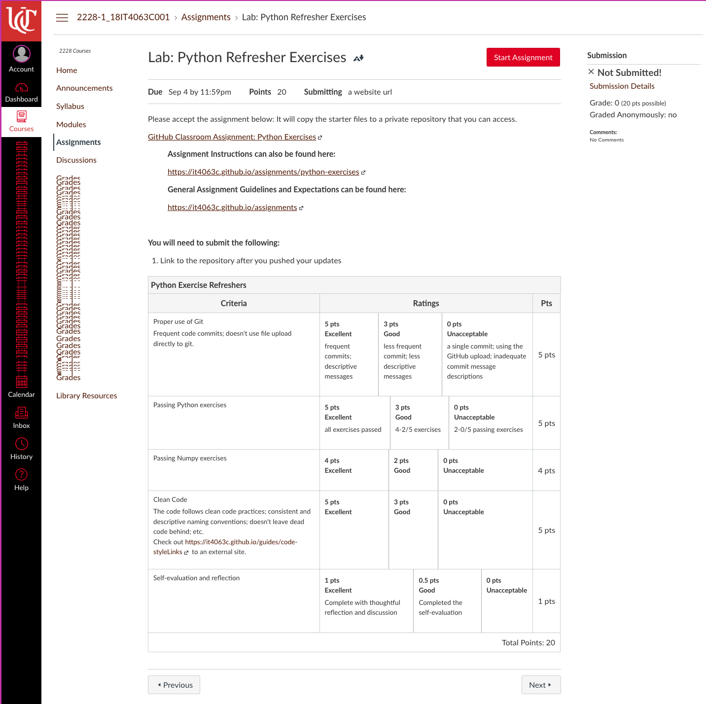
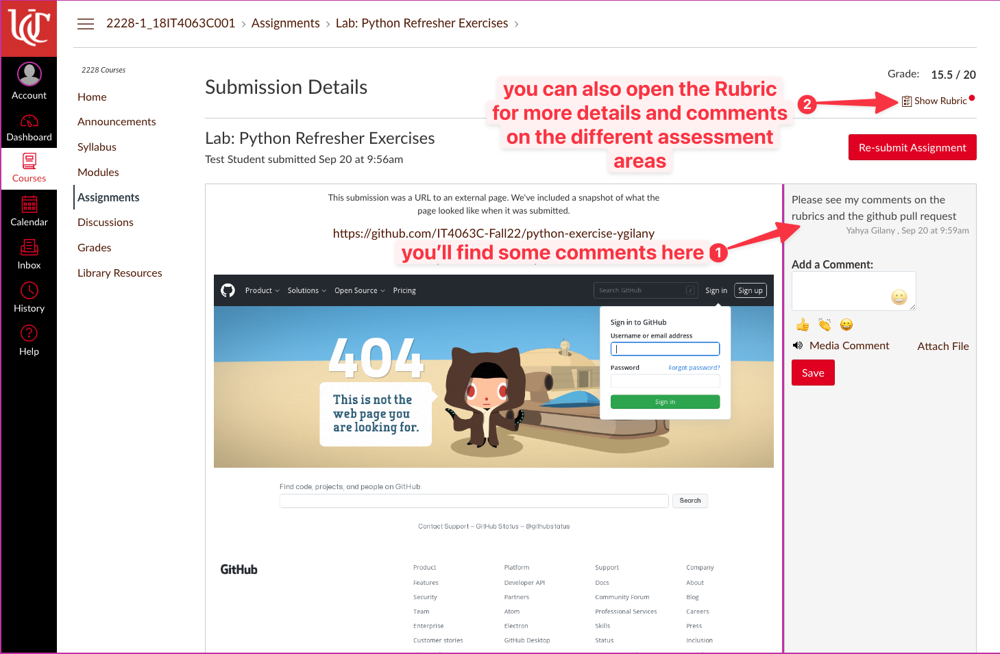
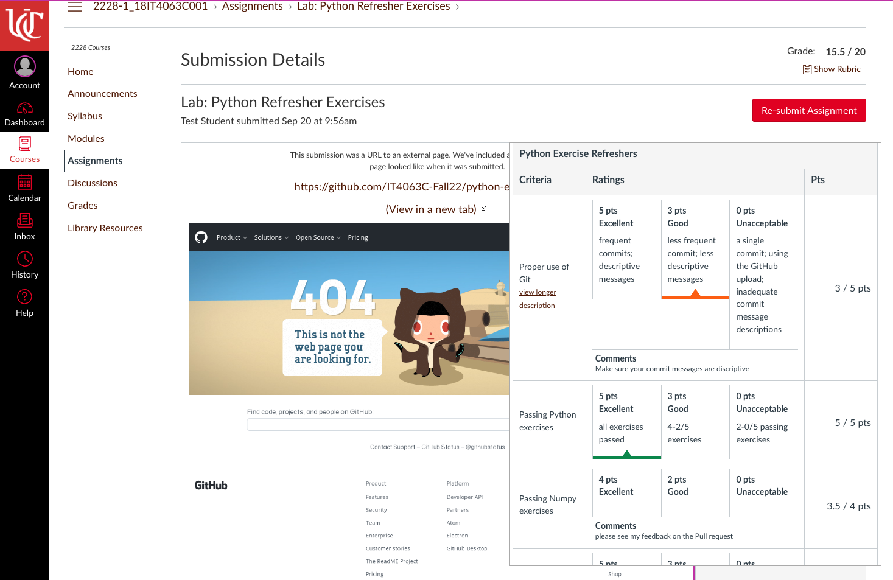
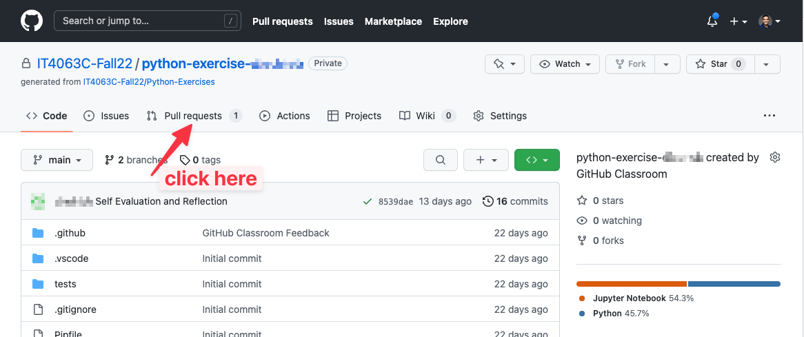
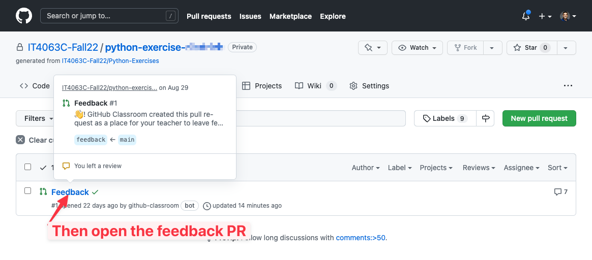
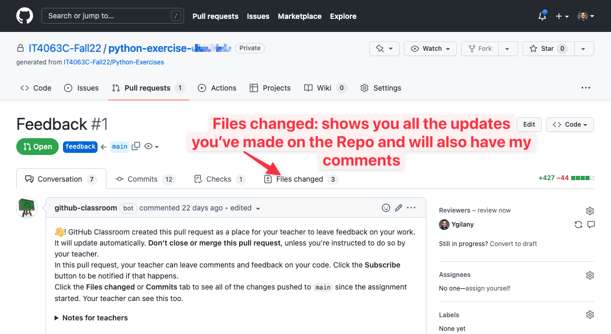
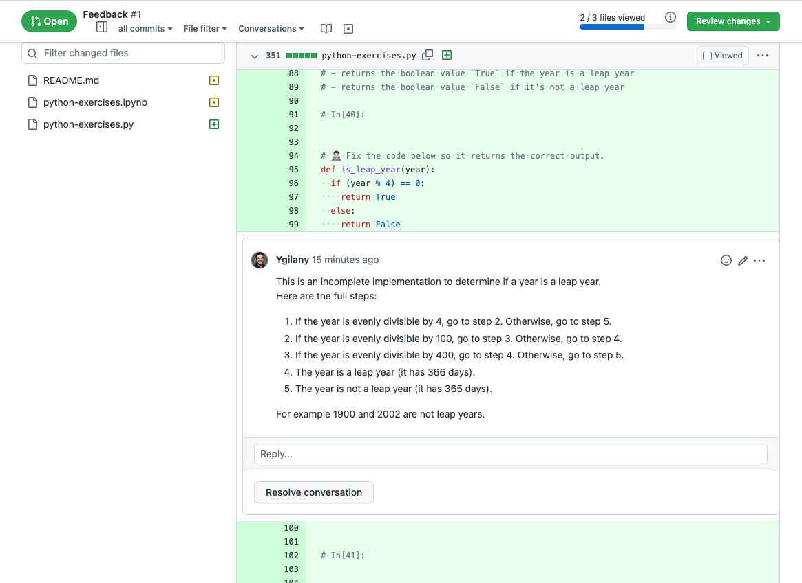
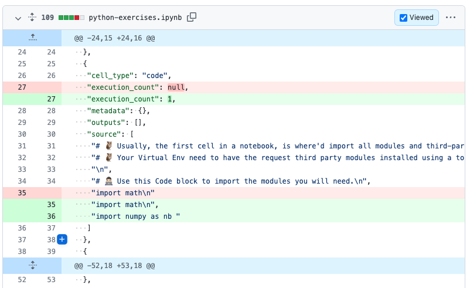

This is where you can find assignment feedback.
For most assignments, there are rubrics for the assignments with details on how you'll be graded for that assignment.

Once your assignment is graded, here's where you can find the assignment feedback.
## On Canvas
1. From the gradebook, go to the assignment.
2. You should see some comments. This may include links to other resources, or links to the GitHub Feedback Pull request (discussed below)
3. You can also go to the Rubric from more details on the grades and the assessment areas of the assignments
  
  

## On GitHub
For coding assignments, I may also provide feedback on your code itself. Here's how to find it.

1. From your code repository on GitHub, click on `Pull Requests`

  

2. Click on the Feedback Pull Requests

  

3. Click on `Files Changed`

  

4. See my comments

  

Most Jupyter Notebook templates I provide for your assignments includes a cell at the end that converts the notebook to Python Script. 
This makes it easier for me to provide feedback on your code.

Jupyer Notebook look like this on GitHub Pull Requests; it's a JSON representation of the cells, the content and the output of the cells.

