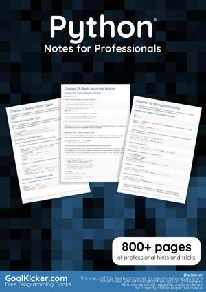

* 
* [Principles and Techniques of Data Science](https://www.textbook.ds100.org/intro.html)
* [Python Tutorial - Official Documentation](https://docs.python.org/3/tutorial/)
* Available on O'Reilly Media
  * 
  * [Practical Statistics for Data Scientists](http://uclid.uc.edu/record=b8346984~S39)