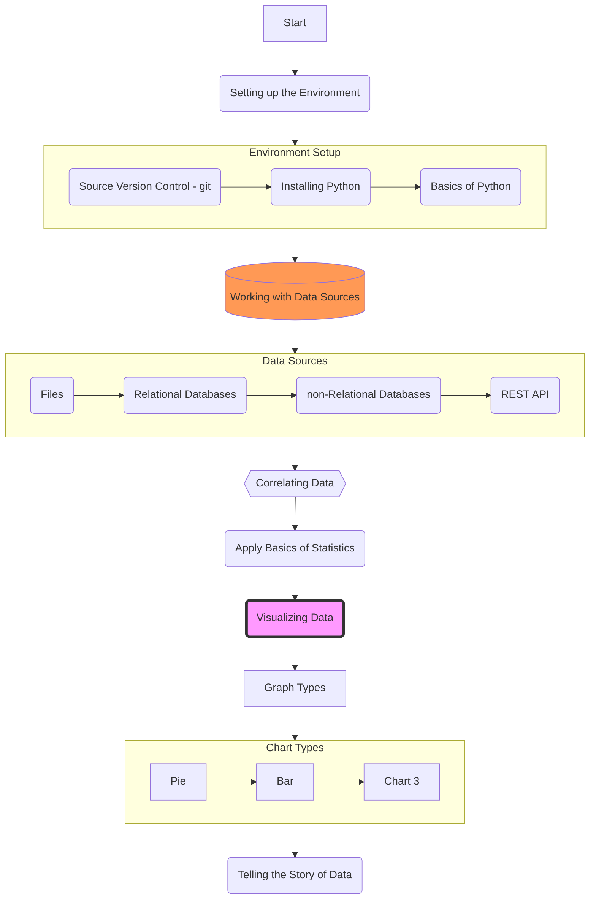
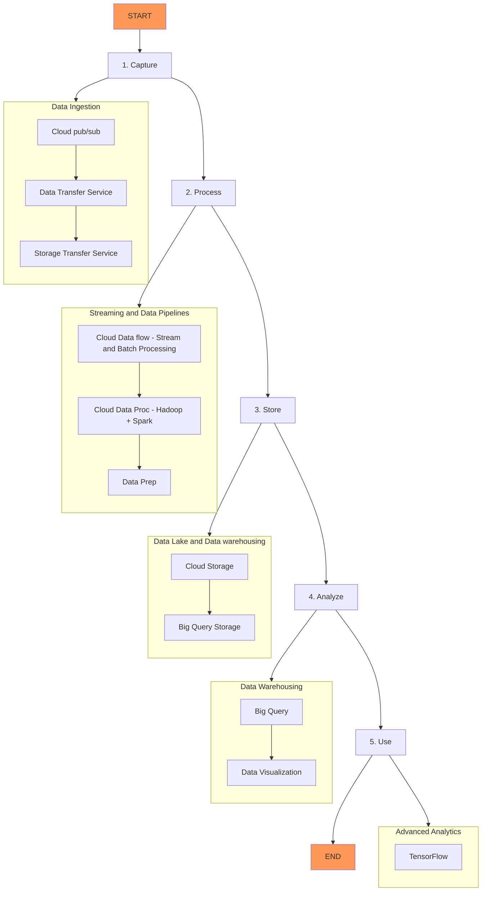

## Syllabus
- Quizzes after videos
- Create a learning log:
  - what kind of questions can data help you answer. Pick a project early on in the semester, throughout the semester you'll be answering new questions based on the topic you selected for yourself. 
  - a single GitHub Repo for that, with multiple entries
	- 1 college credit represents approximately 1 hour spent in a classroom and 2 hours spent on homework each week. As such, you're expected to put in around 9 hours in this class between reviewing the videos, readings, and working on assignments.
	- release the first 3 modules
	

http://www.socr.umich.edu/people/dinov/2017/Spring/DSPA_HS650/DSPA_Topics.html

## Notes:
- Learn how to record a nice course intro video like this one.
  - https://www.coursera.org/learn/data-preparation/lecture/bMOPU/introduction-to-data-exploration
- As a data analyst, you need to be an expert at structuring, extracting, and making sure the data you are working with is reliable.
- You will soon discover that when data is extracted, it isn’t perfect. It might be biased instead of credible, or dirty instead of clean.
- Preparing data for exploration
- Data analysis process steps: Ask, Prepare, Process, Analyze, Share and Act.
- When cleaning data Analyze Data for Bias and Credibility
- What does it mean to have clean data
- "Data Data Data, can't make bricks without clay" - Sherlock Holmes

