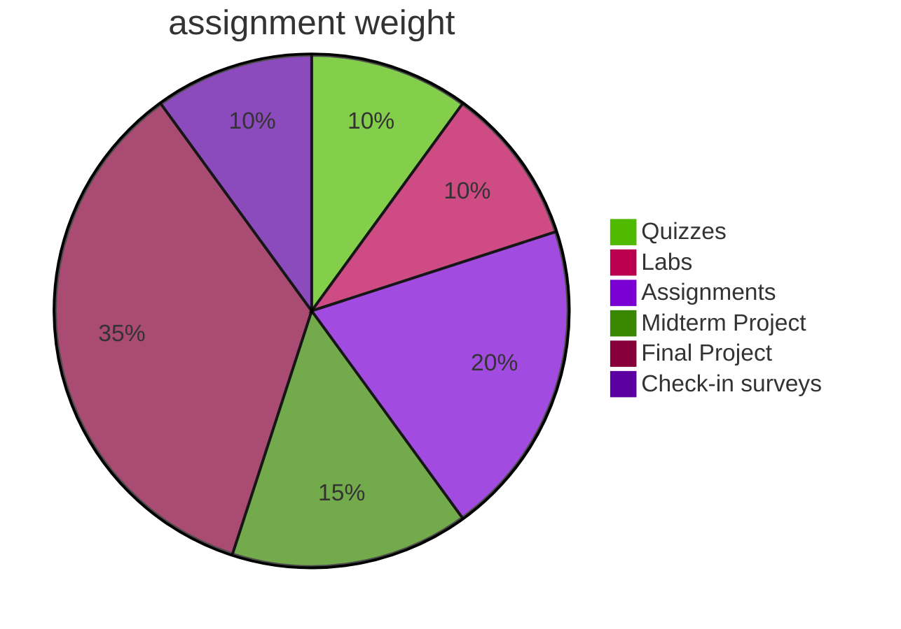

## Grade Weights
Assignments in this course include the following:

| Assignment Type  |  Weight  |
| :--------------: | :------: |
|     Quizzes      |   10%    |
|       Labs       |   10%    |
|   Assignments    |   20%    |
| Midterm Project  |   10%    |
|  Final Project   |   35%    |
| Check-in surveys |    5%    |
|   Extra Credit   |    ?%    |
|    **Total**     | **100%** |

* **Quizzes – 10%**
  * Always due on Sundays at Midnight.
  * Lowest quiz grade will be dropped
  * **Late Work Policy:** Quizzes are only available until their due dates. Once the deadline passes, it passes.

* **Labs – 10%**
  * Labs are guided assessments of the material
  * Always due on Sundays at Midnight
  * Lowest grade will be dropped.
  * **Late Work Policy:** 15% will be deducted for every late day; with a 3 days maximum.
	* please make sure yiu follow the assignment instructions and follow the submission guidelines and formats.
	* Assignments are not accepted if submitted after specified due dates or not in correct formats.
	
* **Assignments – 20%**
  * Assignments are unguided assessments of the material
  * Always due on Sundays at Midnight
  * Lowest grade will be dropped.
  * **Late Work Policy:** 15% will be deducted for every late day; with a 3 days maximum.
	* please make sure yiu follow the assignment instructions and follow the submission guidelines and formats.

* **Midterm Project 15%**
  * 
* **Final Project – 35%**
  * Discussion Boards
  * Assignments
  * Presentation
	* Proposal

* **Check-in surveys – 10%**
    * This will be to collect early feedback from you on the course.

* **Extra Credit**
    * Helping fellow classmates on MS Teams with their questions.
    * Adding New Automated tests (When it's not a requirement already 🙄)
    * Contributing the Labs and Syllabus Repositories with Fixes.

:::danger No Exceptions
**There are no exceptions to the late policy outlined.**
:::

## Grading Procedure
* Individual assignments will be graded based on:
  * [Your self assessment and evaluation](#self-assessment-and-grading).
  * Assignment automated tests and checks.
  * Code and Assignment Review.

* Group assignments will be graded based on:
  * [the Team's self assessment and evaluation](#self-assessment-and-grading).
  * Assignment automated tests and checks.
  * Code and Assignment Review.
  * Peer evaluation. (Further instructions will be shared)

### Self Assessment and Grading
* All assignments will have a `README.md` file at the root directory of the project.
* On the self assessment, you're required to provide:
  * Self-reflection
  * Self-assessment of the grade you think you deserve with justifications.
    * If you complete all the required items on the assignment checklist and they work, give your self the full grade.
    * If you leave out some of the required items, or you're not sure if you satisfied all the requirements, or think you've done everything but it still doesn't work properly, deduct a few points and justify that in the comments.
      * When grading you may receive higher grade that you gave your self 😉.
    * If nothing works (but you tried) and we can see that you tried in the code, give your self half the points.
    * If you say you did something when you didn't or not submit the assignment at all, you'll receive zero points for the assignment.
      * be honest .
      * be active.

## Grading Scale

| Letter |    Percentage    | Letter |    Percentage    |
| :----: | :--------------: | :----: | :--------------: |
|   A    | 93.00% and above |   A-   |  90.00%-92.99%   |
|   B+   |  87.00%-89.99%   |   B    |  83.00%-86.99%   |
|   B-   |  80.00%-82.99%   |   C+   |  77.00%-79.99%   |
|   C    |  73.00%-76.99%   |   C-   |  70.00%-72.99%   |
|   D+   |  67.00%-69.99%   |   D    |  63.00%-66.99%   |
|   D-   |  60.00%-62.99%   |   F    | less than 60.00% |

## Rubrics

