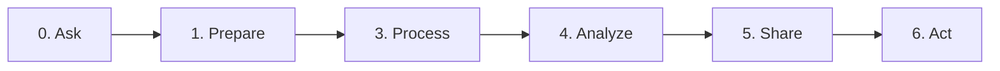

:::caution
The course outline is subject to changes
:::

|  Week  |         Dates         | Content                     | Assignments  |
| :----: | :-------------------: | :-------------------------- | :----------- |
| Week 1 |  1/1/2020 - 1/7/2020  | Introduction to Python      | Assignment 1 |
| Week 2 | 1/8/2020 - 1/14/2020  | \* Python Data Structures   | Assignment 2 |
|        |                       | \* Python Data Structures 2 |              |
| Week 3 | 1/15/2020 - 1/21/2020 | Python Data Structures      | Assignment 3 |
| Week 4 | 1/22/2020 - 1/28/2020 | Python Data Structures      | Assignment 4 |
| Week 5 | 1/29/2020 - 2/4/2020  | Python Data Structures      | Assignment 5 |

| Week | Dates    | Content               | Assignments                       |
| ---- | -------- | --------------------- | --------------------------------- |
| 1    | today    | - Test - another | - assignment 1 - assgiment 2 |
| 2    | tomorrow | - Test - another | - quiz 1  - quiz 2           |

## Calendar (Fall 22)

### Week 1 of (8-22-22)

#### Plan

- Source Version Control
- Environment Setup (virtualenv, pip, etc)
  - This is supposedly done in IT2053C as well.
  - Git and GitHub - Source Version Control
  - Python3
  - Anaconda Virtual Envirnoments
  - VSCode
  - Jupyter Notebook on VSCode.

#### Todo

- [ ] Install git
- [ ] Install VSCode or your preferred IDE
  - [ ] Configure VSCode to use Jupyter Notebook
- [ ] Install Python 3
- [ ] Install Anaconda

#### Assignments
- Submit a link to a github repository that includes a Jupyter Notebook with some exercises.

### Week 2 of (8-29-22)

### Week 3 of (9-5-22)

- Labor Day Holiday: Monday, September 5, 2022

### Week 4 of (9-12-22)

### Week 5 of (9-19-22)

### Week 6 of (9-26-22)

### Week 7 of (10-3-22)

### Week 8 of (10-10-22)

- Fall Reading Days: Monday, October 10, 2022

### Week 9 of (10-17-22)

### Week 10 of (10-24-22)

### Week 11 of (10-31-22)

### Week 12 of (11-7-22)

- Fall Reading Days: Tuesday, November 8, 2022
- Veterans Day Holiday: Friday, November 11, 2022

### Week 13 of (11-14-22)

### Week 14 of (11-21-22)

- Thanksgiving Weekend Holiday: Thursday, November 24, 2022–Sunday, November 27, 2022

### Week 15 of (11-28-22)

- Classes End: Saturday, December 3, 2022

### Week 16 of (12-5-22)

- Examinations: Sunday, December 4, 2022–Saturday, December 10, 2022
- Semester Ends: Saturday, December 10, 2022

## Course Modules

### 1. Source Version Control (git)

- Development Environment Setup
- Source Version Control Using Git/Github
- **Assignment:** Basics of Python
- **Quiz 1:** Syllabus
- **Quiz 2:** Source Version Control

## Data Analytics Pipeline

## Course Technologies

- There needs to be a unified framework to connect all the different technologies together (Python or other)

- Source Version Control (git)
- Data Sources
  - Reading Files
  - Relational Database
    - MS SQL (paid)
    - PostgreSQL (free)
    - MySQL (free)
  - Non-Relational Databases
    - MongoDB (free)
    - ElasticSearch (freemium)
  - REST APIs
- Data Storage
  - Data warehouse
- Data Pipelines
  - ETL
  - Kafka
- Visualization
  - Python Libraries
  - Tableau
  - PowerBI
