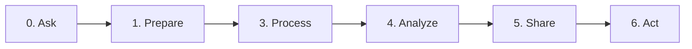

:::caution
The course outline is subject to changes
:::

## Calendar (Fall 22)

- 🎙 - Discussion Board
- 📊 - Lab / Assignment
- 📚 - Quiz

| wk  | Module Title                                        | Assignments                           |
| --- | --------------------------------------------------- | ------------------------------------- |
| 3   | [Data analytics: the big picture](#data-analytics)  | [🎙](#assignments-2)                   |
| 1   | [Environment Setup](#env-setup)                     | [Weekly Assignments](#assignments)    |
| 2   | [Refreshers](#refreshers)                           | [Weekly Assignments](#assignments-1)  |
| 4   | [Working with Different Data Sources ](#week-4)     | [Weekly Assignments](#assignments-3)  |
| 5   | [Data Preperation, and cleaning](#week-5)           | [Weekly Assignments](#assignments-4)  |
| 6   | [Descriptive/Statistical Analysis](#week-8)         | [Weekly Assignments](#assignments-7)  |
| 7   | [Data Visualization](#week-9)                       | [Weekly Assignments](#assignments-8)  |
| 8   | [Diagnostic Analysis](#week-10)                     | [Weekly Assignments](#assignments-10) |
| 9   | Midterm 🧪                                          | [Weekly Assignments](#assignments-6)  |
| 10  | [Data Wrangling](#week-6)                           | [Weekly Assignments](#assignments-5)  |
| 11  | [Data Warehousing](#week-7)                         | [Weekly Assignments](#assignments-9)  |
| 12  | [Predective Analysis   - Forecasting](#week-11) | [Weekly Assignments](#assignments-11) |
| 13  | [Prescriptive Analysis](#week-12)                   | [Weekly Assignments](#assignments-12) |
| 14  | [Distributed Processing](#week-13)                  | [Weekly Assignments](#assignments-13) |
| 15  | [Submit Final Projects](#week-15)                   |                                       |
| 16  | Final 🧪                                            | - Final Exam?                         |

| wk  | Module Title                                        | Assignments                           |
| --- | --------------------------------------------------- | ------------------------------------- |
| 1   | [Environment Setup + Refresher](#env-setup)         | [Weekly Assignments](#assignments)    |
| 2   | [Environment Setup + Refresher](#env-setup)         | [Weekly Assignments](#assignments)    |
| 3   | [Data analytics: the big picture](#data-analytics)  | [🎙](#assignments-2)                   |
| 4   | [Working with Different Data Sources ](#week-4)     | [Weekly Assignments](#assignments-3)  |
| 5   | [Data Wrangling, Preperation, and cleaning](#week-5)           | [Weekly Assignments](#assignments-4)  |
| 6   | [Exploratory Data Analysis - Descriptive/Statistical Analysis](#week-8)         | [Weekly Assignments](#assignments-7)  |
| 7   | [Data Visualization](#week-9)                       | [Weekly Assignments](#assignments-8)  |
| 8   | [Diagnostic Analysis](#week-10)                     | [Weekly Assignments](#assignments-10) |
| 9   | Midterm 🧪                                          | [Weekly Assignments](#assignments-6)  |
| 10  | [Data Wrangling](#week-6)                           | [Weekly Assignments](#assignments-5)  |
| 11  | [Data Warehousing](#week-7)                         | [Weekly Assignments](#assignments-9)  |
| 12  | [Predective Analysis   - Forecasting](#week-11) | [Weekly Assignments](#assignments-11) |
| 13  | [Prescriptive Analysis](#week-12)                   | [Weekly Assignments](#assignments-12) |
| 14  | [Distributed Processing](#week-13)                  | [Weekly Assignments](#assignments-13) |
| 15  | [Submit Final Projects](#week-15)                   |                                       |
| 16  | Final 🧪                                            | - Final Exam?                         |

- **Week 1 & 2**
  - [Environment Setup](#env-setup)
  - [Refresher](#refresher)
  - 🟢 git
  - 🟢 python and Jupyter Notebook
  - 🟢 google collab
  - 🟠 Tell me your data analytics story
- **Week 3**
  - [Data Analytics](#data-analytics)
  - 🟠 Discussion Forum?
  - 🟠 Book Reading reflection
  - 🟠 Ideas for data analytics projects
- **Week 4**
  - [Working with Data Sources](#week-4)
    - Files: CSV, Excel, JSON
    - SQL
    - NoSQL: MongoDB
    - API (http)
    - Web Scrapping
    - Kafka
  - 🟢 The above
  - 🟠 Loading data from different sources
- **Week 5**
  - Data Wrangling, preparation, and cleaning
    - dataset is loaded, cleaned, and merged to enable studying relationship between data & Variables
    - dealing with text and categorical data
  - 🟢 Tableau Preparer
  - 🟠 is there a correlation between yelp reviews and health inspections
- **Week 6**
  - Exploratory Data Analytics
    - Statistical Analysis
    - Descriptive Analysis
    - Visualization
  - 🟠 Read and Practice on notebook. Ch.1 of practical Statistics
- **Week 7**
  - Data Visualization
    - Explantory Analysis & communication
  - 🟢 Matplotlib
  - 🟢 Seaborn
  - 🟢 Plotly
  - 🟢 Tableau
- **Week 8**
  - Midterm
- **Week 9**
- **Week 10**
- **Week 11**
- **Week 12**
- **Week 13**
- **Week 14**
- **Week 15**
- **Week 16**

### Week 3 {#data-analytics}

- Data Analytics - The Big Picture
- Ask Questions
- Identify Sources of Data
- 🎉 Labor Day Holiday: Monday, September 5, 2022

#### Assignments

- Discussion Board: what interests/project would you like to use data to analyze, what questions would you ask
- Submit a Notebook on a set problem statements, what questions would you ask, what data sources can you get

- For a particular problem set by me, what kinds of questions would you ask? what data sources would you use?
  - Submit a Notebook on GitHub

### Week 1 {#env-setup}

- Environment Setup (virtualenv, pip, etc)

  - Git and GitHub - Source Version Control
  - Python3, Anaconda, pip.
  - VSCode or Preferred IDE
  - Jupyter Notebook on VSCode or preferred IDE

  #### Assignments

  - Introduce yourself on Teams - Would you be interested in A Study Group
  - a Notebook submitted on GitHub to tell your "Data Analytics" story

### Week 2 {#refreshers}

- Refreshers:

  - Refresher on Python
  - Refresher on SQL
  - Refresher on MongoDB
  - Refresher on Statistics

  #### Assignments

  - a Notebook Submitted to GitHub with some exercises on Python, SQL, Mongo.

### Week 4

- Work with Different Data Sources
  - Files (CSVs, Spreadsheets, JSON, etc)
  - HTTP APIs
  - SQL
  - MongoDB
  - Web Scrapping
- Data Exploration

#### Assignments

- a Notebook Submitted to GitHub with some exercises on Connecting and reading data from the above data sources.

### Week 5

- Prepare the data and the project
- Data cleaning
  - Missing data
  - Anomalies
  - Duplicates
  - Outliers
- Using python to perform data cleaning
- Using tableau preparer to perform data cleaning

#### Assignments

### Week 6

- Data wrangling
  - Data Transformation
  - Data Aggregation
- Using python to perform data wrangling
- Using tableau preparer to perform data wrangling

#### Assignments

### Week 7

- Data Warehoursing
- Processing data and storing it in a data warehouse

#### Assignments

### Week 8

- 🎉 Fall Reading Days: Monday, October 10, 2022

- Descriptive analysis
- Statistical analysis
- Describe data using statistics

#### Assignments

### Week 9

- Data Visualization
  - Types Of visualization and when to use them
  - Anscombe's quartet - importance
  - Visualizing Data
  - Visualizing Data with Different python visualization tools
  - Visualizing Data with Tableau

#### Assignments

### Week 10

- Diagnostic analysis

  - Linear Regression
  - Logistic Regression
  - Linear Regression with Multiple Variables
  - Logistic Regression with Multiple Variables
  - Classification
  - Correlation vs Causality
  - Hypothesis Testing

  - 

#### Assignments

### Week 11

- Predictive analysis
  - Forcasting

#### Assignments

### Week 12

- Presecriptive Analysis

#### Assignments

- 🎉 Fall Reading Days: Tuesday, November 8, 2022
- 🎉 Veterans Day Holiday: Friday, November 11, 2022

### Week 13

- Distributed Processing
  - Apache Spark
  - Apache Hadoop

#### Assignments

- Discussion or a quiz

### Week 14

- 🎉 Thanksgiving Weekend Holiday: Thursday, November 24, 2022–Sunday, November 27, 2022

#### Assignments

### Week 15

- 🎉 Classes End: Saturday, December 3, 2022

#### Assignments

### Week 16

- 🎉 Examinations: Sunday, December 4, 2022 - Saturday, December 10, 2022
- 🎉 Semester Ends: Saturday, December 10, 2022

#### Assignments

- Submit Final Project Notebook

## Data Analytics Pipeline

| Dates and breaks                             |
| -------------------------------------------- |
| **08-22-2022**                               |
| **08-29-2022**                               |
| **09-05-2022**   - 1 Day 🎉              |
| **09-12-2022**                               |
| **09-19-2022**                               |
| **10-10-2022**   1 Day 🎉                |
| **10-17-2022**                               |
| **10-31-2022**                               |
| **10-03-2022**                               |
| **09-26-2022**                               |
| **10-24-2022**                               |
| **11-07-2022**   - 2 days 🎉             |
| **11-14-2022**                               |
| **11-14-2022**   🎉 Thanksgiving Weekend |
| **11-15-2022**   - 🎉 🔚                 |
| **12-05-2022**                               |
