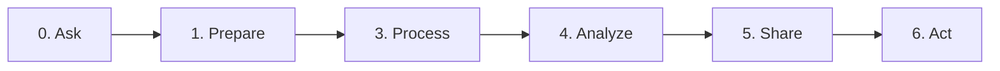

import GitHubIcon from "@mui/icons-material/GitHub";
import GoogleIcon from "@mui/icons-material/Google";

:::caution
The course outline is subject to changes
:::

## Fall 2022

|  #  | Week of        | Title                                | Event                                      |
| :-: | -------------- | ------------------------------------ | ------------------------------------------ |
|  1  | **08-22-2022** | Envirnoment                          | 🏁 Classes Start 🚦                        |
|  2  | **08-29-2022** | Refresher                            |                                            |
|  3  | **09-05-2022** | Data Analytics OR Data Sources 1     | 🎉 Labor Day Holiday                       |
|  4  | **09-12-2022** | Working with Data Sources            |                                            |
|  5  | **09-19-2022** | Exploratory Data Analytics           |                                            |
|  6  | **10-10-2022** | Data Visualization                   | 🎉 Fall Reading Days                       |
|  7  | **10-17-2022** | Intro to ML - Types of ML Algorithms |                                            |
|  8  | **10-31-2022** | Data Prep and Cleaning               |                                            |
|  9  | **10-03-2022** | ML - Classification                  |                                            |
| 10  | **09-26-2022** | Forecasting - Linear Regression      |                                            |
| 11  | **10-24-2022** | Storytelling with Data               |                                            |
| 12  | **11-07-2022** |                                      | 🎉 Veterans Day Holiday & Fall Reading Day |
| 13  | **11-14-2022** | Distributed Processing               |                                            |
| 14  | **11-21-2022** |                                      | 🎉 Thanksgiving Weekend                    |
| 15  | **11-28-2022** | Where to go from here                | 🚩Classes End 🚦                           |
| 16  | **12-05-2022** |                                      |                                            |

- 🎙 - Discussion Board
- 📊 - Lab / Assignment
- 📚 - Quiz

### Week 1

- **Topics:**
  - Environment Setup and Tools
  - Git and GitHub - Source Version Control
- **Assessments:**
  - Tell me your data analytics story
- **Technologies Discussed:**
  - Git and GitHub <GitHubIcon />
  - Python3, Anaconda, pip.
  - Jupyter Notebook on VSCode or preferred IDE
  - Google Collab <GoogleIcon />

### Week 2

- **Topics:**
  - Refresher
    - on Python
    - on SQL
    - on MongoDB
    - on Statistics
- **Assessments:**
  - a Notebook Submitted to GitHub with some exercises on Python, SQL, Mongo.
- **Technologies Discussed:**

### 🏖 Week 3'

- **Topics:**
  - Data Analytics

- **Assessments:**
  - 🟠 Book Reading reflection
  - 🟠 Ideas for data analytics projects
  - Discussion Board: what interests/project would you like to use data to analyze, what questions would you ask
  - Submit a Notebook on a set problem statements, what questions would you ask, what data sources can you get
  - For a particular problem set by me, what kinds of questions would you ask? what data sources would you use?
    - Submit a Notebook on GitHub

### 🏖 Week 3"

- **Topics:**
  - Working with Data Sources 1
    - Files

- **Assessments:**

### Week 4

- **Topics:**

- **Assessments:**

- **Technologies Discussed:**

- [Working with Data Sources](#week-4)
  - Files: CSV, Excel, JSON
  - SQL
  - NoSQL: MongoDB
  - API (http)
  - Web Scrapping
  - Kafka
- 🟢 The above
- 🟠 Loading data from different sources

### Week 5

- **Topics:**

- **Assessments:**

- **Technologies Discussed:**

- Data Wrangling, preparation, and cleaning
  - dataset is loaded, cleaned, and merged to enable studying relationship between data & Variables
  - dealing with text and categorical data
- 🟢 Tableau Preparer
- 🟠 is there a correlation between yelp reviews and health inspections

### 🏖 Week 6

- **Topics:**

- **Assessments:**

- **Technologies Discussed:**

- Exploratory Data Analytics
  - Statistical Analysis
  - Descriptive Analysis
  - Visualization
- 🟠 Read and Practice on notebook. Ch.1 of practical Statistics

### Week 7

- **Topics:**

- **Assessments:**

- **Technologies Discussed:**

- Data Visualization
  - Explantory Analysis & communication
- 🟢 Matplotlib
- 🟢 Seaborn
- 🟢 Plotly
- 🟢 Tableau

### Week 8

- **Topics:**

- **Assessments:**

- **Technologies Discussed:**

- Midterm

### Week 9

- **Topics:**

- **Assessments:**

- **Technologies Discussed:**

### Week 10

- **Topics:**

- **Assessments:**

- **Technologies Discussed:**

### Week 11

- **Topics:**

- **Assessments:**

- **Technologies Discussed:**

### 🏖🏖 Week 12

- **Topics:**

- **Assessments:**

- **Technologies Discussed:**

### Week 13

- **Topics:**

- **Assessments:**

- **Technologies Discussed:**

### 🏖🏖 Week 14

- **Topics:**

- **Assessments:**

- **Technologies Discussed:**

### Week 15

- **Topics:**

- **Assessments:**

- **Technologies Discussed:**

Cassandra?

---

### Week 3 {#data-analytics}

#### Assignments

- Discussion Board: what interests/project would you like to use data to analyze, what questions would you ask
- Submit a Notebook on a set problem statements, what questions would you ask, what data sources can you get

- For a particular problem set by me, what kinds of questions would you ask? what data sources would you use?

  - Submit a Notebook on GitHub

  #### Assignments

  - Introduce yourself on Teams - Would you be interested in A Study Group
  - a Notebook submitted on GitHub to tell your "Data Analytics" story

### Week 2 {#refreshers}

- Refreshers:

  #### Assignments

### Week 4

- Work with Different Data Sources
  - Files (CSVs, Spreadsheets, JSON, etc)
  - HTTP APIs
  - SQL
  - MongoDB
  - Web Scrapping
- Data Exploration

#### Assignments

- a Notebook Submitted to GitHub with some exercises on Connecting and reading data from the above data sources.

### Week 5

- Prepare the data and the project
- Data cleaning
  - Missing data
  - Anomalies
  - Duplicates
  - Outliers
- Using python to perform data cleaning
- Using tableau preparer to perform data cleaning

#### Assignments

### Week 6

- Data wrangling
  - Data Transformation
  - Data Aggregation
- Using python to perform data wrangling
- Using tableau preparer to perform data wrangling

#### Assignments

### Week 7

- Data Warehoursing
- Processing data and storing it in a data warehouse

#### Assignments

### Week 8

- 🎉 Fall Reading Days: Monday, October 10, 2022

- Descriptive analysis
- Statistical analysis
- Describe data using statistics

#### Assignments

### Week 9

- Data Visualization
  - Types Of visualization and when to use them
  - Anscombe's quartet - importance
  - Visualizing Data
  - Visualizing Data with Different python visualization tools
  - Visualizing Data with Tableau

#### Assignments

### Week 10

- Diagnostic analysis

  - Linear Regression
  - Logistic Regression
  - Linear Regression with Multiple Variables
  - Logistic Regression with Multiple Variables
  - Classification
  - Correlation vs Causality
  - Hypothesis Testing

  - 

#### Assignments

### Week 11

- Predictive analysis
  - Forcasting

#### Assignments

### Week 12

- Presecriptive Analysis

#### Assignments

- 🎉 Fall Reading Days: Tuesday, November 8, 2022
- 🎉 Veterans Day Holiday: Friday, November 11, 2022

### Week 13

- Distributed Processing
  - Apache Spark
  - Apache Hadoop

#### Assignments

- Discussion or a quiz

### Week 14

- 🎉 Thanksgiving Weekend Holiday: Thursday, November 24, 2022–Sunday, November 27, 2022

#### Assignments

### Week 15

- 🎉 Classes End: Saturday, December 3, 2022

#### Assignments

### Week 16

- 🎉 Examinations: Sunday, December 4, 2022 - Saturday, December 10, 2022
- 🎉 Semester Ends: Saturday, December 10, 2022

#### Assignments

- Submit Final Project Notebook

## Data Analytics Pipeline

