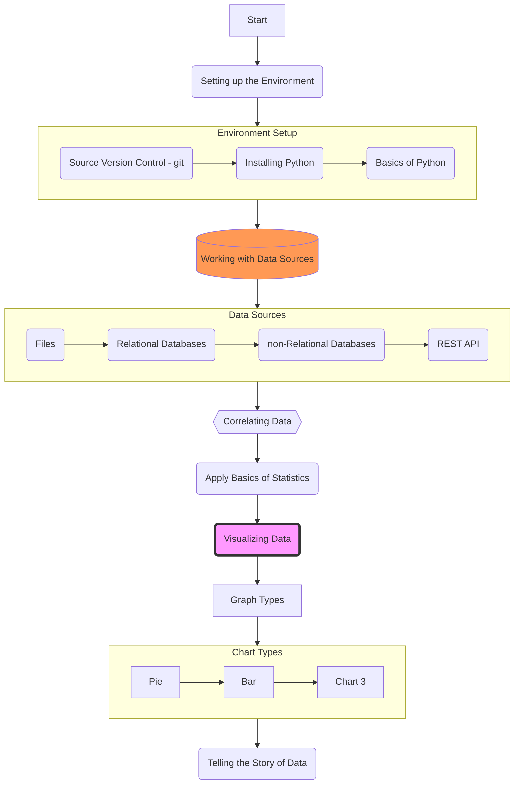

I'm currently in the process of updating the course, adding more modern and relevant topics. The following may not reflect the changes implemented in the class yet.

## Course Modules
### 1. Source Version Control (git)
   * Development Environment Setup
   * Source Version Control Using Git/Github
   * **Assignment:** Basics of Python
   * **Quiz 1:** Syllabus
   * **Quiz 2:** Source Version Control

### 2. 

### 3.

### 4.

### 5.

### 6.

### 7.

### 8.

### 9.

### 10.

### 11.

### 12.

### 13.
